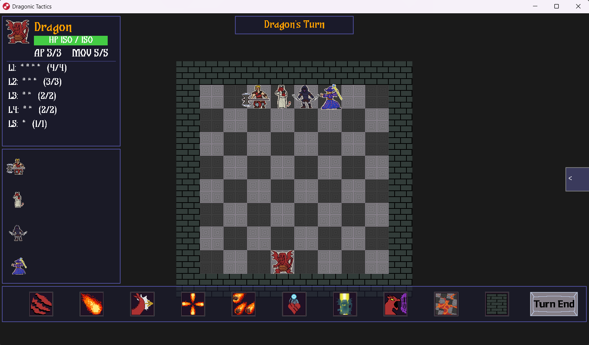
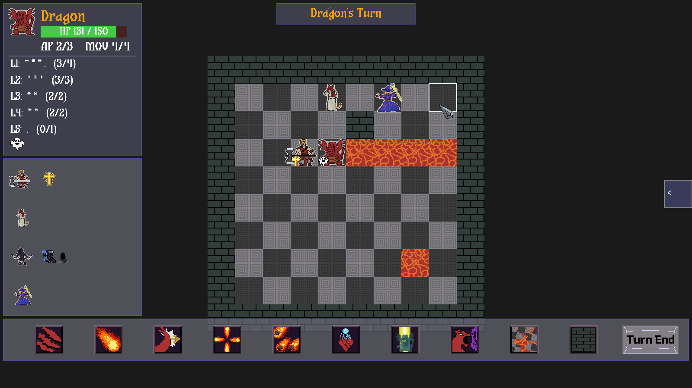
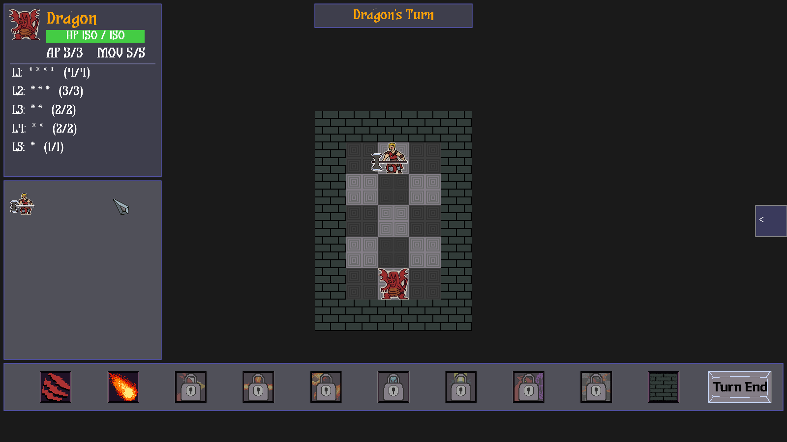
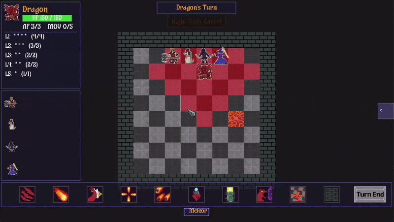

# 🐉 Dragonic Tactics

<p align="center">
  
</p>

> You are the dragon. A party of adventurers has come to slay you in your own lair — don't let them leave.

**Dragonic Tactics** is a D&D-style, turn-based tactics game with a role-reversal premise: instead of playing the heroes, you play the boss monster defending its lair against a coordinated party of AI-controlled adventurers. It's built from scratch on a custom C++20 OpenGL engine and ships to both Windows and the browser (WebAssembly).

Made by **CodePistols**, a 5-person student team at DigiPen Institute of Technology, over a full year of development (GAM200 + GAM250).

## Screenshots

<p align="center">
  
  
  
</p>
<p align="center">
  
</p>

## Play It

- 🌐 **[Play in your browser](https://taekyung00.github.io/dragonic_tactics_presskit/)** — full WebAssembly build, no install needed (first load is ~40 MB)
- 🪟 **Windows**: build from source (see below), or grab the latest playtest ZIP from [Releases](../../releases)
- 📝 Playtest feedback: **[take the survey](https://forms.gle/fSAFsKoonyGdXREn7)**

For controls, win conditions, the full skill/status-effect list, and credits, see **[DragonicTactics/README.md](DragonicTactics/README.md)**.

## Features

- **Play as the dragon.** A role-reversal premise — you're the boss monster, defending your lair against the heroes.
- **Asymmetric one-vs-many tactics.** A single powerful dragon against a coordinated party of up to four adventurers.
- **Tabletop-style combat.** Dice-based attack/defense resolution, action points, movement, and leveled spell slots.
- **Deep dragon spellbook with upcasting.** Spend higher-level slots to amplify spells — trade burst power against resource conservation.
- **Battlefield manipulation.** Terrain-altering spells raise walls and spit lava to reshape the grid; knockback shoves enemies into hazards.
- **9 status effects** (Fear, Curse, Blessing, Haste, Stealth, Lifesteal, Frenzy, Exhaustion, Purify) and **20+ spells** across the cast.
- **Four hand-authored AI archetypes.** Fighter (aggressor), Cleric (support/healer), Rogue (stealth striker), and Wizard (ranged kiter) — each designed as a decision flowchart before it was ever coded.
- **Three escalating encounters.** A 5×7 duel, an 8×8 two-enemy skirmish, and a 10×10 four-adventurer raid.
- **Custom engine, two platforms.** Built on an in-house C++20 OpenGL engine; runs on Windows and in the browser via WebAssembly.

## Building From Source

```bash
cd DragonicTactics
cmake --preset windows-debug
cmake --build --preset windows-debug
build/windows-debug/dragonic_tactics.exe
```

Other presets: `windows-developer-release`, `windows-release`, `linux-debug`, `linux-developer-release`, `linux-release`, and the `web-*` presets (Emscripten, requires WSL/Linux — see [DragonicTactics/docs/DebuggingWeb.md](DragonicTactics/docs/DebuggingWeb.md)). `*-debug` and `*-developer-release` builds include the in-game debug console and cheat tools; `*-release` builds strip them out.

Full build/architecture documentation lives in **[CLAUDE.md](CLAUDE.md)** — originally written as operating instructions for Claude Code (the AI assistant used throughout this project's development), it doubles as the most detailed technical reference for the codebase.

## Repository Structure

| Path | Contents |
|---|---|
| [`DragonicTactics/`](DragonicTactics/) | The game itself: engine + game source, assets, build scripts. See its own [README](DragonicTactics/README.md) and [source/README.md](DragonicTactics/source/README.md). |
| [`architecture/`](architecture/) | System architecture write-up, the original game design document, and the Mermaid flowcharts each AI character's decision logic was designed from before being coded. |
| [`docs/`](docs/) | Deep-dive implementation notes for individual systems (spells, status effects, AI strategies, UI, sound, etc.) and a turn-flow diagram. |
| [`press_kit/`](press_kit/) | The press kit site (screenshots, GIFs, factsheet) — also published at [taekyung00.github.io/dragonic_tactics_presskit](https://taekyung00.github.io/dragonic_tactics_presskit/). |
| `CLAUDE.md` | Detailed guidance for Claude Code covering build commands, architecture, and system-by-system implementation notes. |

## Team — CodePistols

| Name | Role |
|---|---|
| Taekyung Ho | Producer |
| Junyoung Ki | Tech Lead |
| Seungju Song | Designer |
| Ginam Park | Test Lead |
| Sangyoon Lee | QA |
