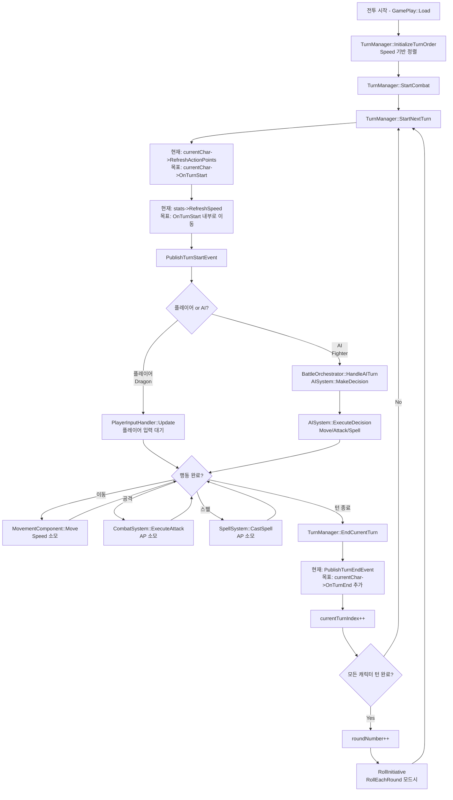

# Week 5 구현 계획 - 시스템 안정화 및 UI 구축

**프로젝트**: Dragonic Tactics - 턴제 전술 RPG
**단계**: 시스템 안정화, 게임 UI 구현, 리팩토링
**기간**: Week 5 / 26주 (마감: 2025-12-09)
**전략**: 5명의 개발자가 병렬로 핵심 안정화 작업 수행

**최종 업데이트**: 2025-11-27
**Week 4 상태**: Week 1-3 완료, REFACTORING_TODO.md 완료

**관련 문서**:

- [Week 1-4](week1.md) - 이전 주차 구현
- [docs/implementation-plan.md](../../implementation-plan.md) - 전체 26주 타임라인
- [architecture/REFACTORING_TODO.md](../../../architecture/REFACTORING_TODO.md) - 리팩토링 완료 사항

---

## 📋 목차

- [Week 5 개요](#week-5-개요)
- [개발자 A: 턴 플로우 시스템 명확화](#개발자-a-턴-플로우-시스템-명확화)
- [개발자 B: AI 시스템 강화](#개발자-b-ai-시스템-강화)
- [개발자 C: 게임 UI 시스템 구현](#개발자-c-게임-ui-시스템-구현)
- [개발자 D: 캐릭터 소유권 모델 재설계](#개발자-d-캐릭터-소유권-모델-재설계)
- [개발자 E: AI 행동 시각화 및 맵 데이터 로딩](#개발자-e-ai-행동-시각화-및-맵-데이터-로딩)
- [Week 5 통합 테스트](#week-5-통합-테스트)
- [Week 5 산출물 및 검증](#week-5-산출물-및-검증)

---

## Week 5 개요

Week 5는 게임의 **핵심 안정화** 및 **플레이어 경험 개선**에 집중합니다. Week 1-3에서 구축한 시스템들의 문제점을 해결하고, 실제 플레이 가능한 상태로 만듭니다.

### 핵심 목표

1. **턴 시스템 안정화**: 모든 턴 작업이 명확하게 정의되고 실행됨을 보장
2. **AI 시스템 강화**: 4명의 모험가 캐릭터에 대한 robust한 AI 구현
3. **게임 UI 구축**: 플레이어가 게임 상태를 파악할 수 있는 UI (ImGui 아님!)
4. **메모리 안정성**: 스마트 포인터 도입으로 메모리 누수 방지
5. **플레이 경험 개선**: AI pause 시스템 및 맵 로딩

### 주요 변경사항 (Week 4 대비)

- **리팩토링 완료**: Engine-Game 의존성 역전, PCH 구축, GamePlay 리팩토링 모두 완료
- **UI 명확화**: ImGui (디버그용) vs 게임 UI (플레이용) 구분
- **메모리 관리**: Raw 포인터 → 스마트 포인터 전환

### ⚠️ 중요: Ability 시스템 미구현

- **Ability 시스템은 Week 6+에 구현 예정입니다**
- ShieldBash, MeleeAttack, Heal 등의 어빌리티 사용 불가
- 현재는 **기본 공격(Attack)만 지원**됩니다
- AI Strategy 코드에서 `UseAbility` 관련 부분은 임시로 주석 처리되어 있습니다

### 통합 목표 (금요일)

- **플레이 가능한 데모**: Dragon vs Fighter 전투가 완전히 플레이 가능
- **UI 완비**: 게임 UI로 모든 정보 확인 가능
- **AI 작동**: Fighter가 자율적으로 전투
- **안정성**: 메모리 누수 없음, 크래시 없음

---

## 개발자 A: 턴 플로우 시스템 명확화

**목표**: 매 턴마다 실행되어야 하는 작업들의 명확한 정의 및 함수 일대일 대응

**현재 코드 상황 분석**:

```cpp
// 현재 TurnManager::StartNextTurn() (TurnManager.cpp 라인 70-112)
void TurnManager::StartNextTurn() {
    Character* currentChar = turnOrder[currentTurnIndex];

    // 문제: TurnManager가 직접 Refresh 호출 (책임 분리 위반!)
    currentChar->RefreshActionPoints();        // 라인 103
    StatsComponent* stats = currentChar->GetStatsComponent();
    if (stats) {
        stats->RefreshSpeed();                 // 라인 106
    }
    PublishTurnStartEvent();                   // 라인 109
}

// 현재 TurnManager::EndCurrentTurn() (TurnManager.cpp 라인 114-169)
void TurnManager::EndCurrentTurn() {
    PublishTurnEndEvent();                     // 라인 123
    currentTurnIndex = (currentTurnIndex + 1) % turnOrder.size();
    turnNumber++;
    if (currentTurnIndex == 0) {
        roundNumber++;
    }
    StartNextTurn();                           // 라인 168
}

// 핵심 문제점:
// 1. Character::OnTurnStart() 함수가 존재하지 않음!
// 2. Character::OnTurnEnd() 함수가 존재하지 않음!
// 3. TurnManager가 Refresh 로직을 직접 관리 (Character의 책임을 침범)
// 4. RefreshSpeed()는 StatsComponent에 있음 (MovementComponent 아님!)
```

**파일 수정 목록**:

```
DragonicTactics/source/pch.h (크로스 플랫폼 매크로 추가)
DragonicTactics/source/Game/DragonicTactics/Objects/Character.h/cpp
DragonicTactics/source/Game/DragonicTactics/Objects/Dragon.h/cpp
DragonicTactics/source/Game/DragonicTactics/Objects/Fighter.h/cpp
DragonicTactics/source/Game/DragonicTactics/StateComponents/TurnManager.cpp
docs/turn-flow-chart.md (신규)
```

---

### 구현 작업 (턴 플로우 시스템)

#### **Task 0: 크로스 플랫폼 함수 이름 매크로 추가** (Day 1 - 우선 작업)

**목표**: GCC, Clang, MSVC, WebAssembly 모두에서 작동하는 함수 이름 매크로 추가

**문제점**:

- `__PRETTY_FUNCTION__`은 GCC/Clang 전용 (MSVC에서 컴파일 오류)
- MSVC는 `__FUNCSIG__` 사용
- 크로스 플랫폼 호환성 필요

**Step 1: pch.h에 매크로 추가**

`DragonicTactics/source/pch.h` 파일 맨 아래에 다음 추가:

```cpp
// Cross-platform function name macro
#if defined(__GNUC__) || defined(__clang__)
    #define FUNC_NAME __PRETTY_FUNCTION__
#elif defined(_MSC_VER)
    #define FUNC_NAME __FUNCSIG__
#else
    #define FUNC_NAME __func__
#endif
```

**설명**:

- `__GNUC__`: GCC 컴파일러 감지
- `__clang__`: Clang 컴파일러 감지 (WebAssembly용 Emscripten 포함)
- `_MSC_VER`: MSVC 컴파일러 감지
- `__func__`: C99 표준 (fallback, 함수 이름만 제공)

**사용 방법**:

```cpp
// 기존 코드 (MSVC에서 오류!)
Engine::GetLogger().LogDebug(std::string(__PRETTY_FUNCTION__) + " - BEGIN");

// 새 코드 (모든 컴파일러에서 작동)
Engine::GetLogger().LogDebug(std::string(FUNC_NAME) + " - BEGIN");
```

**출력 예시**:

- GCC/Clang: `virtual void Character::OnTurnStart() - BEGIN`
- MSVC: `void __cdecl Character::OnTurnStart(void) - BEGIN`
- Fallback: `OnTurnStart - BEGIN`

---

#### **Task 1: 실제 턴 플로우 파악 및 문서화** (Day 1)

**목표**: 현재 코드의 실제 동작 방식을 정확히 파악하고 문서화

**Step 1: 현재 호출 체인 분석**

```
GamePlay::Load()
  └─> TurnManager::InitializeTurnOrder() (라인 114)
      └─> RollInitiative() - Speed 기반 정렬 ✅
  └─> TurnManager::StartCombat() (라인 115)
      └─> StartNextTurn() (라인 67)

GamePlay::Update()
  └─> BattleOrchestrator::Update() (BattleOrchestrator.cpp 라인 39)
      └─> HandleAITurn() (AI 캐릭터만, 라인 79)
          └─> AISystem::MakeDecision()
          └─> AISystem::ExecuteDecision()
          └─> TurnManager::EndCurrentTurn() (라인 99)

TurnManager::StartNextTurn() (라인 70-112)
  1. currentChar->RefreshActionPoints() (라인 103)
  2. stats->RefreshSpeed() (라인 106)
  3. PublishTurnStartEvent() (라인 109)

TurnManager::EndCurrentTurn() (라인 114-169)
  1. PublishTurnEndEvent() (라인 123)
  2. currentTurnIndex++ (라인 126)
  3. if (라운드 종료) roundNumber++ (라인 132)
  4. StartNextTurn() (라인 168)
```

**Step 2: 문제점 식별**

1. **OnTurnStart()/OnTurnEnd() 함수 없음**
   
   - Character.h/cpp에 virtual void OnTurnStart()가 없음
   - TurnManager가 직접 Refresh 호출 → 캐릭터별 커스텀 로직 불가능

2. **RefreshSpeed() 위치**
   
   - StatsComponent::RefreshSpeed() 사용 (라인 106)
   - MovementComponent가 아닌 StatsComponent에 있음

3. **중복 가능성**
   
   - Character::RefreshActionPoints()가 이미 존재 (Character.cpp 라인 44-47)
   - TurnManager가 이를 직접 호출 → Character에 OnTurnStart()를 만들면 중복

**Step 3: 턴 플로우 차트 작성**

`docs/turn-flow-chart.md` 파일 생성:



**중요 원칙**:

- 각 박스 = 하나의 함수 호출
- 함수 중복 호출 금지
- Character의 책임(Refresh)을 TurnManager가 침범하지 않음

---

#### **Task 2: Character에 OnTurnStart()/OnTurnEnd() 추가** (Day 2-3)

**목표**: 캐릭터별 턴 시작/종료 로직을 가상 함수로 캡슐화

**Step 1: Character.h 수정**

```cpp
// Character.h에 추가 (public 섹션)
class Character : public CS230::GameObject {
public:
    // ... 기존 코드 ...

    // 턴 관리 함수 (virtual - 파생 클래스에서 override 가능)
    virtual void OnTurnStart();
    virtual void OnTurnEnd();

    // ... 기존 코드 ...
};
```

**Step 2: Character.cpp 구현**

```cpp
// Character.cpp에 추가
void Character::OnTurnStart() {
    Engine::GetLogger().LogDebug(std::string(FUNC_NAME) + " - BEGIN");

    // 1. ActionPoints Refresh (기존 함수 재사용)
    RefreshActionPoints();
    Engine::GetLogger().LogEvent(TypeName() + " ActionPoints refreshed to " +
                                  std::to_string(GetActionPoints()));

    // 2. Speed Refresh (StatsComponent에 있음!)
    StatsComponent* stats = GetStatsComponent();
    if (stats) {
        stats->RefreshSpeed();
        Engine::GetLogger().LogEvent(TypeName() + " Speed refreshed to " +
                                      std::to_string(stats->GetSpeed()));
    }

    Engine::GetLogger().LogDebug(std::string(FUNC_NAME) + " - END");
}

void Character::OnTurnEnd() {
    Engine::GetLogger().LogDebug(std::string(FUNC_NAME) + " called");
    Engine::GetLogger().LogEvent(TypeName() + " turn ended");
}
```

**Step 3: Dragon.h/cpp 수정** (선택사항 - 커스텀 로직 필요시)

```cpp
// Dragon.h
class Dragon : public Character {
public:
    // ... 기존 코드 ...

    void OnTurnStart() override;  // Dragon 전용 로직
    void OnTurnEnd() override;
};

// Dragon.cpp
void Dragon::OnTurnStart() {
    Engine::GetLogger().LogDebug(std::string(__PRETTY_FUNCTION__) + " - BEGIN");

    // 부모 클래스의 기본 Refresh 먼저 실행
    Character::OnTurnStart();

    // Dragon 전용 로직 (예: 드래곤 브레스 쿨다운 감소)
    // cooldown_breath_--;

    Engine::GetLogger().LogDebug(std::string(__PRETTY_FUNCTION__) + " - END");
}

void Dragon::OnTurnEnd() {
    Engine::GetLogger().LogDebug(std::string(__PRETTY_FUNCTION__) + " called");
    Character::OnTurnEnd();
    // Dragon 전용 턴 종료 로직
}
```

**Step 4: Fighter.h/cpp 수정** (선택사항)

```cpp
// Fighter.h
class Fighter : public Character {
public:
    // ... 기존 코드 ...

    void OnTurnStart() override;
    void OnTurnEnd() override;
};

// Fighter.cpp
void Fighter::OnTurnStart() {
    Engine::GetLogger().LogDebug(std::string(FUNC_NAME) + " - BEGIN");

    Character::OnTurnStart();

    // Fighter 전용 로직 (예: 방어 태세 초기화)
    // defensive_stance_ = false;

    Engine::GetLogger().LogDebug(std::string(FUNC_NAME) + " - END");
}

void Fighter::OnTurnEnd() {
    Engine::GetLogger().LogDebug(std::string(FUNC_NAME) + " called");
    Character::OnTurnEnd();
}
```

---

#### **Task 3: TurnManager 수정** (Day 3-4)

**목표**: TurnManager가 OnTurnStart()/OnTurnEnd()를 호출하도록 수정

**Step 1: TurnManager::StartNextTurn() 수정**

```cpp
// TurnManager.cpp의 StartNextTurn() 수정 (라인 70-112)
void TurnManager::StartNextTurn()
{
    if (!combatActive)
    {
        Engine::GetLogger().LogError("TurnManager: Combat not active");
        return;
    }

    if (turnOrder.empty())
    {
        Engine::GetLogger().LogError("TurnManager: No characters in turn order");
        return;
    }

    // Get current character
    Character* currentChar = turnOrder[currentTurnIndex];

    // Skip dead characters
    while (!currentChar->IsAlive())
    {
        currentTurnIndex = (currentTurnIndex + 1) % turnOrder.size();
        currentChar = turnOrder[currentTurnIndex];

        if (currentTurnIndex == 0)
        {
            Engine::GetLogger().LogEvent("TurnManager: All characters dead, ending combat");
            EndCombat();
            return;
        }
    }

    // ===== 수정 부분 시작 =====
    // 기존 코드 (삭제):
    // currentChar->RefreshActionPoints();
    // StatsComponent* stats = currentChar->GetStatsComponent();
    // if (stats) {
    //     stats->RefreshSpeed();
    // }

    // 새 코드 (추가):
    Engine::GetLogger().LogDebug(std::string(FUNC_NAME) + " - Calling OnTurnStart");
    currentChar->OnTurnStart();  // ✅ 모든 Refresh 로직 포함
    // ===== 수정 부분 종료 =====

    // Publish turn start event (기존 유지)
    PublishTurnStartEvent();

    Engine::GetLogger().LogEvent("TurnManager: Turn " + std::to_string(turnNumber) + " - " + currentChar->TypeName() + "'s turn");
}
```

**Step 2: TurnManager::EndCurrentTurn() 수정**

```cpp
// TurnManager.cpp의 EndCurrentTurn() 수정 (라인 114-169)
void TurnManager::EndCurrentTurn()
{
    if (!combatActive)
    {
        Engine::GetLogger().LogError("TurnManager: Combat not active");
        return;
    }

    // ===== 추가 부분 =====
    Character* currentChar = turnOrder[currentTurnIndex];

    // OnTurnEnd 호출
    Engine::GetLogger().LogDebug(std::string(FUNC_NAME) + " - Calling OnTurnEnd");
    currentChar->OnTurnEnd();  // ✅ 새로 추가
    // ===== 추가 부분 종료 =====

    // Publish turn end event (기존 유지)
    PublishTurnEndEvent();

    // Advance to next character (기존 유지)
    currentTurnIndex = (currentTurnIndex + 1) % turnOrder.size();
    turnNumber++;

    // Check if we completed a round (기존 유지)
    if (currentTurnIndex == 0)
    {
        roundNumber++;
        Engine::GetLogger().LogEvent("TurnManager: Round " + std::to_string(roundNumber) + " started");

        // Re-roll initiative if variant mode enabled (기존 유지)
        if (initiativeMode == InitiativeMode::RollEachRound)
        {
            // ... 기존 re-roll 로직 ...
        }
    }

    // Start next turn (기존 유지)
    StartNextTurn();
}
```

**Step 3: 디버그 로깅 강화** (선택사항)

```cpp
// TurnManager.cpp 전체에 __PRETTY_FUNCTION__ 로깅 추가
void TurnManager::StartNextTurn() {
    Engine::GetLogger().LogDebug(std::string(__PRETTY_FUNCTION__) + " - BEGIN");

    // ... 기존 로직 ...
    currentChar->OnTurnStart();
    PublishTurnStartEvent();

    Engine::GetLogger().LogDebug(std::string(__PRETTY_FUNCTION__) + " - END");
}

void TurnManager::EndCurrentTurn() {
    Engine::GetLogger().LogDebug(std::string(__PRETTY_FUNCTION__) + " - BEGIN");

    // ... 기존 로직 ...
    currentChar->OnTurnEnd();
    PublishTurnEndEvent();

    Engine::GetLogger().LogDebug(std::string(__PRETTY_FUNCTION__) + " - END");
}
```

---

#### **Task 4: GamePlay.cpp에서 콘솔 로그로 검증** (Day 4-5)

**목표**: 별도 테스트 파일 없이 GamePlay 실행으로 턴 플로우 검증

**Step 1: 게임 실행 및 로그 확인**

```bash
# 빌드 및 실행
cd DragonicTactics
cmake --build --preset windows-debug
build/windows-debug/dragonic_tactics.exe
```

**Step 2: 예상 콘솔 출력**

```
[EVENT] TurnManager: Turn order initialized with 2 characters
[EVENT] TurnManager: Combat started
[DEBUG] TurnManager::StartNextTurn - BEGIN
[DEBUG] TurnManager::StartNextTurn - Calling OnTurnStart
[DEBUG] Character::OnTurnStart - BEGIN
[EVENT] Fighter ActionPoints refreshed to 2
[EVENT] Fighter Speed refreshed to 30
[DEBUG] Character::OnTurnStart - END
[DEBUG] Fighter::OnTurnStart - BEGIN
[DEBUG] Fighter::OnTurnStart - END
[EVENT] TurnManager: Turn 1 - Fighter's turn

... (전투 진행) ...

[DEBUG] TurnManager::EndCurrentTurn - BEGIN
[DEBUG] TurnManager::EndCurrentTurn - Calling OnTurnEnd
[DEBUG] Character::OnTurnEnd called
[EVENT] Fighter turn ended
[DEBUG] Fighter::OnTurnEnd called
[DEBUG] TurnManager::EndCurrentTurn - END
[DEBUG] TurnManager::StartNextTurn - BEGIN
[DEBUG] TurnManager::StartNextTurn - Calling OnTurnStart
[DEBUG] Character::OnTurnStart - BEGIN
[EVENT] Dragon ActionPoints refreshed to 2
[EVENT] Dragon Speed refreshed to 40
[DEBUG] Character::OnTurnStart - END
[DEBUG] Dragon::OnTurnStart - BEGIN
[DEBUG] Dragon::OnTurnStart - END
[EVENT] TurnManager: Turn 2 - Dragon's turn
```

**Step 3: 검증 체크리스트**

콘솔 로그에서 다음 항목 확인:

- [ ] `Character::OnTurnStart` 로그가 매 턴마다 출력되는가?
- [ ] `ActionPoints refreshed` 로그가 출력되는가?
- [ ] `Speed refreshed` 로그가 출력되는가?
- [ ] `Character::OnTurnEnd` 로그가 매 턴 종료 시 출력되는가?
- [ ] Dragon과 Fighter의 `OnTurnStart`/`OnTurnEnd`가 각각 호출되는가?
- [ ] 함수 호출 순서가 올바른가? (OnTurnStart → RefreshAP → RefreshSpeed)
- [ ] 함수가 중복 호출되지 않는가? (한 턴에 OnTurnStart 1번만)

**Step 4: 문제 발생 시 디버깅**

```cpp
// GamePlay.cpp의 Update()에서 상세 로그 활성화
void GamePlay::Update(double dt) {
    // ... 기존 코드 ...

    // F9 키로 상세 디버그 로그 토글
    if (Engine::GetInput().KeyJustPressed(CS230::Input::Keys::F9)) {
        static bool debug_mode = false;
        debug_mode = !debug_mode;

        if (debug_mode) {
            Engine::GetLogger().SetLogLevel(LogLevel::Debug);
            Engine::GetLogger().LogEvent("=== DEBUG MODE ON ===");
        } else {
            Engine::GetLogger().SetLogLevel(LogLevel::Event);
            Engine::GetLogger().LogEvent("=== DEBUG MODE OFF ===");
        }
    }

    // ... 기존 코드 ...
}
```

**Step 5: 함수 호출 카운트 검증** (선택사항)

```cpp
// Character.cpp에 임시 카운터 추가 (디버깅용)
static int s_on_turn_start_count = 0;
static int s_on_turn_end_count = 0;

void Character::OnTurnStart() {
    s_on_turn_start_count++;
    Engine::GetLogger().LogDebug("OnTurnStart call count: " + std::to_string(s_on_turn_start_count));

    // ... 기존 로직 ...
}

void Character::OnTurnEnd() {
    s_on_turn_end_count++;
    Engine::GetLogger().LogDebug("OnTurnEnd call count: " + std::to_string(s_on_turn_end_count));

    // ... 기존 로직 ...
}
```

**Step 6: ActionPoints/Speed 값 검증**

콘솔에서 다음 값들이 예상대로 출력되는지 확인:

```
Fighter ActionPoints refreshed to 2   ← Fighter의 max AP
Fighter Speed refreshed to 30         ← Fighter의 max Speed
Dragon ActionPoints refreshed to 2    ← Dragon의 max AP
Dragon Speed refreshed to 40          ← Dragon의 max Speed
```

만약 값이 0이거나 이상하다면:

1. CharacterFactory에서 초기 스탯 설정 확인
2. DataRegistry JSON 파일 확인 (`Assets/Data/characters.json`)
3. StatsComponent::RefreshSpeed() 구현 확인

---

### 구현 예시 전체 코드

**파일 1: Character.h**

```cpp
// Character.h
class Character : public CS230::GameObject {
public:
    Character(CharacterTypes charType, Math::ivec2 start_coordinates,
              int max_action_points, const std::map<int, int>& max_slots_per_level);

    // 기존 함수들...
    void RefreshActionPoints();

    // ✅ 새로 추가
    virtual void OnTurnStart();
    virtual void OnTurnEnd();

    // ... 나머지 코드 ...
};
```

**파일 2: Character.cpp**

```cpp
// Character.cpp
#include "pch.h"
#include "Character.h"
#include "./Engine/Logger.h"
#include "./Game/DragonicTactics/Objects/Components/ActionPoints.h"
#include "./Game/DragonicTactics/Objects/Components/StatsComponent.h"
#include "./Engine/Engine.h"

// ✅ 새로 추가
void Character::OnTurnStart() {
    Engine::GetLogger().LogDebug(std::string(__PRETTY_FUNCTION__) + " - BEGIN");

    // 1. ActionPoints Refresh
    RefreshActionPoints();  // 기존 함수 재사용 (Character.cpp 라인 44-47)
    Engine::GetLogger().LogEvent(TypeName() + " ActionPoints refreshed to " +
                                  std::to_string(GetActionPoints()));

    // 2. Speed Refresh (StatsComponent에 있음!)
    StatsComponent* stats = GetStatsComponent();
    if (stats) {
        stats->RefreshSpeed();
        Engine::GetLogger().LogEvent(TypeName() + " Speed refreshed to " +
                                      std::to_string(stats->GetSpeed()));
    }

    Engine::GetLogger().LogDebug(std::string(__PRETTY_FUNCTION__) + " - END");
}

void Character::OnTurnEnd() {
    Engine::GetLogger().LogDebug(std::string(__PRETTY_FUNCTION__) + " called");
    Engine::GetLogger().LogEvent(TypeName() + " turn ended");
}
```

**파일 3: TurnManager.cpp 수정 부분**

```cpp
// TurnManager.cpp의 StartNextTurn() 수정
void TurnManager::StartNextTurn()
{
    // ... 기존 코드 (dead character skip 등) ...

    Character* currentChar = turnOrder[currentTurnIndex];

    // ===== 수정: 기존 코드 삭제 =====
    // currentChar->RefreshActionPoints();
    // StatsComponent* stats = currentChar->GetStatsComponent();
    // if (stats) { stats->RefreshSpeed(); }

    // ===== 수정: 새 코드 추가 =====
    currentChar->OnTurnStart();  // ✅ 모든 Refresh 로직 포함

    // Publish turn start event (기존 유지)
    PublishTurnStartEvent();

    Engine::GetLogger().LogEvent("TurnManager: Turn " + std::to_string(turnNumber) + " - " + currentChar->TypeName() + "'s turn");
}

// TurnManager.cpp의 EndCurrentTurn() 수정
void TurnManager::EndCurrentTurn()
{
    if (!combatActive) {
        Engine::GetLogger().LogError("TurnManager: Combat not active");
        return;
    }

    // ===== 추가: OnTurnEnd 호출 =====
    Character* currentChar = turnOrder[currentTurnIndex];
    currentChar->OnTurnEnd();  // ✅ 새로 추가

    // Publish turn end event (기존 유지)
    PublishTurnEndEvent();

    // Advance to next character (기존 유지)
    currentTurnIndex = (currentTurnIndex + 1) % turnOrder.size();
    turnNumber++;

    // ... 나머지 기존 코드 ...
}
```

---

### 일일 작업 분배 (개발자 A)

| 일차    | 작업                       | 예상 시간 | 산출물                          |
| ----- | ------------------------ | ----- | ---------------------------- |
| Day 1 | 실제 코드 분석 및 플로우 차트 작성     | 4h    | turn-flow-chart.md           |
| Day 1 | 문제점 식별 및 해결 방안 설계        | 4h    | 문서화                          |
| Day 2 | Character.h/cpp 수정       | 4h    | OnTurnStart/OnTurnEnd 추가     |
| Day 2 | Dragon/Fighter 수정 (선택사항) | 2h    | 커스텀 로직 추가 (필요시)              |
| Day 3 | TurnManager.cpp 수정       | 4h    | StartNextTurn/EndCurrentTurn |
| Day 3 | 디버그 로깅 추가                | 2h    | __PRETTY_FUNCTION__ 로깅       |
| Day 4 | GamePlay 실행 및 로그 검증      | 4h    | 콘솔 출력 확인                     |
| Day 4 | 버그 수정 및 최종 검증            | 4h    | 안정화                          |

**총 예상 시간**: 28시간 (3.5일)

---

## 개발자 B: AI 시스템 강화

**목표**: 4명의 모험가 캐릭터에 대한 robust한 AI 구현

**⚠️ 중요 제약사항**:
- **Ability 시스템은 아직 구현되지 않았습니다** (Week 6+ 구현 예정)
- ShieldBash, MeleeAttack, Heal 등의 어빌리티는 사용 불가
- 현재는 기본 공격(Attack)만 지원됩니다
- AI 코드에서 `AIDecisionType::UseAbility`는 임시로 주석 처리하거나 `Attack`으로 대체해야 합니다

**파일 수정 목록**:

```
DragonicTactics/source/Game/DragonicTactics/StateComponents/AISystem.h/cpp
DragonicTactics/source/Game/DragonicTactics/Objects/Fighter.h/cpp
DragonicTactics/source/Game/DragonicTactics/Test/TestAI.h/cpp
docs/ai-decision-tree.md (신규)
```

---

### 구현 작업 (AI 시스템 강화)

#### **Task 1: 공통 AI 프레임워크** (Day 1-2)

**목표**: 모든 AI 캐릭터가 공유하는 기본 결정 트리

**AI 결정 단계**:

```
1. Evaluate Situation (상황 평가)
   - 자신의 HP, AP
   - 적의 위치, HP
   - 거리 계산
   - 위협도 평가

2. Generate Actions (행동 후보 생성)
   - 이동 가능 위치
   - 공격 가능 대상
   - 스펠 캐스팅 가능 여부

3. Score Actions (행동 점수 계산)
   - 각 행동의 기대 효과
   - Bias 적용 (공격성, 방어성)

4. Select Best Action (최적 행동 선택)
   - 가장 높은 점수의 행동 실행
```

**구현 예시**:

```cpp
// AISystem.h
class AISystem : public CS230::Component {
public:
    struct SituationEvaluation {
        Character* self;
        Character* primary_target;
        std::vector<Character*> all_enemies;

        int self_hp_percent;
        int target_hp_percent;
        int distance_to_target;
        int threat_level;  // 0-100
    };

    struct AIAction {
        enum Type { Move, Attack, CastSpell, Defend };

        Type type;
        Math::ivec2 target_position;
        Character* target_character;
        int spell_id;

        float score;  // 행동 점수
        std::string reasoning;  // 디버그용
    };

    // 공통 AI 프레임워크
    SituationEvaluation EvaluateSituation(Character* ai_character);
    std::vector<AIAction> GenerateActions(Character* ai_character, const SituationEvaluation& eval);
    void ScoreActions(std::vector<AIAction>& actions, const SituationEvaluation& eval, float aggression_bias);
    AIAction SelectBestAction(const std::vector<AIAction>& actions);
    void ExecuteAction(Character* ai_character, const AIAction& action);

    // 캐릭터별 AI (virtual로 오버라이드 가능)
    virtual void ExecuteFighterAI(Character* fighter);
    virtual void ExecuteClericAI(Character* cleric);  // 향후 구현
    virtual void ExecuteWizardAI(Character* wizard);  // 향후 구현
    virtual void ExecuteRogueAI(Character* rogue);    // 향후 구현
};
```

**상황 평가 구현**:

```cpp
AISystem::SituationEvaluation AISystem::EvaluateSituation(Character* ai_character) {
    SituationEvaluation eval;
    eval.self = ai_character;

    // 1. 자신의 상태
    auto stats = ai_character->GetGOComponent<StatsComponent>();
    eval.self_hp_percent = (stats->GetCurrentHP() * 100) / stats->GetMaxHP();

    // 2. 적 탐색
    GridSystem* grid = GetGSComponent<GridSystem>();
    eval.all_enemies = grid->GetCharactersByType(CharacterTypes::Dragon);  // Dragon이 적

    if (eval.all_enemies.empty()) {
        eval.primary_target = nullptr;
        return eval;
    }

    // 3. 주요 타겟 선택 (가장 가까운 적)
    eval.primary_target = FindClosestEnemy(ai_character, eval.all_enemies);

    // 4. 거리 계산
    Math::ivec2 self_pos = ai_character->GetGOComponent<GridPosition>()->Get();
    Math::ivec2 target_pos = eval.primary_target->GetGOComponent<GridPosition>()->Get();
    eval.distance_to_target = std::abs(target_pos.x - self_pos.x) + std::abs(target_pos.y - self_pos.y);

    // 5. 타겟 HP
    auto target_stats = eval.primary_target->GetGOComponent<StatsComponent>();
    eval.target_hp_percent = (target_stats->GetCurrentHP() * 100) / target_stats->GetMaxHP();

    // 6. 위협도 평가 (타겟이 강할수록 높음)
    eval.threat_level = eval.target_hp_percent + (eval.distance_to_target < 3 ? 30 : 0);

    Engine::GetLogger().LogDebug("AI Evaluation: HP=" + std::to_string(eval.self_hp_percent) +
                                  "%, Distance=" + std::to_string(eval.distance_to_target) +
                                  ", Threat=" + std::to_string(eval.threat_level));

    return eval;
}
```

---

#### **Task 2: 캐릭터별 행동 전략** (Day 2-4)

**Fighter AI 전략**:

```cpp
void AISystem::ExecuteFighterAI(Character* fighter) {
    Engine::GetLogger().LogDebug(std::string(__PRETTY_FUNCTION__) + " - BEGIN");

    // 1. 상황 평가
    SituationEvaluation eval = EvaluateSituation(fighter);

    if (!eval.primary_target) {
        Engine::GetLogger().LogWarning("Fighter AI: No target found");
        return;
    }

    // 2. 행동 후보 생성
    std::vector<AIAction> actions = GenerateActions(fighter, eval);

    // 3. Fighter 특화 bias (공격적)
    float aggression_bias = 0.8f;  // 0.0 (방어적) ~ 1.0 (공격적)
    ScoreActions(actions, eval, aggression_bias);

    // 4. 최적 행동 선택
    AIAction best_action = SelectBestAction(actions);

    Engine::GetLogger().LogEvent("Fighter AI Decision: " + best_action.reasoning);

    // 5. 행동 실행
    ExecuteAction(fighter, best_action);

    Engine::GetLogger().LogDebug(std::string(__PRETTY_FUNCTION__) + " - END");
}
```

**행동 후보 생성**:

```cpp
std::vector<AISystem::AIAction> AISystem::GenerateActions(
    Character* ai_character,
    const SituationEvaluation& eval
) {
    std::vector<AIAction> actions;

    GridSystem* grid = GetGSComponent<GridSystem>();
    Math::ivec2 self_pos = ai_character->GetGOComponent<GridPosition>()->Get();
    Math::ivec2 target_pos = eval.primary_target->GetGOComponent<GridPosition>()->Get();

    // 1. 이동 액션 (타겟에게 가까이)
    if (eval.distance_to_target > 1) {
        AIAction move_action;
        move_action.type = AIAction::Move;
        move_action.target_position = GetPositionCloserTo(self_pos, target_pos);
        move_action.reasoning = "Move closer to target";
        actions.push_back(move_action);
    }

    // 2. 공격 액션 (사거리 내)
    int attack_range = ai_character->GetGOComponent<StatsComponent>()->GetAttackRange();
    if (eval.distance_to_target <= attack_range) {
        AIAction attack_action;
        attack_action.type = AIAction::Attack;
        attack_action.target_character = eval.primary_target;
        attack_action.reasoning = "Melee attack on target";
        actions.push_back(attack_action);
    }

    // 3. 방어 액션 (HP 낮을 때)
    if (eval.self_hp_percent < 30) {
        AIAction defend_action;
        defend_action.type = AIAction::Defend;
        defend_action.reasoning = "Defend (low HP)";
        actions.push_back(defend_action);
    }

    return actions;
}
```

**행동 점수 계산**:

```cpp
void AISystem::ScoreActions(
    std::vector<AIAction>& actions,
    const SituationEvaluation& eval,
    float aggression_bias
) {
    for (auto& action : actions) {
        float score = 0.0f;

        switch (action.type) {
            case AIAction::Move:
                // 이동: 타겟에 가까워질수록 높은 점수
                score = 50.0f + (10.0f - eval.distance_to_target) * 5.0f;
                score *= (1.0f + aggression_bias);  // 공격성 반영
                break;

            case AIAction::Attack:
                // 공격: 타겟 HP가 낮을수록 높은 점수
                score = 70.0f + (100 - eval.target_hp_percent) * 0.3f;
                score *= (1.0f + aggression_bias * 0.5f);
                break;

            case AIAction::Defend:
                // 방어: 자신의 HP가 낮을수록 높은 점수
                score = 40.0f + (100 - eval.self_hp_percent) * 0.5f;
                score *= (1.0f - aggression_bias);  // 공격성 낮을수록 선호
                break;
        }

        action.score = score;
    }

    // 점수 순으로 정렬
    std::sort(actions.begin(), actions.end(), [](const AIAction& a, const AIAction& b) {
        return a.score > b.score;
    });
}
```

---

#### **Task 2-1: AI Strategy 패턴으로 리팩토링** (Day 3-4)

**목표**: 기존 AISystem 로직을 Strategy 패턴으로 분리하여 캐릭터별 AI 전략 구현

**배경**:
- 기존 `ExecuteFighterAI()` 방식은 모든 AI 로직이 AISystem 내부에 집중되어 확장성 부족
- Strategy 패턴을 사용하여 각 캐릭터별 AI 로직을 독립적인 클래스로 분리
- Mermaid 플로우차트로 의사결정 로직 시각화 (architecture/character_flowchart/)

**파일 구조**:

```
DragonicTactics/source/Game/DragonicTactics/StateComponents/AI/
├── IAIStrategy.h          # AI 전략 인터페이스
├── FighterStrategy.h/cpp  # 전사 AI 전략
├── ClericStrategy.h/cpp   # 성직자 AI 전략 (향후)
├── WizardStrategy.h/cpp   # 마법사 AI 전략 (향후)
└── RogueStrategy.h/cpp    # 도적 AI 전략 (향후)

architecture/character_flowchart/
├── fighter.mmd   # 전사 AI 플로우차트
├── cleric.mmd    # 성직자 AI 플로우차트
├── wizard.mmd    # 마법사 AI 플로우차트
└── rouge.mmd     # 도적 AI 플로우차트
```

**Step 1: IAIStrategy 인터페이스 정의**

```cpp
// IAIStrategy.h
#pragma once
#include "Engine/Vec2.h"
#include <string>

class Character;

// 1. 의사결정 종류
enum class AIDecisionType
{
    Move,       // 이동
    Attack,     // 공격
    UseAbility, // 스킬 (⚠️ Week 6+ 구현 예정)
    EndTurn,    // 대기
    None
};

// 2. 의사결정 데이터 (명령서)
struct AIDecision
{
    AIDecisionType type = AIDecisionType::None;
    Character* target = nullptr;           // 대상
    Math::ivec2 destination = {0, 0};      // 목적지
    std::string abilityName = "";          // 스킬명 (⚠️ Week 6+ 구현 예정)
    std::string reasoning = "";            // 디버그용 메모
};

// 3. 전략 인터페이스
class IAIStrategy
{
public:
    virtual ~IAIStrategy() = default;

    // 상황을 판단하여 행동을 결정하는 핵심 함수
    virtual AIDecision MakeDecision(Character* actor) = 0;
};
```

**Step 2-A-1: GridSystem에 출구 위치 관리 기능 추가**

**GridSystem.h에 추가**:

```cpp
// GridSystem.h
public:
    enum class TileType
    {
        Empty,
        Wall,
        Lava,
        Difficult,
        Exit,      // 🆕 출구 타일 추가
        Invalid
    };

    // 🆕 출구 위치 관리
    void SetExitPosition(Math::ivec2 pos) { exit_position_ = pos; }
    Math::ivec2 GetExitPosition() const { return exit_position_; }
    bool HasExit() const { return exit_position_ != Math::ivec2{-1, -1}; }

private:
    Math::ivec2 exit_position_ = {-1, -1};  // 출구 위치 (-1, -1은 없음)
```

**GridSystem.cpp 생성자 및 Reset()에 추가**:

```cpp
// GridSystem.cpp
GridSystem::GridSystem()
{
    Reset();
}

void GridSystem::Reset()
{
    for (int y = 0; y < MAP_HEIGHT; ++y)
    {
        for (int x = 0; x < MAP_WIDTH; ++x)
        {
            tile_grid[y][x] = TileType::Empty;
            character_grid[y][x] = nullptr;
        }
    }
    exit_position_ = {-1, -1};  // 리셋 시 출구 위치 초기화
}
```

**GamePlay.cpp의 맵 로딩에 출구 처리 추가**:

```cpp
// GamePlay.cpp - Load()
const std::vector<std::string> map_data = {
    "wwwwwwww",
    "xeefeeew",  // 🆕 왼쪽 상단에 출구 (x)
    "weeeeeew",
    "weeeeeew",
    "weeeeeew",
    "weeeeeew",
    "weedeeew",
    "wwwwwwww"
};

for (int y = 0; y < map_data.size(); ++y)
{
    for (int x = 0; x < map_data[y].length(); ++x)
    {
        char tile_char = map_data[y][x];
        Math::ivec2 current_pos = {x, static_cast<int>(map_data.size()) - 1 - y};

        switch (tile_char)
        {
            case 'w': grid_system->SetTileType(current_pos, GridSystem::TileType::Wall); break;
            case 'e': grid_system->SetTileType(current_pos, GridSystem::TileType::Empty); break;

            // 🆕 출구 타일 처리
            case 'x':  // 'x'를 출구로 사용 (exit)
                grid_system->SetTileType(current_pos, GridSystem::TileType::Exit);
                grid_system->SetExitPosition(current_pos);
                Engine::GetLogger().LogEvent("Exit set at position: " +
                    std::to_string(current_pos.x) + ", " + std::to_string(current_pos.y));
                break;

            case 'f':
                // Fighter 생성 로직...
                break;

            case 'd':
                // Dragon 생성 로직...
                break;
        }
    }
}
```

**GridSystem::Draw()에 출구 시각화 추가** (선택사항):

```cpp
// GridSystem.cpp - Draw()
for (int y = 0; y < MAP_HEIGHT; ++y)
{
    for (int x = 0; x < MAP_WIDTH; ++x)
    {
        int screen_x = x * TILE_SIZE + TILE_SIZE;
        int screen_y = y * TILE_SIZE + TILE_SIZE;

        switch (tile_grid[y][x])
        {
            case TileType::Wall:
                renderer_2d->DrawRectangle(..., CS200::BROWN, 0U);
                break;

            // 🆕 출구 시각화 (녹색)
            case TileType::Exit:
                renderer_2d->DrawRectangle(..., CS200::GREEN, 0U);
                break;

            case TileType::Empty:
                break;

            default:
                break;
        }
        // ...
    }
}
```

**Step 2-A-2: Character 클래스에 팩트 쿼리 메서드 추가**

**하이브리드 접근**: 기본 상태 쿼리는 Character에, 전략별 판단은 Strategy에

**Character.h에 추가**:

```cpp
// Character.h (public 섹션에 추가)
public:
    // ========================================
    // 상태 쿼리 메서드 (Fact Queries)
    // AI 전략 및 다른 시스템에서 사용
    // ========================================

    /// @brief HP 백분율 조회 (0.0 ~ 1.0)
    /// @return 현재 HP / 최대 HP, StatsComponent 없으면 0.0
    float GetHPPercentage() const;

    /// @brief 보물 소유 여부 조회
    /// @return true if has treasure
    bool HasTreasure() const { return has_treasure_; }

    /// @brief 보물 소유 상태 설정 (보물 시스템에서 호출)
    void SetTreasure(bool value) { has_treasure_ = value; }

    /// @brief 특정 레벨의 주문 슬롯 잔여량 조회
    /// @param level 주문 레벨 (1-9)
    /// @return 잔여 슬롯 개수, SpellSlots 없으면 0
    int GetAvailableSpellSlots(int level) const;

    /// @brief 모든 레벨의 주문 슬롯 중 1개라도 있는지
    /// @return true if has any spell slots
    bool HasAnySpellSlot() const;

    // TODO: Week 6+ StatusEffect 시스템 구현 후 추가
    // bool HasBuff(const std::string& buff_name) const;
    // bool HasDebuff(const std::string& debuff_name) const;

private:
    bool has_treasure_ = false;  // 보물 소유 여부
```

**Character.cpp에 구현 추가**:

```cpp
// Character.cpp
float Character::GetHPPercentage() const
{
    const StatsComponent* stats = GetStatsComponent();
    if (stats == nullptr)
        return 0.0f;

    return stats->GetHealthPercentage();
}

int Character::GetAvailableSpellSlots(int level) const
{
    const SpellSlots* slots = GetSpellSlots();
    if (slots == nullptr)
        return 0;

    return slots->GetSpellSlotCount(level);
}

bool Character::HasAnySpellSlot() const
{
    const SpellSlots* slots = GetSpellSlots();
    if (slots == nullptr)
        return false;

    // 레벨 1-5 중 하나라도 슬롯이 있는지 체크
    for (int level = 1; level <= 5; ++level)
    {
        if (slots->HasSlot(level))
            return true;
    }
    return false;
}
```

**⚠️ 중요: ActionPoints vs MovementRange (Speed)**

D&D 스타일 게임에서 이 두 개념을 혼동하지 말 것:

| 개념 | 용도 | Character 메서드 | 예시 |
|------|------|------------------|------|
| **ActionPoints** | 턴당 **행동 횟수** (공격, 스킬 등) | `GetActionPoints()` | 공격 1회 = AP 1 소모 |
| **Speed (MovementRange)** | 턴당 **이동 가능 타일 수** | `GetMovementRange()` | Speed 3 = 3타일 이동 가능 |

**잘못된 예**:
```cpp
// ❌ 이동 체크에 ActionPoints 사용 (잘못됨!)
if (actor->GetActionPoints() > 0)  // 공격용 포인트를 이동 체크에 사용
{
    // 이동 로직
}
```

**올바른 예**:
```cpp
// ✅ 이동 체크에 MovementRange (Speed) 사용
if (actor->GetMovementRange() > 0)  // Speed (이동력) 체크
{
    // 이동 로직
}

// ✅ 공격 체크에 ActionPoints 사용
if (actor->GetActionPoints() > 0)  // 행동력 체크
{
    // 공격 로직
}
```

**Step 2-B: FighterStrategy 구현** (플로우차트 기반, 하이브리드 접근)

**플로우차트 참고**: `architecture/character_flowchart/fighter.mmd`

**FighterStrategy.h**:

```cpp
/**
 * @file FighterStrategy.h
 * @author Sangyun Lee
 * @brief 파이터 전용 AI 전략 (드래곤 추적 및 근접 공격)
 * @date 2025-12-06
 */
#pragma once
#include "IAIStrategy.h"

class GridSystem;

class FighterStrategy : public IAIStrategy
{
public:
    AIDecision MakeDecision(Character* actor) override;

private:
    // 타겟 찾기
    Character* FindDragon();
    Character* FindCleric();  // TODO: Cleric 구현 후 활성화

    // 전략별 판단 헬퍼 (Decision Helpers)
    // Character의 팩트 쿼리를 사용하여 Fighter만의 기준으로 판단
    bool IsInDanger(Character* actor) const;  // Fighter: HP 30% 이하
    bool ShouldUseSpellAttack(Character* actor, Character* target) const;

    // 이동 계산
    Math::ivec2 FindNextMovePos(Character* actor, Character* target, GridSystem* grid);

    // 공격 전략
    AIDecision DecideAttackAction(Character* actor, Character* target, int distance);
};
```

**FighterStrategy.cpp** (플로우차트 완벽 반영):

```cpp
/**
 * @file FighterStrategy.cpp
 * @author Sangyun Lee
 * @brief 파이터 AI 구현: 플로우차트 기반 의사결정
 * @date 2025-12-06
 */
#include "pch.h"
#include "FighterStrategy.h"

#include "../../Objects/Components/ActionPoints.h"
#include "../../Objects/Components/GridPosition.h"
#include "../../Objects/Components/SpellSlots.h"
#include "../../Objects/Components/StatsComponent.h"
#include "../../StateComponents/CombatSystem.h"
#include "../../StateComponents/GridSystem.h"
#include "Engine/Engine.h"
#include "Engine/GameStateManager.h"
#include "Game/DragonicTactics/Types/CharacterTypes.h"

AIDecision FighterStrategy::MakeDecision(Character* actor)
{
    GridSystem* grid = Engine::GetGameStateManager().GetGSComponent<GridSystem>();

    // ============================================================
    // 1단계: 타겟 설정 (플로우차트: SettingTarget)
    // ============================================================

    Character* target = nullptr;
    std::string target_type = "";

    // [조건 1] 보물을 가지고 있는가?
    if (actor->HasTreasure())  // ← Character의 팩트 쿼리
    {
        // → Yes → 목표 = 출구
        target_type = "Exit";

        // GridSystem에서 출구 위치 가져오기 (하드코딩 제거!)
        if (!grid->HasExit())
        {
            Engine::GetLogger().LogWarning("Fighter has treasure but no exit found!");
            return {AIDecisionType::EndTurn, nullptr, {}, "", "No exit available"};
        }

        Math::ivec2 exitPos = grid->GetExitPosition();

        // 출구에 도달했는가?
        if (actor->GetGridPosition()->Get() == exitPos)
        {
            // 게임 패배 (적 탈출 성공)
            return {AIDecisionType::EndTurn, nullptr, {}, "", "Escaped with treasure!"};
        }

        // 출구로 이동
        return {AIDecisionType::Move, nullptr, exitPos, "", "Escaping with treasure"};
    }

    // [조건 2] 내 체력이 30% 이하인가?
    if (IsInDanger(actor))  // ← Character의 GetHPPercentage() 사용
    {
        // → Yes → 클레릭이 살아 있는가?
        Character* cleric = FindCleric();
        if (cleric != nullptr)
        {
            // → Yes → 목표 = 클레릭
            target = cleric;
            target_type = "Cleric";
        }
        else
        {
            // → No → 목표 = 드래곤
            target = FindDragon();
            target_type = "Dragon";
        }
    }
    else
    {
        // → No → 목표 = 드래곤
        target = FindDragon();
        target_type = "Dragon";
    }

    // 타겟이 없으면 턴 종료
    if (target == nullptr)
    {
        return {AIDecisionType::EndTurn, nullptr, {}, "", "No valid target found"};
    }

    // ============================================================
    // 2단계: 행동 시작 (플로우차트: MoveStart)
    // ============================================================

    // 거리 계산
    int distance = grid->ManhattanDistance(
        actor->GetGridPosition()->Get(),
        target->GetGridPosition()->Get()
    );

    int attackRange = actor->GetAttackRange();
    bool onTarget = false;

    // 목표에 도달했나? (출구: 타일 위, 그 외: 사거리 내)
    if (target_type == "Exit")
    {
        onTarget = (distance == 0);  // 출구는 정확히 같은 타일
    }
    else
    {
        onTarget = (distance <= attackRange);  // 사거리 내
    }

    // ============================================================
    // 3단계: 목표 도달 시 행동 분기
    // ============================================================

    if (onTarget)
    {
        // [분기] 현재 목표가 무엇인가?
        if (target_type == "Exit")
        {
            // → 출구 → 게임 패배 (적 탈출 성공)
            Engine::GetEventBus().Publish<CharacterEscapedEvent>(actor);
            return {AIDecisionType::EndTurn, nullptr, {}, "", "Reached exit!"};
        }
        else if (target_type == "Cleric")
        {
            // → 클레릭 → 치료 대기 (턴 종료)
            return {AIDecisionType::EndTurn, nullptr, {}, "", "Waiting for heal from Cleric"};
        }
        else if (target_type == "Dragon")
        {
            // → 드래곤 → 공격 루프 시작
            // 플로우차트: "행동력이 1 이상이며 드래곤이 내 공격 범위 안에 있나?"
            // 공격 후 다시 이 조건으로 돌아와서 행동력이 남아있으면 계속 공격

            if (actor->GetActionPoints() > 0 && distance <= attackRange)
            {
                // 공격 가능 → 공격 결정 반환
                // AISystem이 이 공격을 실행한 후, 행동력을 소모하고
                // 다음 턴에 다시 MakeDecision()을 호출하면 이 루프로 돌아옴
                return DecideAttackAction(actor, target, distance);
            }
            else
            {
                // 공격 불가 (행동력 부족 또는 사거리 밖) → 이동 가능한가? (Speed 체크!)
                if (actor->GetMovementRange() > 0)  // ✅ Speed (이동력) 체크
                {
                    Math::ivec2 movePos = FindNextMovePos(actor, target, grid);
                    if (movePos != actor->GetGridPosition()->Get())
                    {
                        return {AIDecisionType::Move, nullptr, movePos, "", "Moving closer"};
                    }
                }

                // 이동도 불가 → 턴 종료
                return {AIDecisionType::EndTurn, nullptr, {}, "", "No movement left"};
            }
        }
    }

    // ============================================================
    // 4단계: 목표 미도달 시 이동
    // ============================================================

    // 이동력이 1 이상인가? (Speed 체크!)
    if (actor->GetMovementRange() > 0)  // ✅ Speed (이동력) 체크
    {
        // → Yes → 목표로 1칸 이동
        Math::ivec2 movePos = FindNextMovePos(actor, target, grid);

        if (movePos != actor->GetGridPosition()->Get())
        {
            return {AIDecisionType::Move, nullptr, movePos, "",
                    "Moving towards " + target_type};
        }
    }

    // → No → 턴 종료
    return {AIDecisionType::EndTurn, nullptr, {}, "", "No movement left"};
}

// ============================================================
// 공격 결정 로직 (플로우차트: 공격 전략 분기)
// ============================================================

AIDecision FighterStrategy::DecideAttackAction(
    Character* actor,
    Character* target,
    int distance
)
{
    // [조건 1] 클레릭이 살아 있는가?
    Character* cleric = FindCleric();

    if (cleric != nullptr)
    {
        // → Yes → 주문 공격 사용 조건인가?
        if (ShouldUseSpellAttack(actor, target))  // ← 전략별 판단 헬퍼
        {
            // ⚠️ TODO (Week 6+): Ability 시스템 구현 후 활성화
            // if (distance == 1 && actor->HasSpell("Shield Bash"))
            // {
            //     return {AIDecisionType::UseAbility, target, {},
            //             "Shield Bash", "Stunning Dragon (buffed)"};
            // }

            // 현재는 주문 슬롯을 사용하는 강화된 일반 공격
            return {AIDecisionType::Attack, target, {}, "",
                    "Enhanced attack (buffed, using spell slot)"};
        }
        else
        {
            // → No → 일반 공격 (주문 아끼기)
            return {AIDecisionType::Attack, target, {}, "",
                    "Basic attack (saving spell slots)"};
        }
    }
    else
    {
        // → No (클레릭 없음) → 주문 슬롯이 1개 이상인가?
        if (actor->HasAnySpellSlot())  // ← Character의 팩트 쿼리
        {
            // ⚠️ TODO (Week 6+): Ability 시스템 구현 후 활성화
            // if (distance == 1 && actor->HasSpell("Shield Bash"))
            // {
            //     return {AIDecisionType::UseAbility, target, {},
            //             "Shield Bash", "Stunning Dragon"};
            // }

            // 현재는 주문 슬롯을 사용하는 강화된 일반 공격
            return {AIDecisionType::Attack, target, {}, "",
                    "Max damage attack (using spell slot)"};
        }
        else
        {
            // → No → 일반 공격
            return {AIDecisionType::Attack, target, {}, "",
                    "Basic attack"};
        }
    }
}

// ============================================================
// 헬퍼 함수들
// ============================================================

Character* FighterStrategy::FindDragon()
{
    GridSystem* grid = Engine::GetGameStateManager().GetGSComponent<GridSystem>();
    auto allChars = grid->GetAllCharacters();

    for (auto* c : allChars)
    {
        if (c && c->IsAlive() && c->GetCharacterType() == CharacterTypes::Dragon)
        {
            return c;
        }
    }
    return nullptr;
}

Character* FighterStrategy::FindCleric()
{
    // TODO: Cleric 구현 후 활성화
    // GridSystem* grid = Engine::GetGameStateManager().GetGSComponent<GridSystem>();
    // auto allChars = grid->GetAllCharacters();
    //
    // for (auto* c : allChars)
    // {
    //     if (c && c->IsAlive() && c->GetCharacterType() == CharacterTypes::Cleric)
    //     {
    //         return c;
    //     }
    // }
    return nullptr;  // 현재는 null 반환
}

// ============================================================
// 전략별 판단 헬퍼 (Decision Helpers)
// Character의 팩트 쿼리를 사용하여 Fighter만의 기준으로 판단
// ============================================================

bool FighterStrategy::IsInDanger(Character* actor) const
{
    // Fighter 전략: HP 30% 이하를 위험으로 판단
    // (Cleric은 50% 이하, Rogue는 40% 이하 등 전략마다 다름)
    return (actor->GetHPPercentage() <= 0.3f);
}

bool FighterStrategy::ShouldUseSpellAttack(Character* actor, Character* target) const
{
    // Fighter 전략: 클레릭이 있을 때는 버프/디버프 확인 후 주문 사용
    // 조건: 내가 버프 받고, 드래곤이 디버프 받고, 주문 슬롯이 있을 때

    // TODO: Week 6+ StatusEffect 시스템 구현 후 활성화
    // bool iBuffed = actor->HasBuff("Blessed");
    // bool targetDebuffed = target->HasDebuff("Weakened");
    // bool hasSlots = actor->HasAnySpellSlot();
    // return iBuffed && targetDebuffed && hasSlots;

    // 현재는 주문 슬롯만 체크
    return actor->HasAnySpellSlot();
}

Math::ivec2 FighterStrategy::FindNextMovePos(
    Character* actor,
    Character* target,
    GridSystem* grid
)
{
    Math::ivec2 targetPos = target->GetGridPosition()->Get();
    Math::ivec2 myPos = actor->GetGridPosition()->Get();

    std::vector<Math::ivec2> bestPath;
    int bestPathCost = 999999;

    // 드래곤의 상하좌우 4방향 중 갈 수 있는 가장 가까운 곳 탐색
    static const Math::ivec2 offsets[4] = {
        { 0,  1},
        { 0, -1},
        {-1,  0},
        { 1,  0}
    };

    for (const auto& offset : offsets)
    {
        Math::ivec2 attackPos = targetPos + offset;

        // 맵 밖이거나 막힌 곳이면 패스
        if (!grid->IsValidTile(attackPos) || !grid->IsWalkable(attackPos))
        {
            continue;
        }

        // 해당 위치까지 경로 계산 (A*)
        std::vector<Math::ivec2> currentPath = grid->FindPath(myPos, attackPos);

        // 경로가 있고 더 짧다면 갱신
        if (!currentPath.empty() && (int)currentPath.size() < bestPathCost)
        {
            bestPathCost = (int)currentPath.size();
            bestPath = currentPath;
        }
    }

    // 경로가 존재한다면
    if (!bestPath.empty())
    {
        // 내 이동력(Speed) 한계 내에서 가장 멀리 갈 수 있는 칸 선택
        int maxReach = std::min((int)bestPath.size(), actor->GetMovementRange());
        int destIndex = maxReach - 1;

        if (destIndex >= 0)
        {
            return bestPath[destIndex];
        }
    }

    return myPos;  // 갈 곳 없으면 제자리 반환
}
```

**Step 3: AISystem에서 Strategy 사용**

```cpp
// AISystem.cpp
void AISystem::ExecuteAITurn(Character* character)
{
    if (!character || !character->IsAlive())
    {
        return;
    }

    // Strategy 패턴 사용
    std::unique_ptr<IAIStrategy> strategy = nullptr;

    switch (character->GetCharacterType())
    {
        case CharacterTypes::Fighter:
            strategy = std::make_unique<FighterStrategy>();
            break;

        case CharacterTypes::Cleric:
            // strategy = std::make_unique<ClericStrategy>();  // TODO
            break;

        case CharacterTypes::Wizard:
            // strategy = std::make_unique<WizardStrategy>();  // TODO
            break;

        case CharacterTypes::Rogue:
            // strategy = std::make_unique<RogueStrategy>();   // TODO
            break;

        default:
            Engine::GetLogger().LogWarning("Unknown character type for AI");
            return;
    }

    if (strategy)
    {
        AIDecision decision = strategy->MakeDecision(character);
        ExecuteDecision(character, decision);
    }
}

void AISystem::ExecuteDecision(Character* character, const AIDecision& decision)
{
    Engine::GetLogger().LogEvent("AI Decision: " + decision.reasoning);

    switch (decision.type)
    {
        case AIDecisionType::Move:
            // 이동 실행
            GridSystem::Instance().MoveCharacter(character, decision.destination);
            character->SetActionPoints(character->GetActionPoints() - 1);
            break;

        case AIDecisionType::Attack:
            // 공격 실행
            if (decision.target)
            {
                CombatSystem::Instance().ExecuteAttack(character, decision.target);
                character->SetActionPoints(character->GetActionPoints() - 1);
            }
            break;

        case AIDecisionType::UseAbility:
            // ⚠️ TODO (Week 6+): Ability 시스템 구현 후 활성화
            // 현재는 이 분기에 도달하지 않음 (위 코드에서 Attack으로 변경됨)
            if (decision.target)
            {
                Engine::GetLogger().LogWarning("Ability system not implemented yet!");
                // TODO: 어빌리티 시스템 연동
                // Engine::GetLogger().LogEvent("Using ability: " + decision.abilityName);
                // character->SetActionPoints(character->GetActionPoints() - 1);
            }
            break;

        case AIDecisionType::EndTurn:
            // 턴 종료
            break;

        default:
            break;
    }
}
```

**Step 4: 플로우차트 작성** (architecture/character_flowchart/fighter.mmd)

플로우차트는 이미 작성되어 있으므로, 코드와 일치 여부를 확인합니다.

**플로우차트 주요 노드**:
- ✅ 보물 체크 → 출구 이동
- ✅ HP 30% 이하 체크 → 클레릭 찾기
- ✅ 목표 도달 시 행동 분기 (출구/클레릭/드래곤)
- ✅ 공격 시 버프/디버프 체크
- ✅ 주문 슬롯 기반 공격 선택
- ✅ A* 경로 찾기 기반 이동

**테스트 체크리스트**:

```cpp
// TestFighterStrategy.cpp
void TestFighterStrategy()
{
    // 1. 보물 탈출 테스트
    Fighter* fighter = CreateTestFighter({1, 1});
    // fighter->SetHasTreasure(true);  // TODO: 보물 시스템
    // AIDecision decision = strategy->MakeDecision(fighter);
    // assert(decision.type == AIDecisionType::Move);
    // assert(decision.destination == Math::ivec2{0, 0});  // 출구

    // 2. 위험 시 클레릭 찾기 테스트
    fighter->SetHP(30);  // HP 30% 이하
    // Cleric* cleric = CreateTestCleric({3, 3});  // TODO: Cleric
    // decision = strategy->MakeDecision(fighter);
    // assert(decision.target == cleric);

    // 3. 드래곤 공격 테스트
    Dragon* dragon = CreateTestDragon({4, 4});
    fighter->SetHP(100);  // HP 충분
    FighterStrategy strategy;
    AIDecision decision = strategy.MakeDecision(fighter);

    // 거리가 멀면 이동
    assert(decision.type == AIDecisionType::Move);

    // 거리가 가까우면 공격
    fighter->SetGridPosition({4, 3});  // 드래곤 인접
    decision = strategy.MakeDecision(fighter);
    assert(decision.type == AIDecisionType::Attack ||
           decision.type == AIDecisionType::UseAbility);
}
```

**구현 우선순위**:

1. ✅ **Week 4-5 (현재)**: FighterStrategy 완성 (클레릭 없이 드래곤만 상대)
2. 🔜 **Week 6**: ClericStrategy 구현 후 Fighter AI와 연동
3. 🔜 **Week 7**: WizardStrategy, RogueStrategy 구현
4. 🔜 **Week 8**: 보물 시스템, 버프/디버프 시스템 연동

---

**🎯 하이브리드 접근 방식의 장점**

위 구현은 **Fact Query (Character)** + **Decision Helper (Strategy)** 하이브리드 접근을 사용합니다.

**1. Character 클래스의 팩트 쿼리 (Fact Queries)**

```cpp
// Character에 추가한 메서드들
float GetHPPercentage() const;           // HP 백분율
bool HasTreasure() const;                // 보물 소유 여부
int GetAvailableSpellSlots(int level);   // 주문 슬롯 개수
bool HasAnySpellSlot() const;            // 주문 슬롯 1개라도 있는지
```

**장점**:
- ✅ **코드 재사용**: 모든 AI 전략이 동일한 메서드 사용
- ✅ **중앙화된 상태 쿼리**: Character 단위 테스트 가능
- ✅ **다른 시스템 활용**: UI, 디버그 도구에서도 사용 가능
- ✅ **Null Safety**: 컴포넌트 검증을 한 곳에서 처리

**2. FighterStrategy의 판단 헬퍼 (Decision Helpers)**

```cpp
// FighterStrategy의 전략별 판단
bool IsInDanger(Character* actor) const
{
    return (actor->GetHPPercentage() <= 0.3f);  // Fighter: 30% 기준
}

bool ShouldUseSpellAttack(Character* actor, Character* target) const
{
    // Fighter만의 주문 사용 로직
    // TODO: 버프/디버프 체크 추가
    return actor->HasAnySpellSlot();
}
```

**장점**:
- ✅ **전략별 커스터마이징**: 각 캐릭터마다 다른 판단 기준
  - Fighter: HP 30% 이하를 위험으로 판단
  - Cleric: HP 50% 이하를 위험으로 판단 (더 보수적)
  - Rogue: HP 40% 이하를 위험으로 판단
- ✅ **명확한 책임 분리**: Character는 사실만 제공, Strategy가 의사결정
- ✅ **확장성**: 새 전략 추가 시 기존 코드 수정 불필요

**3. 비교: 다른 접근 방식들**

| 접근 방식 | 장점 | 단점 |
|----------|------|------|
| **모두 Strategy에** | 전략이 자체 포함적 | 코드 중복, 유지보수 어려움 |
| **모두 Character에** | 코드 재사용 극대화 | 전략별 커스터마이징 어려움 |
| **하이브리드 (현재)** | 재사용 + 커스터마이징 균형 | 설계 복잡도 약간 증가 |

**4. 향후 확장 예시: ClericStrategy**

```cpp
// ClericStrategy.cpp
bool ClericStrategy::IsInDanger(Character* actor) const
{
    // Cleric은 더 보수적 (50% 이하를 위험으로 판단)
    return (actor->GetHPPercentage() <= 0.5f);
}

bool ClericStrategy::ShouldHealAlly(Character* ally) const
{
    // Cleric의 힐 판단: 아군 HP 60% 이하
    return (ally->GetHPPercentage() <= 0.6f);
}

AIDecision ClericStrategy::MakeDecision(Character* actor)
{
    // 1. 내가 위험한가?
    if (IsInDanger(actor))  // ← Cleric만의 50% 기준
    {
        // 도망 로직
    }

    // 2. 치료가 필요한 아군이 있는가?
    Character* injuredAlly = FindInjuredAlly();
    if (injuredAlly && ShouldHealAlly(injuredAlly))  // ← Cleric만의 60% 기준
    {
        // ⚠️ TODO (Week 6+): Ability 시스템 구현 후 활성화
        // return {AIDecisionType::UseAbility, injuredAlly, {}, "Heal", "Healing ally"};

        // 현재는 임시로 대기 (Heal 어빌리티 미구현)
        return {AIDecisionType::EndTurn, nullptr, {}, "", "Waiting to heal (ability not implemented)"};
    }

    // ...
}
```

**5. Week 6+에서 추가할 것들**

```cpp
// Character.h (Week 6+)
bool HasBuff(const std::string& buff_name) const;
bool HasDebuff(const std::string& debuff_name) const;
std::vector<std::string> GetActiveBuffs() const;
std::vector<std::string> GetActiveDebuffs() const;
```

```cpp
// FighterStrategy.cpp (Week 6+ 업그레이드)
bool FighterStrategy::ShouldUseSpellAttack(Character* actor, Character* target) const
{
    // 완전한 구현: 버프/디버프 확인
    bool iBuffed = actor->HasBuff("Blessed");
    bool targetDebuffed = target->HasDebuff("Weakened");
    bool hasSlots = actor->HasAnySpellSlot();

    return iBuffed && targetDebuffed && hasSlots;
}
```

**6. 핵심 설계 원칙**

> **"사실은 Character가, 판단은 Strategy가"**

- Character: `GetHPPercentage()` → 사실 (0.25f)
- Strategy: `IsInDanger()` → 판단 (0.25f <= 0.3f → true)

이렇게 하면:
- 재사용성 ✅
- 커스터마이징 ✅
- 테스트 용이성 ✅
- 확장성 ✅

모두 확보할 수 있습니다!

---

#### **Task 3: Bias 시스템** (Day 4-5)

**목표**: 런타임에 AI 성향 조정 가능

```cpp
// AISystem.h
class AISystem : public CS230::Component {
public:
    struct AIBias {
        float aggression = 0.5f;  // 0.0 (방어적) ~ 1.0 (공격적)
        float teamwork = 0.5f;    // 0.0 (개인) ~ 1.0 (팀플레이)
        float risk_taking = 0.5f; // 0.0 (안전) ~ 1.0 (위험 감수)
    };

    void SetBias(Character* ai_character, const AIBias& bias);
    AIBias GetBias(Character* ai_character) const;

private:
    std::map<Character*, AIBias> bias_map_;
};
```

**사용 예시**:

```cpp
// GamePlay.cpp - AI 난이도 조절
void GamePlay::Load() {
    // ...

    // Fighter: 공격적인 AI
    AISystem::AIBias fighter_bias;
    fighter_bias.aggression = 0.8f;  // 높은 공격성
    fighter_bias.teamwork = 0.3f;
    fighter_bias.risk_taking = 0.6f;
    AISystem::Instance().SetBias(fighter, fighter_bias);

    // Cleric: 방어적인 AI (향후)
    AISystem::AIBias cleric_bias;
    cleric_bias.aggression = 0.2f;  // 낮은 공격성
    cleric_bias.teamwork = 0.9f;    // 높은 팀워크
    cleric_bias.risk_taking = 0.3f;
    // AISystem::Instance().SetBias(cleric, cleric_bias);
}
```

**ImGui로 런타임 조정** (디버그용):

```cpp
void GamePlay::DrawImGui() {
    if (ImGui::Begin("AI Bias Tuning")) {
        AISystem::AIBias bias = AISystem::Instance().GetBias(fighter);

        ImGui::SliderFloat("Aggression", &bias.aggression, 0.0f, 1.0f);
        ImGui::SliderFloat("Teamwork", &bias.teamwork, 0.0f, 1.0f);
        ImGui::SliderFloat("Risk Taking", &bias.risk_taking, 0.0f, 1.0f);

        if (ImGui::Button("Apply")) {
            AISystem::Instance().SetBias(fighter, bias);
            Engine::GetLogger().LogEvent("AI bias updated");
        }
    }
    ImGui::End();
}
```

---

#### **Task 4: 테스트 및 밸런싱** (Day 5-6)

**AI vs AI 테스트**:

```cpp
// TestAI.cpp
void TestAI::TestFighterAI() {
    // Setup: Fighter vs Fighter
    Fighter* fighter1 = CreateTestFighter({0, 0});
    Fighter* fighter2 = CreateTestFighter({7, 7});

    TurnManager::Instance().InitializeTurnOrder({fighter1, fighter2});

    // 10턴 시뮬레이션
    for (int turn = 0; turn < 10; ++turn) {
        TurnManager::Instance().StartNextTurn();

        Character* current = TurnManager::Instance().GetCurrentCharacter();
        AISystem::Instance().ExecuteFighterAI(current);

        TurnManager::Instance().EndCurrentTurn();

        // 전투 종료 체크
        if (fighter1->GetHP() <= 0 || fighter2->GetHP() <= 0) {
            break;
        }
    }

    // Verify: 둘 중 하나는 승리
    assert((fighter1->GetHP() > 0) != (fighter2->GetHP() > 0));
}
```

**밸런스 테스트**:

```cpp
void TestAI::TestDragonVsFighter() {
    Dragon* dragon = CreateTestDragon({4, 4});
    Fighter* fighter = CreateTestFighter({0, 0});

    // Dragon AI는 플레이어가 조작하므로, Fighter AI만 테스트
    TurnManager::Instance().InitializeTurnOrder({dragon, fighter});

    // Dragon 턴: 수동 행동
    TurnManager::Instance().StartNextTurn();
    // ... Dragon 행동 ...
    TurnManager::Instance().EndCurrentTurn();

    // Fighter 턴: AI 행동
    TurnManager::Instance().StartNextTurn();
    AISystem::Instance().ExecuteFighterAI(fighter);
    TurnManager::Instance().EndCurrentTurn();

    // Verify: Fighter가 Dragon에게 접근했는가?
    Math::ivec2 fighter_pos = fighter->GetGOComponent<GridPosition>()->Get();
    Math::ivec2 dragon_pos = dragon->GetGOComponent<GridPosition>()->Get();
    int distance = std::abs(fighter_pos.x - dragon_pos.x) + std::abs(fighter_pos.y - dragon_pos.y);
    assert(distance < 7);  // 초기 거리보다 가까워져야 함
}
```

---

### 엄격한 테스트 (AI 시스템)

**테스트 케이스**:

1. **행동 생성 테스트**: 모든 가능한 행동이 생성되는가?
2. **점수 계산 테스트**: Bias에 따라 점수가 달라지는가?
3. **행동 실행 테스트**: 선택된 행동이 정확히 실행되는가?
4. **엣지 케이스**: AP 부족, 타겟 없음, 이동 불가능 등

---

### 일일 작업 분배 (개발자 B)

| 일차      | 작업               | 예상 시간 | 산출물                           |
| ------- | ---------------- | ----- | ----------------------------- |
| Day 1-2 | 공통 AI 프레임워크      | 8h    | AISystem.cpp 기본 구조            |
| Day 2-3 | Fighter AI 전략 구현 | 8h    | ExecuteFighterAI 완성           |
| Day 3-4 | 행동 생성 및 점수 계산    | 8h    | GenerateActions, ScoreActions |
| Day 4-5 | Bias 시스템 구현      | 4h    | AIBias 구조체 및 적용               |
| Day 5-6 | 테스트 및 밸런싱        | 12h   | TestAI.cpp, 밸런스 조정            |

**총 예상 시간**: 40시간 (5일)

---

## 개발자 C: 게임 UI 시스템 구현

**목표**: 실제 플레이용 게임 UI 구현 및 개발자용 디버그 UI 개선

**중요 구분**:

- **게임 UI** (GameUIManager): 플레이어가 게임 플레이 시 보는 UI (크고, 가독성 높음, 예쁨)
- **디버그 UI** (DebugUIManager): 개발자가 디버깅 시 보는 UI (ImGui 사용, 작고, 기능 중심)

**파일 목록**:

```
DragonicTactics/source/Game/DragonicTactics/UI/GameUIManager.h/cpp (신규)
DragonicTactics/source/Game/DragonicTactics/UI/DebugUIManager.h/cpp (신규)
DragonicTactics/source/Game/DragonicTactics/UI/UIComponents/ (신규 폴더)
  ├── HPBar.h/cpp
  ├── APDisplay.h/cpp
  ├── TurnOrderPanel.h/cpp
  └── ActionLog.h/cpp
```

---

### 구현 작업 (게임 UI 시스템)

#### **Part A: GameUIManager - 실제 플레이용** (Day 1-3)

**Task 1: GameUIManager 클래스 생성** (Day 1)

**목표**: EventBus에서 정보를 받아 화면에 렌더링

```cpp
// GameUIManager.h
#pragma once
#include "Engine/Component.h"
#include "Engine/Vec2.hpp"
#include <vector>
#include <string>

class Character;

class GameUIManager : public CS230::Component {
public:
    GameUIManager();
    ~GameUIManager();

    void Update(double dt) override;
    void Draw(Math::TransformationMatrix camera_matrix);

    // EventBus에서 호출될 콜백
    void OnTurnStarted(const TurnStartedEvent& event);
    void OnCharacterDamaged(const CharacterDamagedEvent& event);
    void OnCharacterHealed(const CharacterHealedEvent& event);
    void OnSpellCast(const SpellCastEvent& event);

private:
    // UI 컴포넌트들
    struct HPBarUI {
        Character* character;
        Math::vec2 screen_position;
        float current_hp_ratio;  // 0.0 ~ 1.0
        float target_hp_ratio;   // 애니메이션용
    };
    std::vector<HPBarUI> hp_bars_;

    struct ActionLogEntry {
        std::string message;
        double lifetime;
        Math::vec2 position;
    };
    std::vector<ActionLogEntry> action_log_;

    struct TurnOrderUI {
        std::vector<Character*> turn_order;
        int current_turn_index;
    };
    TurnOrderUI turn_order_ui_;

    // 렌더링 헬퍼
    void DrawHPBars(Math::TransformationMatrix camera_matrix);
    void DrawActionLog(Math::TransformationMatrix camera_matrix);
    void DrawTurnOrder(Math::TransformationMatrix camera_matrix);
    void DrawAPDisplay(Character* character, Math::TransformationMatrix camera_matrix);
};
```

**구현 예시**:

```cpp
// GameUIManager.cpp
#include "pch.h"
#include "GameUIManager.h"
#include "../StateComponents/EventBus.h"
#include "../Objects/Character.h"
#include "Engine/TextManager.hpp"
#include "CS200/IRenderer2D.hpp"

GameUIManager::GameUIManager() {
    // EventBus 구독
    EventBus::Instance().Subscribe<TurnStartedEvent>(
        [this](const TurnStartedEvent& event) {
            this->OnTurnStarted(event);
        }
    );

    EventBus::Instance().Subscribe<CharacterDamagedEvent>(
        [this](const CharacterDamagedEvent& event) {
            this->OnCharacterDamaged(event);
        }
    );

    // ... 다른 이벤트 구독
}

void GameUIManager::OnTurnStarted(const TurnStartedEvent& event) {
    // 액션 로그에 추가
    ActionLogEntry entry;
    entry.message = event.character->TypeName() + "'s Turn";
    entry.lifetime = 3.0;  // 3초간 표시
    entry.position = Math::vec2{50, 100};
    action_log_.push_back(entry);

    // 턴 순서 업데이트
    turn_order_ui_.current_turn_index = event.turn_index;
}

void GameUIManager::OnCharacterDamaged(const CharacterDamagedEvent& event) {
    // HP 바 업데이트
    for (auto& hp_bar : hp_bars_) {
        if (hp_bar.character == event.target) {
            float new_ratio = static_cast<float>(event.new_hp) / event.target->GetMaxHP();
            hp_bar.target_hp_ratio = new_ratio;
        }
    }

    // 데미지 텍스트 표시
    ActionLogEntry entry;
    entry.message = event.target->TypeName() + " took " + std::to_string(event.damageAmount) + " damage!";
    entry.lifetime = 2.0;
    entry.position = Math::vec2{50, 150};
    action_log_.push_back(entry);
}

void GameUIManager::Update(double dt) {
    // HP 바 애니메이션 (부드럽게 감소)
    for (auto& hp_bar : hp_bars_) {
        if (hp_bar.current_hp_ratio != hp_bar.target_hp_ratio) {
            float diff = hp_bar.target_hp_ratio - hp_bar.current_hp_ratio;
            hp_bar.current_hp_ratio += diff * 5.0f * static_cast<float>(dt);  // 부드러운 전환
        }
    }

    // 액션 로그 lifetime 감소
    for (auto& entry : action_log_) {
        entry.lifetime -= dt;
    }

    // 만료된 로그 제거
    action_log_.erase(
        std::remove_if(action_log_.begin(), action_log_.end(),
            [](const ActionLogEntry& entry) { return entry.lifetime <= 0; }),
        action_log_.end()
    );
}

void GameUIManager::Draw(Math::TransformationMatrix camera_matrix) {
    DrawHPBars(camera_matrix);
    DrawActionLog(camera_matrix);
    DrawTurnOrder(camera_matrix);

    // 현재 턴 캐릭터의 AP 표시
    if (turn_order_ui_.current_turn_index >= 0 &&
        turn_order_ui_.current_turn_index < turn_order_ui_.turn_order.size()) {
        Character* current = turn_order_ui_.turn_order[turn_order_ui_.current_turn_index];
        DrawAPDisplay(current, camera_matrix);
    }
}
```

**HP 바 렌더링**:

```cpp
void GameUIManager::DrawHPBars(Math::TransformationMatrix camera_matrix) {
    auto* renderer = CS200::IRenderer2D::GetActiveRenderer();

    for (const auto& hp_bar : hp_bars_) {
        // 캐릭터 위치 가져오기
        Math::vec2 char_pos = hp_bar.character->GetPosition();

        // HP 바 위치 (캐릭터 위 50px)
        Math::vec2 bar_pos = char_pos + Math::vec2{0, 50};

        // 배경 (빨간색)
        renderer->DrawRect(
            bar_pos,
            Math::vec2{60, 8},  // 너비 60px, 높이 8px
            0.0f,  // 회전 없음
            CS200::RGBA{200, 0, 0, 255}  // 빨간색
        );

        // HP 바 (녹색)
        float bar_width = 60.0f * hp_bar.current_hp_ratio;
        renderer->DrawRect(
            bar_pos,
            Math::vec2{bar_width, 8},
            0.0f,
            CS200::RGBA{0, 200, 0, 255}  // 녹색
        );

        // HP 텍스트 (숫자)
        int current_hp = hp_bar.character->GetCurrentHP();
        int max_hp = hp_bar.character->GetMaxHP();
        std::string hp_text = std::to_string(current_hp) + "/" + std::to_string(max_hp);

        Engine::GetTextManager().Draw(
            hp_text,
            bar_pos + Math::vec2{70, -3},  // 바 옆에 표시
            Math::vec2{1.0f, 1.0f}  // 크기
        );
    }
}
```

---

**Task 2: 액션 로그 시스템** (Day 2)

```cpp
void GameUIManager::DrawActionLog(Math::TransformationMatrix camera_matrix) {
    float y_offset = 100.0f;

    for (const auto& entry : action_log_) {
        // 페이드 아웃 효과 (lifetime에 따라)
        int alpha = static_cast<int>(entry.lifetime * 127.5f);  // 0 ~ 255
        alpha = std::min(alpha, 255);

        Engine::GetTextManager().Draw(
            entry.message,
            entry.position + Math::vec2{0, y_offset},
            Math::vec2{1.5f, 1.5f},  // 큰 텍스트
            CS200::RGBA{255, 255, 255, static_cast<unsigned char>(alpha)}
        );

        y_offset += 30.0f;
    }
}
```

---

**Task 3: 턴 순서 패널** (Day 2-3)

```cpp
void GameUIManager::DrawTurnOrder(Math::TransformationMatrix camera_matrix) {
    auto* renderer = CS200::IRenderer2D::GetActiveRenderer();

    Math::vec2 panel_pos{10, Engine::GetWindow().GetSize().y - 100};  // 좌측 상단

    // 패널 배경
    renderer->DrawRect(
        panel_pos,
        Math::vec2{200, 80},
        0.0f,
        CS200::RGBA{50, 50, 50, 200}  // 반투명 회색
    );

    // 턴 순서 텍스트
    Engine::GetTextManager().Draw(
        "Turn Order:",
        panel_pos + Math::vec2{10, 60},
        Math::vec2{1.2f, 1.2f}
    );

    // 캐릭터 목록
    float x_offset = 10.0f;
    for (size_t i = 0; i < turn_order_ui_.turn_order.size(); ++i) {
        Character* character = turn_order_ui_.turn_order[i];

        // 현재 턴 캐릭터는 하이라이트
        CS200::RGBA color = (i == turn_order_ui_.current_turn_index) ?
            CS200::RGBA{255, 255, 0, 255} :  // 노란색
            CS200::RGBA{200, 200, 200, 255};  // 회색

        std::string name = character->TypeName().substr(0, 3);  // "Dra", "Fig" 등
        Engine::GetTextManager().Draw(
            name,
            panel_pos + Math::vec2{x_offset, 30},
            Math::vec2{1.0f, 1.0f},
            color
        );

        x_offset += 50.0f;
    }
}
```

---

#### **Part B: DebugUIManager - 개발자용** (Day 3-5)

**목표**: ImGui 기반 디버그 패널

```cpp
// DebugUIManager.h
#pragma once
#include "Engine/Component.h"
#include <imgui.h>

class DebugUIManager : public CS230::Component {
public:
    DebugUIManager();

    void DrawImGui();  // ImGui 렌더링

    // 토글 플래그
    bool show_grid_info = false;
    bool show_ai_debug = false;
    bool show_performance = false;
    bool show_event_log = false;

private:
    void DrawGridInfoPanel();
    void DrawAIDebugPanel();
    void DrawPerformancePanel();
    void DrawEventLogPanel();

    // 성능 메트릭
    float fps_ = 0.0f;
    size_t memory_usage_ = 0;

    // 이벤트 로그
    std::vector<std::string> event_log_;
    const size_t max_log_entries_ = 100;
};
```

**ImGui 패널 구현**:

```cpp
void DebugUIManager::DrawImGui() {
    // F1: Grid Info
    if (ImGui::IsKeyPressed(ImGuiKey_F1)) {
        show_grid_info = !show_grid_info;
    }

    // F4: AI Debug
    if (ImGui::IsKeyPressed(ImGuiKey_F4)) {
        show_ai_debug = !show_ai_debug;
    }

    // 패널 렌더링
    if (show_grid_info) {
        DrawGridInfoPanel();
    }

    if (show_ai_debug) {
        DrawAIDebugPanel();
    }

    if (show_performance) {
        DrawPerformancePanel();
    }

    if (show_event_log) {
        DrawEventLogPanel();
    }
}

void DebugUIManager::DrawGridInfoPanel() {
    ImGui::Begin("Grid Information", &show_grid_info);

    GridSystem* grid = GetGSComponent<GridSystem>();

    // 마우스 위치 타일 좌표
    Math::vec2 mouse_pos = Engine::GetInput().GetMousePos();
    Math::ivec2 tile_pos = grid->ScreenToGrid(mouse_pos);

    ImGui::Text("Mouse Tile: (%d, %d)", tile_pos.x, tile_pos.y);

    // 타일 점유 상태
    Character* occupant = grid->GetCharacterAt(tile_pos);
    if (occupant) {
        ImGui::Text("Occupied by: %s", occupant->TypeName().c_str());
        ImGui::Text("HP: %d/%d", occupant->GetCurrentHP(), occupant->GetMaxHP());
    } else {
        ImGui::Text("Empty");
    }

    // 타일 타입
    bool walkable = grid->IsWalkable(tile_pos);
    ImGui::Text("Walkable: %s", walkable ? "Yes" : "No");

    ImGui::End();
}

void DebugUIManager::DrawAIDebugPanel() {
    ImGui::Begin("AI Debug", &show_ai_debug);

    AISystem* ai_system = GetGSComponent<AISystem>();

    // 현재 AI 결정 정보
    ImGui::Text("Current AI Decision:");
    // ... AI 결정 트리 시각화 ...

    // Bias 조정
    if (ImGui::CollapsingHeader("AI Bias Tuning")) {
        // ... Bias 슬라이더 ...
    }

    ImGui::End();
}
```

---

### 엄격한 테스트 (UI 시스템)

**테스트 시나리오**:

1. **HP 바 테스트**: 데미지 받을 때 부드럽게 감소하는가?
2. **액션 로그 테스트**: 이벤트 발생 시 로그가 표시되는가?
3. **턴 순서 패널 테스트**: 현재 턴 캐릭터가 하이라이트되는가?
4. **디버그 UI 토글 테스트**: F-키로 패널이 켜지고 꺼지는가?

---

### 일일 작업 분배 (개발자 C)

| 일차      | 작업                  | 예상 시간 | 산출물                 |
| ------- | ------------------- | ----- | ------------------- |
| Day 1   | GameUIManager 기본 구조 | 4h    | GameUIManager.h/cpp |
| Day 1-2 | HP 바 시스템            | 4h    | DrawHPBars 완성       |
| Day 2   | 액션 로그 시스템           | 4h    | DrawActionLog 완성    |
| Day 2-3 | 턴 순서 패널             | 4h    | DrawTurnOrder 완성    |
| Day 3   | AP 표시               | 2h    | DrawAPDisplay 완성    |
| Day 3-4 | DebugUIManager 구현   | 6h    | ImGui 패널들           |
| Day 4-5 | 통합 및 테스트            | 8h    | 전체 UI 테스트           |

**총 예상 시간**: 32시간 (4일)

---

## 개발자 D: GameObjectManager Smart Pointer 전환

**목표**: GameObjectManager를 raw pointer에서 `std::unique_ptr`로 변환하여 명확한 소유권 관리 및 메모리 안전성 확보

**기초 지식**:

- GameObjectManager는 현재 raw pointer로 GameObject를 관리
- Unload()에서 메모리 누수 발생 (clear()만 호출, delete 없음)
- 소유권이 불명확하여 dangling pointer 위험

**파일 수정 목록**:

```
DragonicTactics/source/Engine/GameObjectManager.h/cpp
DragonicTactics/source/Game/DragonicTactics/Factories/CharacterFactory.h/cpp
DragonicTactics/source/Game/DragonicTactics/States/GamePlay.cpp
DragonicTactics/source/Game/DragonicTactics/States/BattleOrchestrator.cpp
DragonicTactics/source/Engine/Particle.h
DragonicTactics/source/Game/DragonicTactics/Test/TestMemory.h/cpp (신규)
```

---

### 구현 작업 (Smart Pointer 전환)

#### **Task 1: 설계 결정 및 소유권 다이어그램** (Day 1, 4시간)

**핵심 설계 결정**:

1. **이중 API 전략**
   
   - `GetAll()`: unique_ptr list const 참조 반환 (내부 사용)
   - `GetAllRaw()`: raw pointer vector 반환 (외부 시스템용)

2. **소유권 모델**
   
   - **GameObjectManager**: unique_ptr로 소유
   - **비소유 시스템** (TurnManager, GridSystem, Events): raw pointer 참조
   - **캐시된 포인터** (GamePlay.player/enemy): raw pointer, "비소유 캐시"로 문서화

3. **현재 문제 분석**:

```cpp
// GameObjectManager.cpp - 메모리 누수!
void GameObjectManager::Unload() {
    objects.clear();  // ❌ delete 없이 clear만 → 메모리 누수!
}

// GamePlay.cpp - 소유권 불명확
Character* enemy = CharacterFactory::Create(...);  // ❌ 누가 소유?
go_manager->Add(enemy);  // ❌ 소유권 이전인가, 공유인가?
```

**목표 구조**:

```
GameObjectManager (소유자)
├── unique_ptr<Dragon>     (소유)
├── unique_ptr<Fighter>    (소유)
└── ...

다른 시스템들 (참조자)
├── GamePlay.player:  Character*           (비소유 캐시)
├── TurnManager:      vector<Character*>   (비소유 참조)
├── GridSystem:       Character*[8][8]     (비소유 참조)
└── Events:           vector<Character*>   (비소유 참조)
```

---

#### **Task 2: GameObjectManager 헤더 및 구현 수정** (Day 1-2, 8시간)

**Step 1: GameObjectManager.h 수정**

```cpp
// GameObjectManager.h
namespace CS230 {
    class GameObjectManager : public CS230::Component {
    public:
        // NEW: unique_ptr로 소유권 이전 (move semantics)
        void Add(std::unique_ptr<GameObject> object);

        // NEW: unique_ptr list 반환 (내부 반복용)
        const std::list<std::unique_ptr<GameObject>>& GetAll() const {
            return objects;
        }

        // NEW: 비소유 참조자를 위한 헬퍼
        std::vector<GameObject*> GetAllRaw() const;

    private:
        std::list<std::unique_ptr<GameObject>> objects;  // CHANGED
    };
}
```

**Step 2: GameObjectManager.cpp 수정**

핵심 변경사항:

- `Add()`: `std::move()` 사용하여 소유권 이전
- `Unload()`: `clear()` → unique_ptr 자동 삭제로 메모리 누수 수정
- `UpdateAll()`: iterator 패턴으로 안전한 삭제
- `CollisionTest()`: unique_ptr 순회로 수정, `.get()`으로 raw pointer 전달
- `GetAllRaw()`: 새 헬퍼 메서드 구현

```cpp
void GameObjectManager::Add(std::unique_ptr<GameObject> object) {
    objects.emplace_back(std::move(object));
}

void GameObjectManager::Unload() {
    objects.clear();  // ✅ unique_ptr가 자동 삭제 (누수 수정!)
}

void GameObjectManager::UpdateAll(double dt) {
    // 안전한 삭제를 위한 iterator 수집
    std::vector<std::list<std::unique_ptr<GameObject>>::iterator> destroy_iterators;

    for (auto it = objects.begin(); it != objects.end(); ++it) {
        (*it)->Update(dt);
        if ((*it)->Destroyed()) {
            destroy_iterators.push_back(it);
        }
    }

    for (auto it : destroy_iterators) {
        objects.erase(it);  // unique_ptr 소멸자가 delete 처리
    }
}

void GameObjectManager::CollisionTest() {
    // CHANGED: unique_ptr 순회, .get()으로 raw pointer 전달
    for (const auto& object1 : objects) {
        for (const auto& object2 : objects) {
            if (object1.get() != object2.get() && object1->CanCollideWith(object2->Type())) {
                if (object1->IsCollidingWith(object2.get())) {
                    Engine::GetLogger().LogEvent("Collision Detected: " +
                        object1->TypeName() + " and " + object2->TypeName());
                    object1->ResolveCollision(object2.get());
                }
            }
        }
    }
}

std::vector<GameObject*> GameObjectManager::GetAllRaw() const {
    std::vector<GameObject*> raw_pointers;
    raw_pointers.reserve(objects.size());
    for (const auto& obj_ptr : objects) {
        raw_pointers.push_back(obj_ptr.get());
    }
    return raw_pointers;
}
```

---

#### **Task 3: CharacterFactory 수정** (Day 2, 4시간)

**CharacterFactory.h**:

```cpp
class CharacterFactory {
public:
    // CHANGED: unique_ptr 반환으로 소유권 이전 표현
    static std::unique_ptr<Character> Create(
        CharacterTypes type,
        Math::ivec2 start_position
    );

private:
    static std::unique_ptr<Dragon> CreateDragon(Math::ivec2 position);
    static std::unique_ptr<Fighter> CreateFighter(Math::ivec2 position);
};
```

**CharacterFactory.cpp 구현 패턴**:

```cpp
std::unique_ptr<Dragon> CharacterFactory::CreateDragon(Math::ivec2 position) {
    std::unique_ptr<Dragon> dragon = std::make_unique<Dragon>(position);

    // 컴포넌트 추가...

    return dragon;  // move semantics
}
```

---

#### **Task 4: 호출 지점 업데이트** (Day 3, 8시간)

**GamePlay.cpp - 캐시-then-move 패턴**:

```cpp
// GamePlay.cpp (lines 83-95)
case 'f':
    grid_system->SetTileType(current_pos, GridSystem::TileType::Empty);
    {
        auto enemy_ptr = CharacterFactory::Create(CharacterTypes::Fighter, current_pos);
        enemy = enemy_ptr.get();  // 비소유 캐시 (move 전에!)
        enemy->SetGridSystem(grid_system);
        go_manager->Add(std::move(enemy_ptr));  // 소유권 이전
        grid_system->AddCharacter(enemy, current_pos);
    }
    break;
```

**BattleOrchestrator.cpp - GetAllRaw() 사용**:

```cpp
bool BattleOrchestrator::ShouldContinueTurn(...) {
    // CHANGED: GetAllRaw() 사용 (비소유 반복)
    std::vector<CS230::GameObject*> objects = go_manager->GetAllRaw();

    for (const auto& obj_ptr : objects) {
        if (obj_ptr->Type() == GameObjectTypes::Character) {
            Character* character = static_cast<Character*>(obj_ptr);
            // 처리...
        }
    }
}
```

**Particle.h - 엣지 케이스**:

```cpp
for (int i = 0; i < T::MaxCount; ++i) {
    std::unique_ptr<T> new_particle = std::make_unique<T>();
    T* particle_ptr = new_particle.get();  // 로컬 캐시

    go_manager->Add(std::move(new_particle));  // 소유권 이전
    particles.push_back(particle_ptr);  // 비소유 참조 저장
}
```

---

#### **Task 5: 테스트 및 검증** (Day 3-4, 4시간)

**TestMemory.cpp 작성**:

```cpp
void TestMemory::TestOwnershipTransfer() {
    auto go_manager = std::make_unique<GameObjectManager>();

    auto character = CharacterFactory::Create(CharacterTypes::Dragon, {0, 0});
    Character* raw_ptr = character.get();

    go_manager->Add(std::move(character));

    // Verify: character는 nullptr
    assert(character == nullptr);

    // Verify: raw_ptr은 여전히 유효
    assert(raw_ptr != nullptr);

    // Verify: GetAllRaw()에 포함됨
    auto objects = go_manager->GetAllRaw();
    assert(objects.size() == 1);
    assert(objects[0] == raw_ptr);
}

void TestMemory::TestUnloadNoLeak() {
    auto go_manager = std::make_unique<GameObjectManager>();

    // 5개 캐릭터 추가
    for (int i = 0; i < 5; ++i) {
        auto character = CharacterFactory::Create(CharacterTypes::Fighter, {i, 0});
        go_manager->Add(std::move(character));
    }

    assert(go_manager->GetAllRaw().size() == 5);

    // Unload → unique_ptr가 자동 삭제
    go_manager->Unload();

    assert(go_manager->GetAllRaw().size() == 0);
    // ✅ 메모리 누수 없음!
}
```

**빌드 및 통합 테스트**:

```bash
cd DragonicTactics
cmake --preset windows-debug
cmake --build --preset windows-debug

# 실행 테스트
build/windows-debug/dragonic_tactics.exe
```

**체크리스트**:

- [ ] 캐릭터 생성 정상 작동
- [ ] 턴 시스템 정상 작동
- [ ] 전투 시스템 정상 작동
- [ ] 캐릭터 사망 시 정리 확인
- [ ] Unload 후 메모리 누수 없음 (Visual Studio Profiler)
- [ ] GamePlay 종료 시 크래시 없음

---

### 일일 작업 분배 (개발자 D)

| 일차      | 작업                   | 예상 시간 | 산출물                  |
| ------- | -------------------- | ----- | -------------------- |
| Day 1   | 소유권 분석 및 다이어그램       | 4h    | ownership-diagram.md |
| Day 2   | GameObjectManager 수정 | 4h    | unique_ptr 적용        |
| Day 3   | CharacterFactory 수정  | 4h    | unique_ptr 반환        |
| Day 4   | GamePlay 수정          | 4h    | 소유권 이전 코드            |
| Day 4-5 | 메모리 테스트              | 8h    | TestMemory.cpp, 레포트  |

**총 예상 시간**: 24시간 (3일)

---

## 개발자 E: AI 행동 시각화 및 맵 데이터 로딩

**목표**: AI pause 시스템 + JSON 맵 로딩

**파일 목록**:

```
DragonicTactics/source/Game/DragonicTactics/StateComponents/AIPauseSystem.h/cpp (신규)
DragonicTactics/source/Game/DragonicTactics/StateComponents/MapDataRegistry.h/cpp (신규)
DragonicTactics/Assets/Data/maps.json (신규)
DragonicTactics/source/Game/DragonicTactics/Test/TestMapLoading.h/cpp (신규)
```

---

### 구현 작업 (AI 행동 시각화)

#### **Task 1: AI Pause 시스템** (Day 1-3)

**목표**: AI 행동 중간에 pause를 추가하여 플레이어가 상황 파악 가능

```cpp
// AIPauseSystem.h
class AIPauseSystem : public CS230::Component {
public:
    void Update(double dt) override;

    // AI 행동 단계별 pause
    void PauseBeforeAction(Character* ai_character, const std::string& action_description);
    void PauseAfterAction(Character* ai_character);

    // Pause 시간 설정
    void SetPauseDuration(double seconds);
    double GetPauseDuration() const { return pause_duration_; }

    bool IsPaused() const { return is_paused_; }

private:
    bool is_paused_ = false;
    double pause_timer_ = 0.0;
    double pause_duration_ = 1.0;  // 기본 1초

    std::string current_action_description_;
    Character* current_ai_character_ = nullptr;
};
```

**사용 예시**:

```cpp
// AISystem.cpp
void AISystem::ExecuteFighterAI(Character* fighter) {
    AIPauseSystem* pause_system = GetGSComponent<AIPauseSystem>();

    // 1. 행동 전 pause (플레이어가 "Fighter가 뭔가 하려고 한다"는 것을 인지)
    pause_system->PauseBeforeAction(fighter, "Fighter is thinking...");

    // 대기 중...
    if (pause_system->IsPaused()) {
        return;  // 다음 프레임에 계속
    }

    // 2. 행동 결정
    AIAction action = DecideAction(fighter);

    // 3. 행동 실행 전 pause (플레이어가 행동 내용을 인지)
    std::string action_desc = "Fighter will " + action.reasoning;
    pause_system->PauseBeforeAction(fighter, action_desc);

    if (pause_system->IsPaused()) {
        return;
    }

    // 4. 행동 실행
    ExecuteAction(fighter, action);

    // 5. 행동 후 pause (결과를 확인할 시간)
    pause_system->PauseAfterAction(fighter);
}
```

**UI 표시** (GameUIManager 연동):

```cpp
// GameUIManager.cpp - AI 행동 표시
void GameUIManager::DrawAIActionIndicator() {
    AIPauseSystem* pause_system = GetGSComponent<AIPauseSystem>();

    if (pause_system->IsPaused()) {
        std::string action_desc = pause_system->GetCurrentActionDescription();

        // 화면 중앙에 큰 텍스트로 표시
        Math::vec2 screen_center = Engine::GetWindow().GetSize() / 2.0f;

        Engine::GetTextManager().Draw(
            action_desc,
            screen_center,
            Math::vec2{2.0f, 2.0f},  // 큰 크기
            CS200::RGBA{255, 255, 0, 255}  // 노란색
        );
    }
}
```

---

### 구현 작업 (맵 데이터 로딩)

#### **Task 2: maps.json 스키마 설계** (Day 3)

```json
// DragonicTactics/Assets/Data/maps.json
{
    "maps": [
        {
            "id": "arena_01",
            "name": "Basic Arena",
            "width": 8,
            "height": 8,
            "tiles": [
                "########",
                "#......#",
                "#......#",
                "#...W..#",
                "#...W..#",
                "#......#",
                "#......#",
                "########"
            ],
            "legend": {
                "#": "wall",
                ".": "floor",
                "W": "water",
                "L": "lava"
            },
            "spawn_points": {
                "dragon": {"x": 4, "y": 4},
                "fighter": {"x": 1, "y": 1},
                "cleric": {"x": 6, "y": 1},
                "wizard": {"x": 6, "y": 6},
                "rogue": {"x": 1, "y": 6}
            }
        },
        {
            "id": "lava_chamber",
            "name": "Lava Chamber",
            "width": 8,
            "height": 8,
            "tiles": [
                "########",
                "#......#",
                "#.LLLL.#",
                "#.LLLL.#",
                "#.LLLL.#",
                "#.LLLL.#",
                "#......#",
                "########"
            ],
            "spawn_points": {
                "dragon": {"x": 2, "y": 2},
                "fighter": {"x": 5, "y": 5}
            }
        }
    ]
}
```

---

#### **Task 3: MapDataRegistry 구현** (Day 3-4)

```cpp
// MapDataRegistry.h
struct MapData {
    std::string id;
    std::string name;
    int width;
    int height;
    std::vector<std::string> tiles;
    std::map<char, std::string> legend;  // 타일 기호 → 타일 타입
    std::map<std::string, Math::ivec2> spawn_points;
};

class MapDataRegistry : public CS230::Component {
public:
    void LoadMaps(const std::string& json_path);
    MapData GetMapData(const std::string& map_id) const;
    std::vector<std::string> GetAllMapIds() const;

private:
    std::map<std::string, MapData> maps_;
};
```

**구현**:

```cpp
// MapDataRegistry.cpp
#include "pch.h"
#include "MapDataRegistry.h"
#include <nlohmann/json.hpp>
#include <fstream>

using json = nlohmann::json;

void MapDataRegistry::LoadMaps(const std::string& json_path) {
    Engine::GetLogger().LogEvent("MapDataRegistry: Loading " + json_path);

    std::ifstream file(json_path);
    if (!file.is_open()) {
        Engine::GetLogger().LogError("Failed to open " + json_path);
        return;
    }

    json j;
    file >> j;

    for (const auto& map_json : j["maps"]) {
        MapData map_data;
        map_data.id = map_json["id"];
        map_data.name = map_json["name"];
        map_data.width = map_json["width"];
        map_data.height = map_json["height"];

        // 타일 데이터
        for (const auto& row : map_json["tiles"]) {
            map_data.tiles.push_back(row);
        }

        // 범례
        for (const auto& [key, value] : map_json["legend"].items()) {
            map_data.legend[key[0]] = value;
        }

        // 스폰 포인트
        for (const auto& [char_type, pos] : map_json["spawn_points"].items()) {
            Math::ivec2 spawn_pos{pos["x"], pos["y"]};
            map_data.spawn_points[char_type] = spawn_pos;
        }

        maps_[map_data.id] = map_data;
        Engine::GetLogger().LogEvent("Loaded map: " + map_data.id);
    }
}

MapData MapDataRegistry::GetMapData(const std::string& map_id) const {
    auto it = maps_.find(map_id);
    if (it != maps_.end()) {
        return it->second;
    }

    Engine::GetLogger().LogError("Map not found: " + map_id);
    return MapData{};
}
```

---

#### **Task 4: GridSystem에 맵 적용** (Day 4-5)

```cpp
// GridSystem.h
class GridSystem : public CS230::Component {
public:
    void LoadMap(const MapData& map_data);

    // 타일 타입 쿼리
    std::string GetTileType(Math::ivec2 tile_pos) const;
    bool IsWalkable(Math::ivec2 tile_pos) const override;

private:
    std::map<Math::ivec2, std::string> tile_types_;  // 위치 → 타입 ("wall", "floor", "lava")
};
```

**구현**:

```cpp
void GridSystem::LoadMap(const MapData& map_data) {
    Engine::GetLogger().LogEvent("GridSystem: Loading map " + map_data.id);

    tile_types_.clear();

    // 타일 데이터 파싱
    for (int y = 0; y < map_data.height; ++y) {
        const std::string& row = map_data.tiles[y];

        for (int x = 0; x < map_data.width; ++x) {
            char tile_char = row[x];

            // 범례에서 타일 타입 조회
            auto it = map_data.legend.find(tile_char);
            if (it != map_data.legend.end()) {
                Math::ivec2 pos{x, y};
                tile_types_[pos] = it->second;
            }
        }
    }

    Engine::GetLogger().LogEvent("GridSystem: Loaded " + std::to_string(tile_types_.size()) + " tiles");
}

bool GridSystem::IsWalkable(Math::ivec2 tile_pos) const {
    auto it = tile_types_.find(tile_pos);
    if (it == tile_types_.end()) {
        return false;  // 맵 밖
    }

    const std::string& tile_type = it->second;
    return (tile_type == "floor" || tile_type == "water");  // wall, lava는 불가
}
```

---

#### **Task 5: GamePlay에서 맵 로딩** (Day 5)

```cpp
// GamePlay.cpp
void GamePlay::Load() {
    // 맵 데이터 로드
    auto* map_registry = AddGSComponent(new MapDataRegistry());
    map_registry->LoadMaps("Assets/Data/maps.json");

    // 맵 선택
    MapData arena_map = map_registry->GetMapData("arena_01");

    // GridSystem에 맵 적용
    auto* grid_system = GetGSComponent<GridSystem>();
    grid_system->LoadMap(arena_map);

    // 스폰 포인트에서 캐릭터 생성
    Math::ivec2 dragon_spawn = arena_map.spawn_points["dragon"];
    auto dragon = CharacterFactory::CreateDragon(dragon_spawn);
    // ...

    Engine::GetLogger().LogEvent("Map loaded: " + arena_map.name);
}
```

---

### 일일 작업 분배 (개발자 E)

| 일차      | 작업                 | 예상 시간 | 산출물                 |
| ------- | ------------------ | ----- | ------------------- |
| Day 1-2 | AIPauseSystem 구현   | 8h    | AIPauseSystem.cpp   |
| Day 2-3 | AI 행동 UI 표시        | 4h    | GameUIManager 연동    |
| Day 3   | maps.json 스키마 설계   | 2h    | maps.json (2개 맵)    |
| Day 3-4 | MapDataRegistry 구현 | 6h    | MapDataRegistry.cpp |
| Day 4-5 | GridSystem 맵 로딩    | 6h    | GridSystem::LoadMap |
| Day 5   | 통합 테스트             | 6h    | TestMapLoading.cpp  |

**총 예상 시간**: 32시간 (4일)

---

## Week 5 통합 테스트

**금요일 오후 (2-3시간)**

### 통합 테스트 시나리오

**시나리오 1: 완전한 전투 플레이**

```
1. 게임 실행 → "arena_01" 맵 로드
2. Dragon vs Fighter 배치 (스폰 포인트에서)
3. 턴 1 (Dragon):
   - GameUI: HP 바, AP 표시, 턴 순서 확인
   - 플레이어가 이동 또는 공격
   - 로그: 모든 턴 체크리스트 함수 호출 확인
4. 턴 2 (Fighter):
   - AI Pause: "Fighter is thinking..." 표시 (1초)
   - AI Pause: "Fighter will move closer" 표시 (1초)
   - Fighter가 Dragon에게 접근
   - GameUI: Fighter 행동 로그 표시
5. 반복 (승자 결정까지)
```

**검증 항목**:

- [ ] 맵이 JSON에서 로드됨
- [ ] 캐릭터가 스폰 포인트에 생성됨
- [ ] 턴 플로우 체크리스트 모두 실행됨 (로그 확인)
- [ ] GameUI: HP 바가 부드럽게 감소
- [ ] GameUI: 액션 로그가 표시됨
- [ ] GameUI: 턴 순서 패널이 업데이트됨
- [ ] AI가 자율적으로 행동
- [ ] AI pause가 작동 (행동 표시)
- [ ] 메모리 누수 없음 (Visual Studio Profiler)
- [ ] 크래시 없음

---

**시나리오 2: 디버그 UI 테스트**

```
1. F1 키 → Grid Info 패널 표시
2. 마우스 호버 → 타일 좌표 표시
3. F4 키 → AI Debug 패널 표시
4. Fighter 턴 → AI 결정 트리 시각화
5. ImGui Bias 슬라이더 → 실시간 AI 조정
```

---

## Week 5 산출물 및 검증

### 최종 산출물 목록

**문서**:

- [ ] turn-flow-chart.md (턴 플로우 차트)
- [ ] ai-decision-tree.md (AI 결정 트리)
- [ ] ownership-diagram.md (소유권 다이어그램)
- [ ] maps.json (2개 이상의 맵)

**코드**:

- [ ] TurnManager.cpp (체크리스트 적용)
- [ ] AISystem.cpp (robust AI)
- [ ] GameUIManager.cpp (게임 UI)
- [ ] DebugUIManager.cpp (디버그 UI)
- [ ] GameObjectManager.cpp (스마트 포인터)
- [ ] CharacterFactory.cpp (unique_ptr 반환)
- [ ] AIPauseSystem.cpp (AI pause)
- [ ] MapDataRegistry.cpp (맵 로딩)

**테스트**:

- [ ] TestTurnFlow.cpp
- [ ] TestAI.cpp
- [ ] TestMemory.cpp
- [ ] TestMapLoading.cpp

### 검증 체크리스트

**기능 검증**:

- [ ] 턴 시스템이 안정적으로 작동 (함수 호출 로그 확인)
- [ ] AI가 자율적으로 전투 (플레이어 개입 없이)
- [ ] 게임 UI로 모든 정보 확인 가능
- [ ] 디버그 UI로 개발 정보 확인 가능
- [ ] AI pause로 행동 파악 가능
- [ ] 맵이 JSON에서 로드됨

**품질 검증**:

- [ ] 메모리 누수 없음 (Visual Studio Memory Profiler)
- [ ] 크래시 없음 (10분 플레이 테스트)
- [ ] 로그에 오류 없음
- [ ] 성능 문제 없음 (60 FPS 유지)

---

## 🎯 추가 구현: 지속적 캐릭터 스탯 표시 (Persistent Character Stats Display)

**목표**: 화면 오른쪽에 모든 캐릭터의 HP/ActionPoints/Speed를 지속적으로 표시

**기존 구현 vs 신규 구현 차이점**:

| 항목 | 기존 (DamageText) | 신규 (Persistent Stats) |
|------|-------------------|-------------------------|
| **표시 위치** | 캐릭터 위치에 표시 | 화면 오른쪽 고정 패널 |
| **표시 시간** | 일시적 (0.5초 후 사라짐) | 지속적 (게임 내내 표시) |
| **업데이트 방식** | 이벤트 발생 시 생성 | 매 프레임 실시간 조회 |
| **데이터 저장** | DamageText 구조체 벡터 | 저장 불필요 (직접 조회) |

---

### 구현 작업

#### **Step 1: GamePlayUIManager.h 확장**

**파일**: [GamePlayUIManager.h](../../../DragonicTactics/source/Game/DragonicTactics/States/GamePlayUIManager.h)

**추가할 내용**:

```cpp
// GamePlayUIManager.h
#pragma once
#include "Engine/Matrix.h"
#include "Engine/Vec2.h"
#include <string>
#include <vector>

class Character; // 전방 선언 추가

class GamePlayUIManager
{
public:
  void ShowDamageText(int damage, Math::vec2 position, Math::vec2 size);
  void Update(double dt);
  void Draw(Math::TransformationMatrix camera_matrix);

  // ========================================
  // 🆕 신규 추가: 지속적 스탯 표시
  // ========================================

  /// @brief 추적할 캐릭터들 설정 (GamePlay::Load에서 호출)
  void SetCharacters(const std::vector<Character*>& characters);

  /// @brief 화면 오른쪽에 모든 캐릭터의 스탯 패널 그리기
  void DrawCharacterStatsPanel(Math::TransformationMatrix camera_matrix);

private:
  struct DamageText
  {
    std::string text;
    Math::vec2  position;
    Math::vec2  size;
    double      lifetime;
  };

  std::vector<DamageText> m_damage_texts;

  // ========================================
  // 🆕 신규 추가: 캐릭터 추적
  // ========================================
  std::vector<Character*> m_characters; // 추적할 캐릭터 목록
};
```

---

#### **Step 2: GamePlayUIManager.cpp 구현**

**파일**: [GamePlayUIManager.cpp](../../../DragonicTactics/source/Game/DragonicTactics/States/GamePlayUIManager.cpp)

**추가할 헤더**:

```cpp
#include "pch.h" // 이미 있어야 함
#include "./CS200/IRenderer2D.h"
#include "./CS200/NDC.h"
#include "./Engine/Engine.h"
#include "./Engine/TextManager.h"
#include "./Engine/Window.h"
#include "GamePlayUIManager.h"

// 🆕 신규 추가
#include "../Objects/Character.h"
#include "../Objects/Components/StatsComponent.h"
#include "../Objects/Components/ActionPoints.h"
```

**신규 메서드 구현**:

```cpp
// ========================================
// 캐릭터 설정
// ========================================
void GamePlayUIManager::SetCharacters(const std::vector<Character*>& characters)
{
  m_characters = characters;
  Engine::GetLogger().LogEvent("GamePlayUIManager: Tracking " + std::to_string(m_characters.size()) + " characters for stats display");
}

// ========================================
// 캐릭터 스탯 패널 그리기 (화면 오른쪽)
// ========================================
void GamePlayUIManager::DrawCharacterStatsPanel(Math::TransformationMatrix camera_matrix)
{
  if (m_characters.empty())
  {
    return; // 추적할 캐릭터 없음
  }

  // 화면 크기 가져오기
  Math::ivec2 window_size = Engine::GetWindow().GetSize();

  // 패널 위치: 화면 오른쪽 상단
  const float panel_x = static_cast<float>(window_size.x) - 250.0f; // 오른쪽에서 250px 떨어진 곳
  const float panel_start_y = static_cast<float>(window_size.y) - 100.0f; // 위에서 100px 아래

  // 각 캐릭터당 패널 높이
  const float panel_height_per_char = 120.0f;
  const float panel_width = 230.0f;

  float current_y = panel_start_y;

  for (Character* character : m_characters)
  {
    if (character == nullptr)
    {
      continue;
    }

    // ========================================
    // 1. 패널 배경 그리기 (반투명 검정)
    // ========================================
    auto* renderer = Engine::GetTextureManager().GetRenderer2D();

    Math::TransformationMatrix bg_transform = Math::TransformationMatrix::build_translation({ panel_x, current_y });

    renderer->DrawRectangle(
      bg_transform * Math::TransformationMatrix::build_scale({ panel_width, panel_height_per_char }),
      CS200::RGBA{ 30, 30, 30, 180 },  // fill_color: 반투명 어두운 회색
      CS200::RGBA{ 100, 100, 100, 255 }, // line_color: 밝은 회색 테두리
      2.0,  // line_width
      0.5f  // depth
    );

    // ========================================
    // 2. 캐릭터 이름 표시
    // ========================================
    std::string name = character->TypeName();
    Engine::GetTextManager().DrawText(
      name,
      Math::vec2{ panel_x + 10.0f, current_y + panel_height_per_char - 20.0f },
      Fonts::Outlined,
      Math::vec2{ 1.5f, 1.5f },  // 크기
      CS200::WHITE
    );

    // ========================================
    // 3. HP 표시 (빨간색)
    // ========================================
    int current_hp = character->GetHP();
    int max_hp = character->GetMaxHP();
    std::string hp_text = "HP: " + std::to_string(current_hp) + " / " + std::to_string(max_hp);

    Engine::GetTextManager().DrawText(
      hp_text,
      Math::vec2{ panel_x + 10.0f, current_y + panel_height_per_char - 50.0f },
      Fonts::Outlined,
      Math::vec2{ 1.2f, 1.2f },
      CS200::RED
    );

    // ========================================
    // 4. Action Points 표시 (노란색)
    // ========================================
    int current_ap = character->GetActionPoints();
    std::string ap_text = "AP: " + std::to_string(current_ap);

    Engine::GetTextManager().DrawText(
      ap_text,
      Math::vec2{ panel_x + 10.0f, current_y + panel_height_per_char - 75.0f },
      Fonts::Outlined,
      Math::vec2{ 1.2f, 1.2f },
      CS200::YELLOW
    );

    // ========================================
    // 5. Speed (Movement Range) 표시 (초록색)
    // ========================================
    int speed = character->GetMovementRange();
    std::string speed_text = "Speed: " + std::to_string(speed);

    Engine::GetTextManager().DrawText(
      speed_text,
      Math::vec2{ panel_x + 10.0f, current_y + panel_height_per_char - 100.0f },
      Fonts::Outlined,
      Math::vec2{ 1.2f, 1.2f },
      CS200::GREEN
    );

    // 다음 캐릭터 패널 위치로 이동
    current_y -= panel_height_per_char + 10.0f; // 10px 간격
  }
}
```

**기존 Draw() 메서드 수정**:

```cpp
void GamePlayUIManager::Draw([[maybe_unused]] Math::TransformationMatrix camera_matrix)
{
  // 기존 데미지 텍스트 그리기
  for (const auto& text : m_damage_texts)
  {
    Engine::GetTextManager().DrawText(text.text, text.position, Fonts::Outlined, text.size, CS200::VIOLET);
  }

  // 🆕 신규 추가: 캐릭터 스탯 패널 그리기
  DrawCharacterStatsPanel(camera_matrix);
}
```

---

#### **Step 3: GamePlay.cpp 통합**

**파일**: [GamePlay.cpp](../../../DragonicTactics/source/Game/DragonicTactics/States/GamePlay.cpp)

**GamePlay::Load() 수정** (캐릭터 생성 후):

```cpp
void GamePlay::Load()
{
  // ... (기존 코드: EventBus, DiceManager, GridSystem 등 초기화)

  // ... (기존 코드: 맵 데이터 로딩 및 캐릭터 생성)

  // TurnManager 초기화
  TurnManager* turnMgr = GetGSComponent<TurnManager>();
  turnMgr->SetEventBus(GetGSComponent<EventBus>());
  turnMgr->InitializeTurnOrder(std::vector<Character*>{ player, enemy });
  turnMgr->StartCombat();

  // 🆕 신규 추가: UI Manager에 캐릭터 등록
  m_ui_manager->SetCharacters({ player, enemy });
  Engine::GetLogger().LogEvent("GamePlay::Load - Characters registered to UI Manager");

  // ... (기존 코드: 이벤트 구독)
}
```

---

### 테스트 방법 (로그 기반 검증)

**테스트는 별도의 테스트 함수를 만들지 않고, GamePlay 상태를 실행하면서 콘솔 로그로 검증합니다.**

#### **검증 항목 1: 초기화 로그 확인**

**예상 로그**:

```
[EVENT] GamePlay::Load - Characters registered to UI Manager
[EVENT] GamePlayUIManager: Tracking 2 characters for stats display
```

**검증 방법**:

1. 게임 실행 (`build/windows-debug/dragonic_tactics.exe`)
2. GamePlay 상태 진입
3. 콘솔에서 위 로그 확인

---

#### **검증 항목 2: 화면 표시 확인**

**예상 화면**:

```
화면 오른쪽 상단:

┌─────────────────────────┐
│ Dragon                  │
│ HP: 50 / 50            │ (빨간색)
│ AP: 2                  │ (노란색)
│ Speed: 6               │ (초록색)
└─────────────────────────┘

┌─────────────────────────┐
│ Fighter                 │
│ HP: 30 / 30            │ (빨간색)
│ AP: 1                  │ (노란색)
│ Speed: 4               │ (초록색)
└─────────────────────────┘
```

**검증 방법**:

1. 게임 실행 후 화면 오른쪽 확인
2. 패널이 2개 표시되는지 확인
3. 각 패널의 캐릭터 이름, HP, AP, Speed 확인

---

#### **검증 항목 3: 실시간 업데이트 확인**

**시나리오**: Dragon이 Fighter를 공격하여 데미지 입힘

**예상 동작**:

1. **공격 전**: `Fighter HP: 30 / 30`
2. **공격 후** (예: 10 데미지):
   - 데미지 텍스트가 Fighter 위에 잠시 표시 (`"10"`, 보라색, 0.5초 후 사라짐)
   - 오른쪽 패널의 Fighter HP가 **즉시 업데이트**: `Fighter HP: 20 / 30` (빨간색)

**검증 방법**:

1. ImGui "Player Actions" 패널에서 "Action" → "Attack" 선택
2. Fighter 클릭하여 공격
3. **콘솔 로그 확인**:
   ```
   [DEBUG] Damage Event! 10
   ```
4. **화면 확인**:
   - Fighter 위에 보라색 "10" 텍스트가 잠시 표시
   - 오른쪽 패널의 Fighter HP가 `20 / 30`으로 변경

---

#### **검증 항목 4: 턴 종료 시 AP/Speed 업데이트**

**시나리오**: "End Turn" 버튼 클릭 → 새 턴 시작 → AP/Speed 갱신

**예상 동작**:

1. **턴 종료 전**: `Dragon AP: 0` (행동을 다 사용한 상태)
2. **턴 종료 후** (Dragon의 다음 턴):
   - `Dragon AP: 2` (갱신됨)
   - `Dragon Speed: 6` (갱신됨)

**예상 로그**:

```
[EVENT] TurnManager: Ending turn for Dragon
[EVENT] TurnManager: Starting turn for Fighter
[EVENT] Character::OnTurnStart called (Fighter)
[EVENT] TurnManager: Ending turn for Fighter
[EVENT] TurnManager: Starting turn for Dragon
[EVENT] Character::OnTurnStart called (Dragon)
```

**검증 방법**:

1. "End Turn" 버튼 클릭
2. 콘솔에서 턴 로그 확인
3. 오른쪽 패널에서 AP/Speed가 갱신되는지 확인

---

#### **검증 항목 5: 캐릭터 사망 시 HP 0 표시**

**시나리오**: Fighter를 여러 번 공격하여 HP를 0으로 만듦

**예상 동작**:

1. **사망 전**: `Fighter HP: 5 / 30`
2. **사망 후** (HP 0):
   - `Fighter HP: 0 / 30` (빨간색으로 표시됨)
   - 콘솔에 사망 로그 출력

**예상 로그**:

```
[DEBUG] Damage Event! 15
[DEBUG] Game Over: Fighter has died.
```

**검증 방법**:

1. Fighter를 반복 공격하여 HP를 0으로 만듦
2. 콘솔에서 "Game Over" 로그 확인
3. 오른쪽 패널에서 `Fighter HP: 0 / 30` 확인

---

### 추가 개선 사항 (선택 사항)

#### **1. HP 바 시각화**

텍스트만 표시하는 것이 아니라, HP 바를 추가로 그릴 수 있습니다:

```cpp
// DrawCharacterStatsPanel() 내부에 추가
// HP 바 그리기 (텍스트 아래)
float hp_ratio = static_cast<float>(current_hp) / static_cast<float>(max_hp);
float bar_width = 200.0f;
float bar_height = 10.0f;

// 배경 (빨간색)
Math::TransformationMatrix bar_bg_transform = Math::TransformationMatrix::build_translation(
  { panel_x + 10.0f, current_y + panel_height_per_char - 65.0f }
);
renderer->DrawRectangle(
  bar_bg_transform * Math::TransformationMatrix::build_scale({ bar_width, bar_height }),
  CS200::RGBA{ 100, 0, 0, 255 },  // 어두운 빨강
  CS200::CLEAR,
  0.0,
  0.4f
);

// HP 바 (밝은 빨강)
Math::TransformationMatrix hp_bar_transform = Math::TransformationMatrix::build_translation(
  { panel_x + 10.0f, current_y + panel_height_per_char - 65.0f }
);
renderer->DrawRectangle(
  hp_bar_transform * Math::TransformationMatrix::build_scale({ bar_width * hp_ratio, bar_height }),
  CS200::RGBA{ 255, 0, 0, 255 },  // 밝은 빨강
  CS200::CLEAR,
  0.0,
  0.3f
);
```

---

#### **2. 현재 턴 캐릭터 하이라이트**

현재 턴인 캐릭터의 패널을 노란색 테두리로 강조:

```cpp
// DrawCharacterStatsPanel() 내부 수정
// TurnManager에서 현재 턴 캐릭터 가져오기
TurnManager* turnMgr = GetGSComponent<TurnManager>();
Character* current_turn_char = turnMgr ? turnMgr->GetCurrentCharacter() : nullptr;

// 패널 배경 그리기 시 테두리 색상 변경
CS200::RGBA border_color = (character == current_turn_char)
  ? CS200::RGBA{ 255, 255, 0, 255 }  // 노란색 (현재 턴)
  : CS200::RGBA{ 100, 100, 100, 255 }; // 회색 (대기 중)

renderer->DrawRectangle(
  bg_transform * Math::TransformationMatrix::build_scale({ panel_width, panel_height_per_char }),
  CS200::RGBA{ 30, 30, 30, 180 },
  border_color,  // 🆕 조건부 테두리 색상
  3.0,  // 두꺼운 테두리
  0.5f
);
```

**주의**: 이를 구현하려면 `GamePlayUIManager`가 `TurnManager`에 접근할 수 있어야 합니다. `GamePlay.cpp`에서 `m_ui_manager`에 `TurnManager` 포인터를 전달하거나, `GetGSComponent<TurnManager>()`를 사용해야 합니다.

---

### 최종 체크리스트

**구현 완료 확인**:

- [ ] `GamePlayUIManager.h`에 `SetCharacters()`, `DrawCharacterStatsPanel()` 선언 추가
- [ ] `GamePlayUIManager.cpp`에 위 메서드 구현
- [ ] `GamePlayUIManager::Draw()`에서 `DrawCharacterStatsPanel()` 호출
- [ ] `GamePlay::Load()`에서 `m_ui_manager->SetCharacters()` 호출
- [ ] 빌드 성공 (CMake 재구성 후 빌드)

**테스트 완료 확인**:

- [ ] 게임 실행 시 초기화 로그 출력 확인
- [ ] 화면 오른쪽에 캐릭터 스탯 패널 2개 표시 확인
- [ ] 공격 시 HP가 실시간으로 업데이트되는지 확인
- [ ] 턴 종료 시 AP/Speed가 갱신되는지 확인
- [ ] 캐릭터 사망 시 HP 0 표시 확인

---

## 🔧 개선: 캐릭터 스탯 패널 정렬 문제 해결

**문제점**: 현재 구현에서 텍스트들이 각각 다른 X 위치에 그려져 정렬이 맞지 않음

**원인 분석**:

```cpp
// 현재 코드의 문제점 (GamePlayUIManager.cpp 라인 119-138)
Engine::GetTextManager().DrawText(name, Math::vec2{ text_x_pos + 40, ... });     // +40
Engine::GetTextManager().DrawText(hp_text, Math::vec2{ text_x_pos, ... });       // +0
Engine::GetTextManager().DrawText(ap_text, Math::vec2{ text_x_pos + 50, ... });  // +50
Engine::GetTextManager().DrawText(speed_text, Math::vec2{ text_x_pos + 30, ... }); // +30
```

각 줄마다 **임의의 X 오프셋**이 추가되어 있어 정렬이 어긋남.

---

### 해결 방법 1: 완전 왼쪽 정렬 (권장)

**모든 텍스트를 동일한 X 위치에 정렬**

```cpp
// GamePlayUIManager.cpp의 DrawCharacterStatsPanel() 수정

void GamePlayUIManager::DrawCharacterStatsPanel([[maybe_unused]] Math::TransformationMatrix camera_matrix)
{
  if (m_characters.empty())
  {
    return;
  }

  Math::ivec2 window_size = Engine::GetWindow().GetSize();

  // 패널 위치: 화면 오른쪽 상단
  const float panel_x = static_cast<float>(window_size.x) - 250.0f;
  const float panel_start_y = static_cast<float>(window_size.y) - 100.0f;

  // 각 캐릭터당 패널 높이
  const float panel_height_per_char = 120.0f;
  const float panel_width = 230.0f;

  // 텍스트 정렬 설정
  const float text_left_margin = 10.0f;  // 패널 왼쪽에서 텍스트까지의 여백
  const float line_height = 25.0f;       // 줄 간격
  const Math::vec2 text_scale = { 1.0f, 1.0f };  // 폰트 크기

  float current_y = panel_start_y;

  for (Character* character : m_characters)
  {
    if (character == nullptr)
    {
      continue;
    }

    // ========================================
    // 1. 패널 배경 그리기 (반투명 검정)
    // ========================================
    auto* renderer = Engine::GetTextureManager().GetRenderer2D();

    Math::TransformationMatrix bg_transform = Math::TransformationMatrix::build_translation({ panel_x, current_y });

    renderer->DrawRectangle(
      bg_transform * Math::TransformationMatrix::build_scale({ panel_width, panel_height_per_char }),
      CS200::RGBA{ 30, 30, 30, 180 },  // fill_color: 반투명 어두운 회색
      CS200::RGBA{ 100, 100, 100, 255 }, // line_color: 밝은 회색 테두리
      2.0,  // line_width
      0.5f  // depth
    );

    // ========================================
    // 텍스트 X 위치 통일 (왼쪽 정렬)
    // ========================================
    float text_x = panel_x + text_left_margin;

    // ========================================
    // 2. 캐릭터 이름 표시
    // ========================================
    std::string name = character->TypeName();
    float name_y = current_y + panel_height_per_char - 20.0f;

    Engine::GetTextManager().DrawText(
      name,
      Math::vec2{ text_x, name_y },
      Fonts::Outlined,
      Math::vec2{ 1.5f, 1.5f },  // 이름은 크게
      CS200::WHITE
    );

    // ========================================
    // 3. HP 표시 (이름 아래)
    // ========================================
    int current_hp = character->GetHP();
    int max_hp = character->GetMaxHP();
    std::string hp_text = "HP: " + std::to_string(current_hp) + " / " + std::to_string(max_hp);
    float hp_y = name_y - line_height;

    Engine::GetTextManager().DrawText(
      hp_text,
      Math::vec2{ text_x, hp_y },
      Fonts::Outlined,
      text_scale,
      CS200::RED
    );

    // ========================================
    // 4. Action Points 표시 (HP 아래)
    // ========================================
    int current_ap = character->GetActionPoints();
    std::string ap_text = "AP: " + std::to_string(current_ap);
    float ap_y = hp_y - line_height;

    Engine::GetTextManager().DrawText(
      ap_text,
      Math::vec2{ text_x, ap_y },
      Fonts::Outlined,
      text_scale,
      CS200::YELLOW
    );

    // ========================================
    // 5. Speed (Movement Range) 표시 (AP 아래)
    // ========================================
    int speed = character->GetMovementRange();
    std::string speed_text = "Speed: " + std::to_string(speed);
    float speed_y = ap_y - line_height;

    Engine::GetTextManager().DrawText(
      speed_text,
      Math::vec2{ text_x, speed_y },
      Fonts::Outlined,
      text_scale,
      CS200::GREEN
    );

    // 다음 캐릭터 패널 위치로 이동
    current_y -= panel_height_per_char + 10.0f; // 10px 간격
  }
}
```

**변경 사항**:
- ✅ **모든 텍스트의 X 좌표를 `text_x`로 통일** (임의의 오프셋 제거)
- ✅ **Y 좌표를 명확하게 계산** (`name_y`, `hp_y`, `ap_y`, `speed_y`)
- ✅ **line_height로 줄 간격 일관성 유지**
- ✅ **패널 배경 추가** (가독성 향상)

**예상 결과**:

```
┌─────────────────────────┐
│ Dragon                  │
│ HP: 140 / 140           │
│ AP: 3                   │
│ Speed: 5                │
└─────────────────────────┘

┌─────────────────────────┐
│ Fighter                 │
│ HP: 90 / 90             │
│ AP: 2                   │
│ Speed: 3                │
└─────────────────────────┘
```

---

### 해결 방법 2: 2단 레이아웃 (더 콤팩트)

**이름은 크게, HP/AP/Speed는 2단으로 배치**

```cpp
void GamePlayUIManager::DrawCharacterStatsPanel([[maybe_unused]] Math::TransformationMatrix camera_matrix)
{
  if (m_characters.empty())
  {
    return;
  }

  Math::ivec2 window_size = Engine::GetWindow().GetSize();

  const float panel_x = static_cast<float>(window_size.x) - 250.0f;
  const float panel_start_y = static_cast<float>(window_size.y) - 100.0f;

  const float panel_height_per_char = 80.0f;  // 더 작게
  const float panel_width = 230.0f;

  const float text_left_margin = 10.0f;
  const float column_gap = 115.0f;  // 좌우 컬럼 간격
  const float line_height = 25.0f;
  const Math::vec2 text_scale = { 1.0f, 1.0f };

  float current_y = panel_start_y;

  for (Character* character : m_characters)
  {
    if (character == nullptr)
    {
      continue;
    }

    // 배경 그리기
    auto* renderer = Engine::GetTextureManager().GetRenderer2D();
    Math::TransformationMatrix bg_transform = Math::TransformationMatrix::build_translation({ panel_x, current_y });

    renderer->DrawRectangle(
      bg_transform * Math::TransformationMatrix::build_scale({ panel_width, panel_height_per_char }),
      CS200::RGBA{ 30, 30, 30, 180 },
      CS200::RGBA{ 100, 100, 100, 255 },
      2.0,
      0.5f
    );

    // 텍스트 X 위치
    float text_x_left = panel_x + text_left_margin;
    float text_x_right = text_x_left + column_gap;

    // 1. 이름 (상단 중앙)
    std::string name = character->TypeName();
    float name_y = current_y + panel_height_per_char - 15.0f;

    Engine::GetTextManager().DrawText(
      name,
      Math::vec2{ text_x_left + 50.0f, name_y },  // 중앙 정렬 (대략)
      Fonts::Outlined,
      Math::vec2{ 1.5f, 1.5f },
      CS200::WHITE
    );

    // 2단 레이아웃
    float stats_y = name_y - line_height - 5.0f;

    // 왼쪽 컬럼: HP
    int current_hp = character->GetHP();
    int max_hp = character->GetMaxHP();
    std::string hp_text = "HP: " + std::to_string(current_hp) + "/" + std::to_string(max_hp);

    Engine::GetTextManager().DrawText(
      hp_text,
      Math::vec2{ text_x_left, stats_y },
      Fonts::Outlined,
      text_scale,
      CS200::RED
    );

    // 오른쪽 컬럼: AP
    int current_ap = character->GetActionPoints();
    std::string ap_text = "AP: " + std::to_string(current_ap);

    Engine::GetTextManager().DrawText(
      ap_text,
      Math::vec2{ text_x_right, stats_y },
      Fonts::Outlined,
      text_scale,
      CS200::YELLOW
    );

    // 하단: Speed (중앙)
    int speed = character->GetMovementRange();
    std::string speed_text = "Speed: " + std::to_string(speed);
    float speed_y = stats_y - line_height;

    Engine::GetTextManager().DrawText(
      speed_text,
      Math::vec2{ text_x_left + 60.0f, speed_y },  // 중앙 정렬 (대략)
      Fonts::Outlined,
      text_scale,
      CS200::GREEN
    );

    current_y -= panel_height_per_char + 10.0f;
  }
}
```

**레이아웃**:

```
┌─────────────────────────┐
│        Dragon           │
│ HP: 140/140    AP: 3    │
│      Speed: 5           │
└─────────────────────────┘

┌─────────────────────────┐
│        Fighter          │
│ HP: 90/90      AP: 2    │
│      Speed: 3           │
└─────────────────────────┘
```

---

### 해결 방법 3: 아이콘 스타일 (가장 깔끔)

**레이블과 값을 분리하여 표 형식으로 정렬**

```cpp
void GamePlayUIManager::DrawCharacterStatsPanel([[maybe_unused]] Math::TransformationMatrix camera_matrix)
{
  if (m_characters.empty())
  {
    return;
  }

  Math::ivec2 window_size = Engine::GetWindow().GetSize();

  const float panel_x = static_cast<float>(window_size.x) - 200.0f;
  const float panel_start_y = static_cast<float>(window_size.y) - 100.0f;

  const float panel_height_per_char = 100.0f;
  const float panel_width = 180.0f;

  const float text_left_margin = 10.0f;
  const float value_offset = 50.0f;  // 레이블과 값 사이 간격
  const float line_height = 22.0f;
  const Math::vec2 label_scale = { 0.9f, 0.9f };
  const Math::vec2 value_scale = { 1.1f, 1.1f };

  float current_y = panel_start_y;

  for (Character* character : m_characters)
  {
    if (character == nullptr)
    {
      continue;
    }

    // 배경 그리기
    auto* renderer = Engine::GetTextureManager().GetRenderer2D();
    Math::TransformationMatrix bg_transform = Math::TransformationMatrix::build_translation({ panel_x, current_y });

    renderer->DrawRectangle(
      bg_transform * Math::TransformationMatrix::build_scale({ panel_width, panel_height_per_char }),
      CS200::RGBA{ 30, 30, 30, 200 },
      CS200::RGBA{ 100, 100, 100, 255 },
      2.0,
      0.5f
    );

    float text_x = panel_x + text_left_margin;
    float value_x = text_x + value_offset;

    // 1. 이름
    std::string name = character->TypeName();
    float name_y = current_y + panel_height_per_char - 15.0f;

    Engine::GetTextManager().DrawText(
      name,
      Math::vec2{ text_x, name_y },
      Fonts::Outlined,
      Math::vec2{ 1.4f, 1.4f },
      CS200::WHITE
    );

    // 2. HP (레이블 + 값)
    int current_hp = character->GetHP();
    int max_hp = character->GetMaxHP();
    std::string hp_text = std::to_string(current_hp) + " / " + std::to_string(max_hp);
    float hp_y = name_y - line_height - 5.0f;

    Engine::GetTextManager().DrawText(
      "HP",
      Math::vec2{ text_x, hp_y },
      Fonts::Outlined,
      label_scale,
      CS200::RGBA{ 150, 150, 150, 255 }  // 회색 레이블
    );

    Engine::GetTextManager().DrawText(
      hp_text,
      Math::vec2{ value_x, hp_y },
      Fonts::Outlined,
      value_scale,
      CS200::RED
    );

    // 3. AP
    int current_ap = character->GetActionPoints();
    std::string ap_text = std::to_string(current_ap);
    float ap_y = hp_y - line_height;

    Engine::GetTextManager().DrawText(
      "AP",
      Math::vec2{ text_x, ap_y },
      Fonts::Outlined,
      label_scale,
      CS200::RGBA{ 150, 150, 150, 255 }
    );

    Engine::GetTextManager().DrawText(
      ap_text,
      Math::vec2{ value_x, ap_y },
      Fonts::Outlined,
      value_scale,
      CS200::YELLOW
    );

    // 4. Speed
    int speed = character->GetMovementRange();
    std::string speed_text = std::to_string(speed);
    float speed_y = ap_y - line_height;

    Engine::GetTextManager().DrawText(
      "SPD",
      Math::vec2{ text_x, speed_y },
      Fonts::Outlined,
      label_scale,
      CS200::RGBA{ 150, 150, 150, 255 }
    );

    Engine::GetTextManager().DrawText(
      speed_text,
      Math::vec2{ value_x, speed_y },
      Fonts::Outlined,
      value_scale,
      CS200::GREEN
    );

    current_y -= panel_height_per_char + 10.0f;
  }
}
```

**레이아웃**:

```
┌──────────────────┐
│ Dragon           │
│ HP  140 / 140    │
│ AP  3            │
│ SPD 5            │
└──────────────────┘

┌──────────────────┐
│ Fighter          │
│ HP  90 / 90      │
│ AP  2            │
│ SPD 3            │
└──────────────────┘
```

---

### 권장 사항

**해결 방법 1 (완전 왼쪽 정렬)**을 권장합니다:
- ✅ 가장 단순하고 명확
- ✅ 모든 텍스트가 동일한 X 좌표에서 시작
- ✅ 수정이 쉬움 (Y 좌표만 `line_height`로 계산)
- ✅ 가독성 우수

**빠른 수정 (현재 코드 기반)**:

현재 코드의 라인 115-138을 다음과 같이 수정:

```cpp
// 텍스트 X 위치 통일
float text_x = panel_x + text_left_margin;

// Y 좌표 계산
float name_y = current_y + panel_height_per_char - first_line_y;
float hp_y = name_y - line_height;
float ap_y = hp_y - line_height;
float speed_y = ap_y - line_height;

// 1. 이름 (모든 오프셋 제거)
Engine::GetTextManager().DrawText(
  name,
  Math::vec2{ text_x, name_y },
  Fonts::Outlined, text_scale, CS200::WHITE
);

// 2. HP (오프셋 제거)
Engine::GetTextManager().DrawText(
  hp_text,
  Math::vec2{ text_x, hp_y },
  Fonts::Outlined, text_scale, CS200::RED
);

// 3. AP (오프셋 제거)
Engine::GetTextManager().DrawText(
  ap_text,
  Math::vec2{ text_x, ap_y },
  Fonts::Outlined, text_scale, CS200::YELLOW
);

// 4. Speed (오프셋 제거)
Engine::GetTextManager().DrawText(
  speed_text,
  Math::vec2{ text_x, speed_y },
  Fonts::Outlined, text_scale, CS200::GREEN
);
```

**핵심 변경**: `text_x_pos + 40`, `text_x_pos + 50`, `text_x_pos + 30` → 모두 `text_x`로 통일

---

### 테스트 검증

**수정 후 예상 화면**:

```
화면 오른쪽 상단:

Dragon
HP: 140 / 140
AP: 3
Speed: 5

Fighter
HP: 90 / 90
AP: 2
Speed: 3
```

모든 텍스트가 **왼쪽 정렬**되어 깔끔하게 표시됨.

---

## 🎮 추가 구현: 캐릭터 이동 범위 시각화 (Movement Range Visualization)

**목표**: 이동 버튼 클릭 시 이동 가능 타일을 시각화하고, 마우스 호버 시 경로를 표시

**요구사항**:

1. **이동 버튼 클릭 시**: 이동 가능한 타일들을 낮은 알파값의 초록색으로 표시
2. **마우스 호버 시**: 마우스 커서 위치까지의 최적 경로를 진한 초록색으로 표시 (혹은 화살표)
3. **마우스 클릭 시**: 표시된 경로를 따라 캐릭터 이동

**구현 위치**: GridSystem에서 시각화 데이터 관리, GridSystem::Draw()에서 렌더링

---

### 구현 작업

#### **Step 1: GridSystem.h 확장**

**파일**: [GridSystem.h](../../../DragonicTactics/source/Game/DragonicTactics/StateComponents/GridSystem.h)

**추가할 내용**:

```cpp
// GridSystem.h
#pragma once
#include "./Engine/Component.h"
#include "./Engine/Vec2.h"
#include "./Game/DragonicTactics/Objects/Character.h"
#include <map>
#include <set>

class GridSystem : public CS230::Component
{
public:
  enum class TileType { /* ... 기존 코드 ... */ };

  // ... 기존 메서드들 ...

  // ========================================
  // 🆕 신규 추가: 이동 범위 시각화
  // ========================================

  /// @brief 이동 가능한 타일들을 계산 (BFS 기반)
  /// @param start 시작 위치
  /// @param max_distance 최대 이동 거리 (Speed)
  /// @return 이동 가능한 타일 목록
  std::vector<Math::ivec2> GetReachableTiles(Math::ivec2 start, int max_distance);

  /// @brief 이동 모드 활성화 (이동 가능 타일 계산 및 저장)
  /// @param character_pos 캐릭터 현재 위치
  /// @param movement_range 캐릭터 이동 범위
  void EnableMovementMode(Math::ivec2 character_pos, int movement_range);

  /// @brief 이동 모드 비활성화 (시각화 데이터 초기화)
  void DisableMovementMode();

  /// @brief 마우스 호버 위치 설정 (경로 계산)
  /// @param hovered_tile 마우스가 위치한 타일
  void SetHoveredTile(Math::ivec2 hovered_tile);

  /// @brief 마우스 호버 해제
  void ClearHoveredTile();

  /// @brief 이동 모드 활성화 여부
  bool IsMovementModeActive() const { return movement_mode_active_; }

  /// @brief 특정 타일이 이동 가능한지 확인
  bool IsReachable(Math::ivec2 tile) const;

private:
  // ... 기존 멤버 변수들 ...

  // ========================================
  // 🆕 신규 추가: 시각화 데이터
  // ========================================
  bool movement_mode_active_ = false;              // 이동 모드 활성화 여부
  Math::ivec2 movement_source_pos_ = {-1, -1};     // 이동 시작 위치
  std::set<Math::ivec2> reachable_tiles_;          // 이동 가능한 타일 집합
  std::vector<Math::ivec2> hovered_path_;          // 마우스 호버 시 경로
  Math::ivec2 hovered_tile_ = {-1, -1};            // 현재 마우스 호버 타일

public:
  void Draw() const;  // 기존 메서드 (시각화 추가)
};

// ========================================
// Math::ivec2 비교 연산자 (std::set 사용을 위해 필요)
// ========================================
inline bool operator<(const Math::ivec2& a, const Math::ivec2& b)
{
  if (a.x != b.x) return a.x < b.x;
  return a.y < b.y;
}

inline bool operator==(const Math::ivec2& a, const Math::ivec2& b)
{
  return a.x == b.x && a.y == b.y;
}

inline bool operator!=(const Math::ivec2& a, const Math::ivec2& b)
{
  return !(a == b);
}
```

---

#### **Step 2: GridSystem.cpp 구현**

**파일**: [GridSystem.cpp](../../../DragonicTactics/source/Game/DragonicTactics/StateComponents/GridSystem.cpp)

**추가할 헤더**:

```cpp
#include "pch.h"
// ... 기존 헤더들 ...
#include <queue>
#include <set>
#include <algorithm>
```

**신규 메서드 구현**:

```cpp
// ========================================
// BFS 기반 이동 가능 타일 계산
// ========================================
std::vector<Math::ivec2> GridSystem::GetReachableTiles(Math::ivec2 start, int max_distance)
{
  std::vector<Math::ivec2> reachable;

  if (!IsValidTile(start))
  {
    Engine::GetLogger().LogError("GetReachableTiles: Invalid start position");
    return reachable;
  }

  // BFS 탐색
  std::queue<std::pair<Math::ivec2, int>> queue; // {position, distance}
  std::set<Math::ivec2> visited;

  queue.push({start, 0});
  visited.insert(start);

  while (!queue.empty())
  {
    auto [current_pos, distance] = queue.front();
    queue.pop();

    // 시작 위치는 제외 (현재 위치이므로 이동할 수 없음)
    if (current_pos != start)
    {
      reachable.push_back(current_pos);
    }

    // 최대 거리 도달 시 더 이상 탐색 안 함
    if (distance >= max_distance)
    {
      continue;
    }

    // 인접 타일 탐색
    std::vector<Math::ivec2> neighbors = GetNeighbors(current_pos);
    for (const auto& neighbor : neighbors)
    {
      // 방문하지 않았고, 걸을 수 있는 타일만 추가
      if (visited.find(neighbor) == visited.end() &&
          GetTileType(neighbor) == TileType::Empty &&
          !IsOccupied(neighbor))
      {
        visited.insert(neighbor);
        queue.push({neighbor, distance + 1});
      }
    }
  }

  Engine::GetLogger().LogEvent("GetReachableTiles: Found " + std::to_string(reachable.size()) + " reachable tiles");
  return reachable;
}

// ========================================
// 이동 모드 활성화
// ========================================
void GridSystem::EnableMovementMode(Math::ivec2 character_pos, int movement_range)
{
  movement_mode_active_ = true;
  movement_source_pos_ = character_pos;

  // 이동 가능한 타일 계산
  std::vector<Math::ivec2> reachable = GetReachableTiles(character_pos, movement_range);
  reachable_tiles_.clear();
  for (const auto& tile : reachable)
  {
    reachable_tiles_.insert(tile);
  }

  Engine::GetLogger().LogEvent("GridSystem: Movement mode enabled at (" +
    std::to_string(character_pos.x) + ", " + std::to_string(character_pos.y) +
    ") with range " + std::to_string(movement_range));
}

// ========================================
// 이동 모드 비활성화
// ========================================
void GridSystem::DisableMovementMode()
{
  movement_mode_active_ = false;
  movement_source_pos_ = {-1, -1};
  reachable_tiles_.clear();
  hovered_path_.clear();
  hovered_tile_ = {-1, -1};

  Engine::GetLogger().LogEvent("GridSystem: Movement mode disabled");
}

// ========================================
// 마우스 호버 타일 설정 (경로 계산)
// ========================================
void GridSystem::SetHoveredTile(Math::ivec2 hovered_tile)
{
  // 이미 호버 중인 타일이면 무시
  if (hovered_tile_ == hovered_tile)
  {
    return;
  }

  hovered_tile_ = hovered_tile;

  // 이동 가능한 타일이 아니면 경로 초기화
  if (!IsReachable(hovered_tile))
  {
    hovered_path_.clear();
    return;
  }

  // A* 경로 찾기
  hovered_path_ = FindPath(movement_source_pos_, hovered_tile);

  if (!hovered_path_.empty())
  {
    Engine::GetLogger().LogDebug("GridSystem: Path to (" +
      std::to_string(hovered_tile.x) + ", " + std::to_string(hovered_tile.y) +
      ") calculated (" + std::to_string(hovered_path_.size()) + " tiles)");
  }
}

// ========================================
// 마우스 호버 해제
// ========================================
void GridSystem::ClearHoveredTile()
{
  hovered_tile_ = {-1, -1};
  hovered_path_.clear();
}

// ========================================
// 특정 타일이 이동 가능한지 확인
// ========================================
bool GridSystem::IsReachable(Math::ivec2 tile) const
{
  return reachable_tiles_.find(tile) != reachable_tiles_.end();
}
```

**기존 Draw() 메서드 수정** (시각화 추가):

```cpp
void GridSystem::Draw() const
{
  auto renderer_2d = Engine::GetTextureManager().GetRenderer2D();

  // 1. 기존 타일 및 캐릭터 그리기 (생략 - 기존 코드 유지)
  for (int y = 0; y < MAP_HEIGHT; ++y)
  {
    for (int x = 0; x < MAP_WIDTH; ++x)
    {
      int screen_x = x * TILE_SIZE + TILE_SIZE;
      int screen_y = y * TILE_SIZE + TILE_SIZE;

      // ... 기존 타일 렌더링 코드 ...
    }
  }

  // ========================================
  // 🆕 2. 이동 가능 타일 시각화 (낮은 알파 초록색)
  // ========================================
  if (movement_mode_active_)
  {
    for (const auto& tile : reachable_tiles_)
    {
      int screen_x = tile.x * TILE_SIZE + TILE_SIZE;
      int screen_y = tile.y * TILE_SIZE + TILE_SIZE;

      // 반투명 초록색 오버레이
      renderer_2d->DrawRectangle(
        Math::TranslationMatrix(Math::ivec2{ screen_x - (TILE_SIZE / 2), screen_y - (TILE_SIZE / 2) }) *
        Math::ScaleMatrix(TILE_SIZE),
        CS200::RGBA{ 0, 255, 0, 80 },  // 낮은 알파 초록색 (fill_color)
        0U,  // line_color: 없음
        0.0,  // line_width
        0.2f  // depth
      );
    }
  }

  // ========================================
  // 🆕 3. 마우스 호버 경로 시각화 (진한 초록색)
  // ========================================
  if (!hovered_path_.empty())
  {
    for (const auto& tile : hovered_path_)
    {
      int screen_x = tile.x * TILE_SIZE + TILE_SIZE;
      int screen_y = tile.y * TILE_SIZE + TILE_SIZE;

      // 진한 초록색 오버레이
      renderer_2d->DrawRectangle(
        Math::TranslationMatrix(Math::ivec2{ screen_x - (TILE_SIZE / 2), screen_y - (TILE_SIZE / 2) }) *
        Math::ScaleMatrix(TILE_SIZE),
        CS200::RGBA{ 0, 200, 0, 150 },  // 진한 초록색 (fill_color)
        CS200::RGBA{ 0, 255, 0, 255 },  // 밝은 초록색 테두리 (line_color)
        2.0,  // line_width
        0.1f  // depth (경로가 이동 가능 타일보다 위에 그려지도록)
      );
    }
  }
}
```

---

#### **Step 3: PlayerInputHandler.cpp 통합**

**파일**: [PlayerInputHandler.cpp](../../../DragonicTactics/source/Game/DragonicTactics/States/PlayerInputHandler.cpp)

**HandleDragonInput() 수정** (마우스 호버 처리):

```cpp
void PlayerInputHandler::HandleDragonInput([[maybe_unused]] double dt, Dragon* dragon, GridSystem* grid, CombatSystem* combat_system)
{
  auto& input = Engine::GetInput();
  bool is_clicking_ui = ImGui::GetIO().WantCaptureMouse;

  // 🆕 1. 이동 모드일 때 마우스 호버 처리
  if (m_state == ActionState::SelectingMove)
  {
    Math::vec2 mouse_pos = input.GetMousePos();
    Math::ivec2 grid_pos = ConvertScreenToGrid(mouse_pos);

    // 유효한 타일이고 이동 가능한 타일이면 경로 표시
    if (grid->IsValidTile(grid_pos) && grid->IsReachable(grid_pos))
    {
      grid->SetHoveredTile(grid_pos);
    }
    else
    {
      grid->ClearHoveredTile();
    }
  }

  // 우클릭 처리
  if (input.MouseJustPressed(2))
  {
    HandleRightClick(dragon);
    return;
  }

  // 좌클릭 처리
  if (input.MouseJustPressed(0) && !is_clicking_ui)
  {
    Math::vec2 mouse_pos = input.GetMousePos();
    HandleMouseClick(mouse_pos, dragon, grid, combat_system);
  }
}
```

**HandleMouseClick() 수정** (이동 시 경로 사용):

```cpp
void PlayerInputHandler::HandleMouseClick(Math::vec2 mouse_pos, Dragon* dragon, GridSystem* grid, CombatSystem* combat_system)
{
  Math::ivec2 grid_pos = ConvertScreenToGrid(mouse_pos);

  switch (m_state)
  {
    case ActionState::SelectingMove:
      // 🆕 이동 가능한 타일인지 확인
      if (grid->IsReachable(grid_pos))
      {
        // A* 경로 찾기 (이미 계산된 경로 사용 가능)
        auto path = grid->FindPath(dragon->GetGridPosition()->Get(), grid_pos);

        if (!path.empty())
        {
          dragon->SetPath(std::move(path));
          m_state = ActionState::Moving;

          Engine::GetLogger().LogEvent("Dragon moving to (" +
            std::to_string(grid_pos.x) + ", " + std::to_string(grid_pos.y) + ")");

          // 🆕 이동 모드 비활성화
          grid->DisableMovementMode();
        }
      }
      else
      {
        Engine::GetLogger().LogDebug("Cannot move to (" +
          std::to_string(grid_pos.x) + ", " + std::to_string(grid_pos.y) + "): Not reachable");
      }
      break;

    // ... 다른 케이스들 (기존 코드 유지) ...
  }
}
```

**HandleRightClick() 수정** (이동 모드 취소):

```cpp
void PlayerInputHandler::HandleRightClick(Dragon* dragon)
{
  // 🆕 이동 모드 비활성화
  if (m_state == ActionState::SelectingMove)
  {
    // GridSystem 접근이 필요한 경우 GamePlay에서 전달받아야 함
    Engine::GetLogger().LogEvent("Movement mode cancelled by right-click");
  }

  if (m_state == ActionState::Moving)
  {
    dragon->GetGOComponent<MovementComponent>()->ClearPath();
  }

  m_state = ActionState::None;
}
```

**CancelCurrentAction() 수정**:

```cpp
void PlayerInputHandler::CancelCurrentAction()
{
  // 🆕 이동 모드였다면 GridSystem에도 알려야 함
  if (m_state == ActionState::SelectingMove)
  {
    Engine::GetLogger().LogEvent("Movement mode cancelled");
    // GridSystem::DisableMovementMode() 호출 필요
    // GamePlay에서 처리하도록 수정
  }

  m_state = ActionState::None;
}
```

---

#### **Step 4: GamePlay.cpp 통합**

**파일**: [GamePlay.cpp](../../../DragonicTactics/source/Game/DragonicTactics/States/GamePlay.cpp)

**DrawImGui() 수정** (Move 버튼 클릭 시 이동 모드 활성화):

```cpp
void GamePlay::DrawImGui()
{
  // ... 기존 코드 ...

  // Move Button
  const char* move_text = (currentState == ActionState::SelectingMove) ? "Cancel Move" : "Move";
  bool is_move_disabled = (currentState != ActionState::None && currentState != ActionState::SelectingMove);

  if (is_move_disabled)
    ImGui::BeginDisabled();

  if (ImGui::Button(move_text))
  {
    if (currentState == ActionState::SelectingMove)
    {
      m_input_handler->CancelCurrentAction();

      // 🆕 이동 모드 비활성화
      GridSystem* grid = GetGSComponent<GridSystem>();
      if (grid)
      {
        grid->DisableMovementMode();
      }

      Engine::GetLogger().LogEvent("UI: 'Cancel Move' button clicked.");
    }
    else
    {
      m_input_handler->SetState(ActionState::SelectingMove);

      // 🆕 이동 모드 활성화
      TurnManager* turnMgr = GetGSComponent<TurnManager>();
      GridSystem* grid = GetGSComponent<GridSystem>();

      if (turnMgr && grid)
      {
        Character* current = turnMgr->GetCurrentCharacter();
        if (current)
        {
          Math::ivec2 current_pos = current->GetGridPosition()->Get();
          int movement_range = current->GetMovementRange();

          grid->EnableMovementMode(current_pos, movement_range);

          Engine::GetLogger().LogEvent("UI: 'Move' button clicked. Movement mode enabled.");
        }
      }
    }
  }

  if (is_move_disabled)
    ImGui::EndDisabled();

  // ... 나머지 버튼들 ...
}
```

**Update() 수정** (우클릭 시 이동 모드 비활성화):

```cpp
void GamePlay::Update(double dt)
{
  // ... 기존 코드 ...

  // 🆕 우클릭 시 이동 모드 비활성화 처리
  if (Engine::GetInput().MouseJustPressed(2) &&
      m_input_handler->GetCurrentState() == PlayerInputHandler::ActionState::SelectingMove)
  {
    GridSystem* grid = GetGSComponent<GridSystem>();
    if (grid)
    {
      grid->DisableMovementMode();
    }
  }

  // ... 기존 코드 ...
}
```

---

### 테스트 방법 (로그 및 시각적 검증)

**테스트는 GamePlay 상태를 실행하면서 콘솔 로그와 화면으로 검증합니다.**

#### **검증 항목 1: Move 버튼 클릭 시 이동 가능 타일 표시**

**시나리오**: ImGui에서 "Move" 버튼 클릭

**예상 로그**:

```
[EVENT] UI: 'Move' button clicked. Movement mode enabled.
[EVENT] GridSystem: Movement mode enabled at (3, 6) with range 6
[EVENT] GetReachableTiles: Found 24 reachable tiles
```

**예상 화면**:

- Dragon 주변 이동 가능한 타일들이 **낮은 알파 초록색**으로 표시됨
- 벽 타일이나 Fighter가 있는 타일은 표시되지 않음
- Dragon의 현재 위치는 표시되지 않음 (이미 그 위치에 있으므로)

**검증 방법**:

1. 게임 실행
2. ImGui "Player Actions" 패널에서 "Move" 버튼 클릭
3. 콘솔에서 위 로그 확인
4. 화면에서 초록색 타일들 확인 (Dragon 주변 6칸 이내)

---

#### **검증 항목 2: 마우스 호버 시 경로 표시**

**시나리오**: Move 모드에서 이동 가능한 타일에 마우스 올리기

**예상 로그**:

```
[DEBUG] GridSystem: Path to (5, 4) calculated (3 tiles)
```

**예상 화면**:

- 마우스 커서가 위치한 타일까지의 경로가 **진한 초록색 + 밝은 초록색 테두리**로 표시됨
- 경로는 Dragon의 현재 위치에서 마우스 위치까지의 최단 경로
- 마우스를 다른 타일로 이동하면 경로가 실시간으로 업데이트됨

**검증 방법**:

1. Move 모드 활성화 상태에서
2. 마우스를 초록색 타일 위로 이동
3. 콘솔에서 경로 계산 로그 확인
4. 화면에서 진한 초록색 경로 확인
5. 마우스를 여러 타일로 이동하며 경로가 변경되는지 확인

---

#### **검증 항목 3: 이동 불가능한 타일에 호버 시**

**시나리오**: Move 모드에서 이동 불가능한 타일(벽, 적 위치, 범위 밖)에 마우스 올리기

**예상 동작**:

- 경로가 표시되지 않음
- 로그에 경로 계산 메시지 없음

**검증 방법**:

1. Move 모드 활성화
2. 마우스를 벽 타일이나 Fighter 위치로 이동
3. 경로가 표시되지 않는지 확인
4. 마우스를 이동 범위 밖으로 이동
5. 여전히 경로가 표시되지 않는지 확인

---

#### **검증 항목 4: 타일 클릭 시 이동**

**시나리오**: Move 모드에서 이동 가능한 타일 클릭

**예상 로그**:

```
[EVENT] Dragon moving to (5, 4)
[EVENT] GridSystem: Movement mode disabled
```

**예상 동작**:

1. Dragon이 표시된 경로를 따라 이동 시작
2. 초록색 타일 하이라이트가 모두 사라짐
3. 이동 완료 후 상태가 None으로 복귀

**검증 방법**:

1. Move 모드에서 초록색 타일 클릭
2. 콘솔에서 이동 로그 및 모드 비활성화 로그 확인
3. Dragon이 실제로 이동하는지 확인
4. 초록색 하이라이트가 사라지는지 확인

---

#### **검증 항목 5: Cancel Move (우클릭 또는 버튼)**

**시나리오**: Move 모드에서 우클릭 또는 "Cancel Move" 버튼 클릭

**예상 로그**:

```
[EVENT] Movement mode cancelled by right-click
[EVENT] GridSystem: Movement mode disabled
```

또는

```
[EVENT] UI: 'Cancel Move' button clicked.
[EVENT] GridSystem: Movement mode disabled
```

**예상 동작**:

- 초록색 타일 하이라이트가 모두 사라짐
- 경로 표시도 사라짐
- 상태가 None으로 복귀

**검증 방법**:

1. Move 모드 활성화
2. 우클릭 (또는 "Cancel Move" 버튼 클릭)
3. 콘솔에서 로그 확인
4. 초록색 하이라이트가 모두 사라지는지 확인

---

#### **검증 항목 6: 이동 불가능한 타일 클릭 시**

**시나리오**: Move 모드에서 이동 불가능한 타일(벽, 적, 범위 밖) 클릭

**예상 로그**:

```
[DEBUG] Cannot move to (0, 0): Not reachable
```

**예상 동작**:

- Dragon이 이동하지 않음
- 이동 모드가 계속 유지됨 (초록색 하이라이트 그대로)

**검증 방법**:

1. Move 모드 활성화
2. 벽이나 Fighter가 있는 타일 클릭
3. 콘솔에서 "Not reachable" 로그 확인
4. Dragon이 이동하지 않는지 확인
5. 초록색 하이라이트가 여전히 표시되는지 확인

---

### 추가 개선 사항 (선택 사항)

#### **1. 화살표로 경로 표시**

텍스트 대신 화살표로 경로를 표시할 수 있습니다:

```cpp
// GridSystem::Draw() 내부
// 경로의 각 타일에 화살표 방향 계산
for (size_t i = 0; i < hovered_path_.size(); ++i)
{
  Math::ivec2 current = hovered_path_[i];

  // 다음 타일 방향 계산
  if (i + 1 < hovered_path_.size())
  {
    Math::ivec2 next = hovered_path_[i + 1];
    Math::ivec2 direction = next - current;

    // 방향에 따라 화살표 회전
    float rotation = 0.0f;
    if (direction.x > 0) rotation = 0.0f;        // 오른쪽
    else if (direction.x < 0) rotation = 180.0f; // 왼쪽
    else if (direction.y > 0) rotation = 90.0f;  // 위
    else if (direction.y < 0) rotation = 270.0f; // 아래

    // 화살표 텍스처 그리기 (텍스처가 있다면)
    // renderer_2d->DrawQuad(..., arrow_texture, rotation);
  }
}
```

#### **2. 이동 거리에 따른 색상 변화**

시작점에서 멀수록 다른 색상으로 표시:

```cpp
// GetReachableTiles() 수정하여 거리 정보도 반환
std::map<Math::ivec2, int> reachable_tiles_with_distance_;

// Draw()에서 거리에 따라 알파값 조정
for (const auto& [tile, distance] : reachable_tiles_with_distance_)
{
  // 거리가 멀수록 알파값 감소
  int alpha = 150 - (distance * 15); // 예: 6칸이면 알파 60
  renderer_2d->DrawRectangle(..., CS200::RGBA{ 0, 255, 0, alpha });
}
```

#### **3. 애니메이션 효과**

이동 가능 타일에 펄스 효과 추가:

```cpp
// GridSystem에 타이머 추가
private:
  double pulse_timer_ = 0.0;

// Update()에서 타이머 증가
void GridSystem::Update(double dt)
{
  if (movement_mode_active_)
  {
    pulse_timer_ += dt;
  }
  else
  {
    pulse_timer_ = 0.0;
  }
}

// Draw()에서 sin 함수로 알파값 변화
int alpha = static_cast<int>(80 + 40 * std::sin(pulse_timer_ * 3.0));
renderer_2d->DrawRectangle(..., CS200::RGBA{ 0, 255, 0, alpha });
```

---

### 최종 체크리스트

**구현 완료 확인**:

- [ ] `GridSystem.h`에 이동 범위 시각화 메서드 선언 추가
- [ ] `GridSystem.h`에 `operator<`, `operator==` 추가 (std::set 사용)
- [ ] `GridSystem.cpp`에 `GetReachableTiles()`, `EnableMovementMode()`, `DisableMovementMode()` 구현
- [ ] `GridSystem.cpp`에 `SetHoveredTile()`, `ClearHoveredTile()`, `IsReachable()` 구현
- [ ] `GridSystem::Draw()`에 이동 가능 타일 및 경로 시각화 추가
- [ ] `PlayerInputHandler::HandleDragonInput()`에 마우스 호버 처리 추가
- [ ] `PlayerInputHandler::HandleMouseClick()`에 이동 가능 여부 확인 로직 추가
- [ ] `GamePlay::DrawImGui()`에서 Move 버튼 클릭 시 `EnableMovementMode()` 호출
- [ ] `GamePlay::DrawImGui()`에서 Cancel Move 버튼 클릭 시 `DisableMovementMode()` 호출
- [ ] 빌드 성공 (CMake 재구성 후 빌드)

**테스트 완료 확인**:

- [ ] Move 버튼 클릭 시 초록색 타일 하이라이트 확인
- [ ] 마우스 호버 시 경로 표시 확인
- [ ] 마우스를 다른 타일로 이동 시 경로 실시간 업데이트 확인
- [ ] 이동 불가능한 타일에 호버 시 경로 미표시 확인
- [ ] 타일 클릭 시 Dragon 이동 확인
- [ ] 이동 시 하이라이트 자동 해제 확인
- [ ] Cancel Move (우클릭/버튼) 시 하이라이트 해제 확인
- [ ] 이동 불가능한 타일 클릭 시 무시되는지 확인

---

**최종 업데이트**: 2025-12-07
**다음 단계**: Week 5 완료 후 우선순위 재논의 (Week 6 계획)
