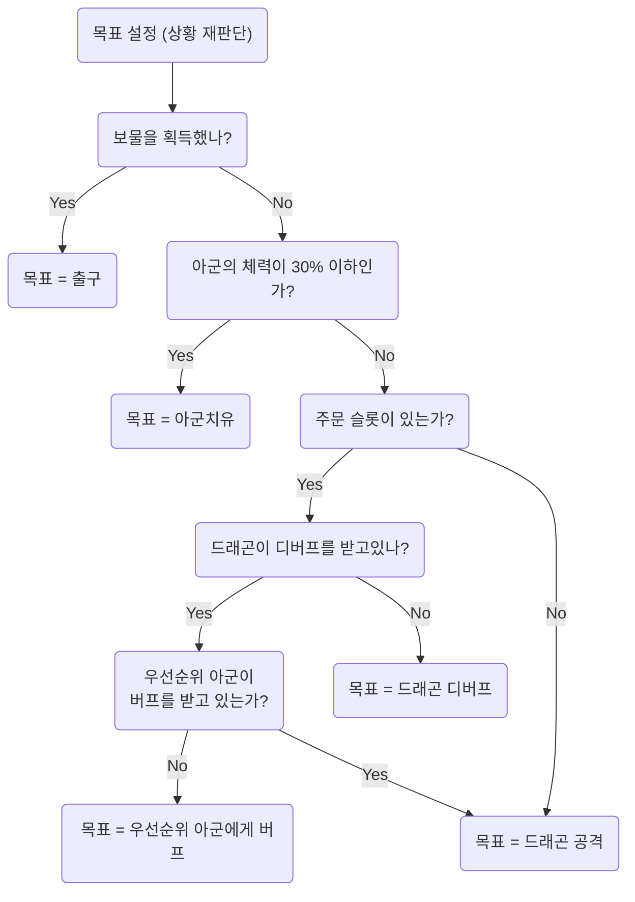

# Cleric Character Implementation Guide

**작성일**: 2025-12-08
**작성자**: Claude (AI Assistant)
**기반 문서**:
- [architecture/character_flowchart/cleric.mmd](../../../architecture/character_flowchart/cleric.mmd) - Cleric AI 플로우차트
- [architecture/character_flowchart/fighter.mmd](../../../architecture/character_flowchart/fighter.mmd) - Fighter AI 플로우차트 (참조 구현)
- [DragonicTactics/source/Game/DragonicTactics/StateComponents/AI/FighterStrategy.cpp](../../../DragonicTactics/source/Game/DragonicTactics/StateComponents/AI/FighterStrategy.cpp) - Fighter 전략 구현 (품질 기준)

---

## 📋 목차

1. [개요](#개요)
2. [Cleric 캐릭터 스펙](#cleric-캐릭터-스펙)
3. [Fighter-Cleric AI 상호작용 분석](#fighter-cleric-ai-상호작용-분석)
4. [Cleric AI 플로우차트 분석](#cleric-ai-플로우차트-분석)
5. [구현 작업 목록](#구현-작업-목록)
6. [상세 구현 가이드](#상세-구현-가이드)
7. [테스트 계획](#테스트-계획)

---

## 개요

### 목표

**Cleric 캐릭터를 FighterStrategy.cpp와 동일한 수준의 완성도로 구현**하여, Fighter AI와 완벽하게 상호작용하는 AI 전략을 만든다.

### 핵심 요구사항

1. **완성도 기준**: FighterStrategy.cpp 수준 (플로우차트의 모든 노드를 코드로 구현)
2. **상호작용**: Fighter가 HP 30% 이하일 때 Cleric에게 접근하면, Cleric이 이를 감지하고 치료
3. **미구현 시스템 대응**: 주문 시스템(Week 6+), StatusEffect 시스템(Week 6+) 고려
4. **코드 품질**: 명확한 주석, 플로우차트 단계별 매핑, 헬퍼 함수 분리

### FighterStrategy.cpp 분석 결과

**FighterStrategy.cpp는 fighter.mmd 플로우차트를 100% 구현**했다:

| 플로우차트 노드 | 코드 위치 | 구현 여부 |
|---------------|---------|---------|
| `SettingTarget` | Line 21-86 | ✅ 완전 구현 |
| `AreWeInDanger` (보물 소유 체크) | Line 33 | ✅ `HasTreasure()` |
| `AmIInDanger` (HP 30% 이하) | Line 59 | ✅ `IsInDanger()` 헬퍼 |
| `IsClericAlive` | Line 62-74 | ✅ `FindCleric()` 헬퍼 |
| `MoveStart` | Line 90-159 | ✅ 완전 구현 |
| `AmIOnTarget` | Line 100-107 | ✅ 거리 계산 + 사거리 체크 |
| `CheckTargetType` | Line 116-139 | ✅ 3-way 분기 (Exit/Cleric/Dragon) |
| `WaitHeal` | Line 125 | ✅ EndTurn 반환 |
| `CanIAttack` | Line 130 | ✅ ActionPoints 체크 |
| `DoIHaveSpellSlot` | Line 222 | ✅ `ShouldUseSpellAttack()` 헬퍼 (Week 6+ 대비) |
| `CanIMove` | Line 147 | ✅ `GetMovementRange()` 체크 |
| `FindNextMovePos` | Line 225-276 | ✅ A* 경로 찾기 + Speed 제한 |

**Cleric 구현도 이 수준을 따라야 함!**

---

## Cleric 캐릭터 스펙

### 기본 스탯 (dragonic_tactics.pdf 기준)

```cpp
// Cleric 스탯
HP: 90
Speed: 2 (턴당 이동 가능 타일 수)
AP: 1 (턴당 행동 포인트)
Attack: 5+1d6 (기본 공격)
Defense: 2d6 (방어 주사위)

// 주문 슬롯
Level 1: 4개
Level 2: 3개
```

### 특수 능력

| 능력 | 설명 | 사거리 | AP 소모 |
|------|------|--------|---------|
| **Heal** | 아군 HP 회복 | 전방 2칸 | 1 |
| **Bless** (버프) | 아군 공격력 증가 | 전방 2칸 | 1 + 주문 슬롯 |
| **Debuff** | 드래곤 방어력 감소 | 전방 2칸 | 1 + 주문 슬롯 |

**⚠️ 주의**: 주문 시스템(Week 6+) 미구현 상태이므로, **Bless/Debuff는 주석 처리된 TODO로 남겨둠**

---

## Fighter-Cleric AI 상호작용 분석

### 상호작용 시나리오

#### 시나리오 1: Fighter가 위험 상태 (HP ≤ 30%)

1. **Fighter AI 행동** (FighterStrategy.cpp:59-74):
   ```cpp
   if (IsInDanger(actor)) // HP <= 30%
   {
       Character* cleric = FindCleric();
       if (cleric != nullptr)
       {
           target = cleric;
           target_type = "Cleric";
       }
   }
   ```
   - Fighter는 Cleric을 목표로 설정
   - Cleric에게 접근 (사거리 1칸 내)
   - 도달하면 **턴 종료하며 치료 대기** (Line 125)

2. **Cleric AI 행동** (cleric.mmd 기준):
   ```
   IsAllianceInDanger → "Yes" → TargetAllianceHeal
   ```
   - Cleric은 **아군 HP < 30%** 체크
   - 해당 아군(Fighter)을 목표로 설정
   - 사거리 2칸 내 접근
   - **Heal 사용** (AP 1 소모)

#### 시나리오 2: 버프/디버프 협력 (Week 6+ StatusEffect 구현 후)

1. **Cleric AI**:
   - 드래곤에게 Debuff 시전 (`IsDragonGettingDebuff → No`)
   - Fighter에게 Bless 시전 (`IsPriorityAllyBuffed → No`)

2. **Fighter AI** (FighterStrategy.cpp:210-223):
   ```cpp
   // TODO: Week 6+ StatusEffect 시스템 구현 후 활성화
   bool iBuffed = actor->HasBuff("Blessed");
   bool targetDebuffed = target->HasDebuff("Weakened");
   ```
   - Fighter는 **자신이 버프 받고, 드래곤이 디버프 받았을 때** 주문 공격 사용

### 상호작용 요구사항 체크리스트

- ✅ **Fighter → Cleric 접근 감지**: `FindCleric()` 이미 구현됨 (FighterStrategy.cpp:182)
- ✅ **Cleric → Fighter HP 체크**: `IsAllianceInDanger()` 헬퍼 함수 필요
- ⏳ **버프/디버프 체크**: Week 6+ StatusEffect 구현 대기 (TODO 주석 남김)
- ✅ **거리 계산**: `GridSystem::ManhattanDistance()` 사용
- ✅ **턴 대기 메커니즘**: Fighter는 `EndTurn` 반환, Cleric은 다음 턴에 치료

---

## Cleric AI 플로우차트 분석

### cleric.mmd 플로우차트 전체 구조



### 단계별 코드 매핑 계획

| 플로우차트 노드 | 구현 위치 | 헬퍼 함수 | 비고 |
|---------------|---------|---------|------|
| `SettingTarget` | `MakeDecision()` 시작 | - | Fighter와 동일 구조 |
| `AreWeInDanger` (보물) | 조건 분기 1 | `HasTreasure()` | Character 메서드 사용 |
| `IsAllianceInDanger` | 조건 분기 2 | `FindAllyInDanger()` | HP 30% 이하 아군 찾기 |
| `DoIHaveSpellSlot` | 조건 분기 3 | `HasAnySpellSlot()` | Character 메서드 사용 |
| `IsDragonGettingDebuff` | 조건 분기 4 | `HasDebuff()` | ⚠️ Week 6+ TODO |
| `IsPriorityAllyBuffed` | 조건 분기 5 | `HasBuff()` | ⚠️ Week 6+ TODO |
| `TargetExit` | 목표 타입 = "Exit" | - | Fighter와 동일 |
| `TargetAllianceHeal` | 목표 타입 = "AllyHeal" | `FindAllyInDanger()` | 새로운 타입 |
| `TargetDragonDebuff` | 목표 타입 = "DragonDebuff" | `FindDragon()` | ⚠️ Week 6+ TODO |
| `TargetPriorityAllyBuff` | 목표 타입 = "AllyBuff" | `FindPriorityAlly()` | ⚠️ Week 6+ TODO |
| `TargetDragonAttack` | 목표 타입 = "DragonAttack" | `FindDragon()` | Fighter와 동일 |
| `MoveStart` | 거리 계산 시작 | - | Fighter와 동일 구조 |
| `AmIOnTarget` | 거리 체크 | - | 치료 사거리 = 2칸 |
| `CanIAct` | ActionPoints 체크 | - | Fighter와 동일 |
| `WhatIsTarget` | 목표 타입별 분기 | - | 5-way 분기 |
| `HealAlliance` | Heal 액션 | `ExecuteHeal()` | **핵심 구현** |
| `DebuffDragon` | Debuff 액션 | - | ⚠️ Week 6+ TODO |
| `BuffAlliance` | Buff 액션 | - | ⚠️ Week 6+ TODO |
| `AttackDragon` | 공격 액션 | - | Fighter와 동일 |
| `CanIMove` | MovementRange 체크 | - | Fighter와 동일 |
| `FindNextMovePos` | A* 경로 찾기 | `FindNextMovePos()` | Fighter 코드 재사용 |

---

## 구현 작업 목록

### Phase 1: 기본 캐릭터 클래스 구현

#### 1.1. Cleric.h/cpp 생성

**파일 경로**:
- `DragonicTactics/source/Game/DragonicTactics/Objects/Cleric.h`
- `DragonicTactics/source/Game/DragonicTactics/Objects/Cleric.cpp`

**구현 내용**:
```cpp
// Cleric.h
#pragma once
#include "Character.h"

class Cleric : public Character
{
public:
    Cleric(Math::ivec2 starting_position);
    ~Cleric() override = default;

    CharacterTypes GetCharacterType() const override { return CharacterTypes::Cleric; }
    std::string TypeName() const override { return "Cleric"; }

    // Cleric 전용 메서드
    int GetHealRange() const { return 2; }  // 치유 사거리
    int GetHealAmount() const;              // 치유량 계산 (1d8+5)
};
```

**스탯 설정** (Cleric.cpp):
```cpp
Cleric::Cleric(Math::ivec2 starting_position) : Character(starting_position)
{
    // 기본 스탯 설정
    GetGOComponent<StatsComponent>()->SetMaxHP(90);
    GetGOComponent<StatsComponent>()->SetHP(90);
    GetGOComponent<StatsComponent>()->SetSpeed(2);          // 턴당 이동 2칸
    GetGOComponent<StatsComponent>()->SetAttackDice("1d6"); // 공격 1d6
    GetGOComponent<StatsComponent>()->SetAttackBonus(5);    // +5 고정 데미지
    GetGOComponent<StatsComponent>()->SetDefenseDice("2d6");
    GetGOComponent<StatsComponent>()->SetAttackRange(1);    // 기본 공격 사거리 1칸

    // 주문 슬롯 설정
    GetGOComponent<SpellSlots>()->SetSlots(1, 4); // 1레벨 4개
    GetGOComponent<SpellSlots>()->SetSlots(2, 3); // 2레벨 3개

    // ActionPoints 설정
    GetGOComponent<ActionPoints>()->SetMaxActionPoints(1);
    GetGOComponent<ActionPoints>()->SetActionPoints(1);
}

int Cleric::GetHealAmount() const
{
    // 1d8+5 치유량
    int roll = DiceManager::Instance().RollDice(1, 8);
    return roll + 5;
}
```

#### 1.2. CharacterTypes.h 수정

**파일**: `DragonicTactics/source/Game/DragonicTactics/Types/CharacterTypes.h`

```cpp
enum class CharacterTypes
{
    Dragon,
    Fighter,
    Cleric,   // ← 추가
    // Wizard, Rogue (Week 6+)
};
```

#### 1.3. CharacterFactory 수정

**파일**: `DragonicTactics/source/Game/DragonicTactics/Factories/CharacterFactory.h`

```cpp
// CharacterFactory.h
class CharacterFactory
{
public:
    static Character* Create(CharacterTypes type, Math::ivec2 position);

    static Dragon* CreateDragon(Math::ivec2 position);
    static Fighter* CreateFighter(Math::ivec2 position);
    static Cleric* CreateCleric(Math::ivec2 position);  // ← 추가
};
```

**파일**: `DragonicTactics/source/Game/DragonicTactics/Factories/CharacterFactory.cpp`

```cpp
Character* CharacterFactory::Create(CharacterTypes type, Math::ivec2 position)
{
    switch (type)
    {
        case CharacterTypes::Dragon:  return CreateDragon(position);
        case CharacterTypes::Fighter: return CreateFighter(position);
        case CharacterTypes::Cleric:  return CreateCleric(position);  // ← 추가
        default: return nullptr;
    }
}

Cleric* CharacterFactory::CreateCleric(Math::ivec2 position)
{
    Cleric* cleric = new Cleric(position);

    // JSON 데이터 로드 (선택사항)
    auto& registry = DataRegistry::Instance();
    if (registry.HasCharacterData("Cleric"))
    {
        auto data = registry.GetCharacterData("Cleric");
        // 필요시 스탯 오버라이드
    }

    return cleric;
}
```

#### 1.4. characters.json 수정

**파일**: `DragonicTactics/Assets/Data/characters.json`

```json
{
  "characters": [
    {
      "name": "Cleric",
      "type": "Cleric",
      "stats": {
        "hp": 90,
        "speed": 2,
        "actionPoints": 1,
        "attack": "5+1d6",
        "defense": "2d6",
        "attackRange": 1,
        "healRange": 2,
        "healAmount": "5+1d8"
      },
      "spellSlots": {
        "level1": 4,
        "level2": 3
      }
    }
  ]
}
```

---

### Phase 2: ClericStrategy AI 구현

#### 2.1. ClericStrategy.h 생성

**파일**: `DragonicTactics/source/Game/DragonicTactics/StateComponents/AI/ClericStrategy.h`

```cpp
#pragma once
#include "IAIStrategy.h"

class Character;
class GridSystem;

class ClericStrategy : public IAIStrategy
{
public:
    AIDecision MakeDecision(Character* actor) override;

private:
    // ============================================================
    // 타겟 찾기 헬퍼
    // ============================================================
    Character* FindDragon();
    Character* FindAllyInDanger();        // HP 30% 이하 아군 찾기
    Character* FindPriorityAlly();        // 버프 우선순위 아군 (Week 6+ TODO)

    // ============================================================
    // 전략별 판단 헬퍼 (Decision Helpers)
    // ============================================================
    bool IsAllyInDanger(Character* ally) const;  // 아군 HP <= 30%?
    bool ShouldDebuffDragon(Character* actor, Character* dragon) const; // Week 6+ TODO
    bool ShouldBuffAlly(Character* actor, Character* ally) const;       // Week 6+ TODO

    // ============================================================
    // 이동 및 액션
    // ============================================================
    Math::ivec2 FindNextMovePos(Character* actor, Character* target, GridSystem* grid);
    AIDecision DecideHealAction(Character* actor, Character* target);
    AIDecision DecideAttackAction(Character* actor, Character* target);
};
```

#### 2.2. ClericStrategy.cpp 구현

**파일**: `DragonicTactics/source/Game/DragonicTactics/StateComponents/AI/ClericStrategy.cpp`

```cpp
/**
 * @file ClericStrategy.cpp
 * @author Claude (AI Assistant)
 * @brief 클레릭 AI 구현: 아군 치료, 버프/디버프, 드래곤 공격
 * @date 2025-12-08
 *
 * 기반 문서: architecture/character_flowchart/cleric.mmd
 * 참조 구현: FighterStrategy.cpp (품질 기준)
 */
#include "pch.h"

#include "../../Objects/Components/ActionPoints.h"
#include "../../Objects/Components/GridPosition.h"
#include "../../Objects/Components/SpellSlots.h"
#include "../../Objects/Components/StatsComponent.h"
#include "../../StateComponents/CombatSystem.h"
#include "../../StateComponents/GridSystem.h"
#include "./Engine/Engine.h"
#include "./Engine/GameStateManager.h"
#include "Game/DragonicTactics/StateComponents/EventBus.h"
#include "ClericStrategy.h"
#include "Game/DragonicTactics/Types/CharacterTypes.h"

AIDecision ClericStrategy::MakeDecision(Character* actor)
{
  GridSystem* grid = Engine::GetGameStateManager().GetGSComponent<GridSystem>();

  // ============================================================
  // 1단계: 타겟 설정 (플로우차트: SettingTarget)
  // ============================================================

  Character*  target      = nullptr;
  std::string target_type = "";

  // [조건 1] 보물을 가지고 있는가? (플로우차트: AreWeInDanger)
  if (actor->HasTreasure()) // ← Character의 팩트 쿼리
  {
    // → Yes → 목표 = 출구
    target_type = "Exit";

    // GridSystem에서 출구 위치 가져오기
    if (!grid->HasExit())
    {
      Engine::GetLogger().LogError("Cleric has treasure but no exit found!");
      return { AIDecisionType::EndTurn, nullptr, {}, "", "No exit available" };
    }

    Math::ivec2 exitPos = grid->GetExitPosition();

    // 출구에 도달했는가?
    if (actor->GetGridPosition()->Get() == exitPos)
    {
      // 게임 패배 (적 탈출 성공)
      return { AIDecisionType::EndTurn, nullptr, {}, "", "Escaped with treasure!" };
    }

    // 출구로 이동
    return { AIDecisionType::Move, nullptr, exitPos, "", "Escaping with treasure" };
  }

  // [조건 2] 아군의 체력이 30% 이하인가? (플로우차트: IsAllianceInDanger)
  Character* allyInDanger = FindAllyInDanger();
  if (allyInDanger != nullptr)
  {
    // → Yes → 목표 = 아군 치유
    target      = allyInDanger;
    target_type = "AllyHeal";
  }
  else
  {
    // → No → 주문 슬롯이 있는가? (플로우차트: DoIHaveSpellSlot)
    if (actor->HasAnySpellSlot())
    {
      // → Yes → 드래곤이 디버프를 받고 있나? (플로우차트: IsDragonGettingDebuff)
      Character* dragon = FindDragon();
      if (dragon != nullptr)
      {
        // TODO: Week 6+ StatusEffect 시스템 구현 후 활성화
        // if (dragon->HasDebuff("Weakened"))
        // {
        //     // → Yes → 우선순위 아군이 버프를 받고 있는가?
        //     Character* ally = FindPriorityAlly();
        //     if (ally && !ally->HasBuff("Blessed"))
        //     {
        //         target = ally;
        //         target_type = "AllyBuff";
        //     }
        //     else
        //     {
        //         target = dragon;
        //         target_type = "DragonAttack";
        //     }
        // }
        // else
        // {
        //     // → No → 목표 = 드래곤 디버프
        //     target = dragon;
        //     target_type = "DragonDebuff";
        // }

        // 현재는 StatusEffect 미구현이므로 바로 공격
        target      = dragon;
        target_type = "DragonAttack";
      }
    }
    else
    {
      // → No → 목표 = 드래곤 공격
      target      = FindDragon();
      target_type = "DragonAttack";
    }
  }

  // 타겟이 없으면 턴 종료
  if (target == nullptr)
  {
    return { AIDecisionType::EndTurn, nullptr, {}, "", "No valid target found" };
  }

  // ============================================================
  // 2단계: 행동 시작 (플로우차트: MoveStart)
  // ============================================================

  // 거리 계산
  int distance = grid->ManhattanDistance(actor->GetGridPosition()->Get(), target->GetGridPosition()->Get());

  int  actionRange = 0;
  bool onTarget    = false;

  // 목표 타입별 사거리 설정
  if (target_type == "Exit")
  {
    actionRange = 0; // 출구는 정확히 같은 타일
  }
  else if (target_type == "AllyHeal" || target_type == "AllyBuff" || target_type == "DragonDebuff")
  {
    actionRange = 2; // 치유/버프/디버프 사거리 2칸
  }
  else // "DragonAttack"
  {
    actionRange = actor->GetAttackRange(); // 공격 사거리 (기본 1칸)
  }

  // 목표에 도달했나? (플로우차트: AmIOnTarget)
  if (target_type == "Exit")
  {
    onTarget = (distance == 0); // 출구는 정확히 같은 타일
  }
  else
  {
    onTarget = (distance <= actionRange); // 사거리 내
  }

  // ============================================================
  // 3단계: 목표 도달 시 행동 분기
  // ============================================================

  if (onTarget)
  {
    // [분기] 현재 목표가 무엇인가? (플로우차트: IsTargetExit, WhatIsTarget)
    if (target_type == "Exit")
    {
      // → 출구 → 게임 패배 (적 탈출 성공)
      Engine::GetGameStateManager().GetGSComponent<EventBus>()->Publish(CharacterEscapedEvent{ actor });
      return { AIDecisionType::EndTurn, nullptr, {}, "", "Reached exit!" };
    }
    else if (target_type == "AllyHeal")
    {
      // → 아군 치유 → 행동력이 1 이상인가? (플로우차트: CanIAct)
      if (actor->GetActionPoints() > 0)
      {
        return DecideHealAction(actor, target);
      }
      else
      {
        return { AIDecisionType::EndTurn, nullptr, {}, "", "No ActionPoints for heal" };
      }
    }
    else if (target_type == "AllyBuff")
    {
      // → 아군 버프 (Week 6+ TODO)
      // TODO: Week 6+ Ability 시스템 구현 후 활성화
      return { AIDecisionType::EndTurn, nullptr, {}, "", "Buff not implemented yet" };
    }
    else if (target_type == "DragonDebuff")
    {
      // → 드래곤 디버프 (Week 6+ TODO)
      // TODO: Week 6+ Ability 시스템 구현 후 활성화
      return { AIDecisionType::EndTurn, nullptr, {}, "", "Debuff not implemented yet" };
    }
    else if (target_type == "DragonAttack")
    {
      // → 드래곤 공격 → 행동력이 1 이상인가?
      if (actor->GetActionPoints() > 0)
      {
        return DecideAttackAction(actor, target);
      }
      else
      {
        return { AIDecisionType::EndTurn, nullptr, {}, "", "No ActionPoints for attack" };
      }
    }
  }

  // ============================================================
  // 4단계: 목표 미도달 시 이동
  // ============================================================

  // 이동력이 1 이상인가? (플로우차트: CanIMove)
  if (actor->GetMovementRange() > 0) // Speed 체크
  {
    // → Yes → 목표로 1칸 이동
    Math::ivec2 movePos = FindNextMovePos(actor, target, grid);

    if (movePos != actor->GetGridPosition()->Get())
    {
      return { AIDecisionType::Move, nullptr, movePos, "", "Moving towards " + target_type };
    }
  }

  // → No → 턴 종료
  return { AIDecisionType::EndTurn, nullptr, {}, "", "No movement left" };
}

// ============================================================
// 헬퍼 함수들
// ============================================================

Character* ClericStrategy::FindDragon()
{
  GridSystem* grid      = Engine::GetGameStateManager().GetGSComponent<GridSystem>();
  auto        allChars = grid->GetAllCharacters();

  for (auto* c : allChars)
  {
    // 살아있는 드래곤만 찾음
    if (c && c->IsAlive() && c->GetCharacterType() == CharacterTypes::Dragon)
    {
      return c;
    }
  }
  return nullptr;
}

Character* ClericStrategy::FindAllyInDanger()
{
  GridSystem* grid      = Engine::GetGameStateManager().GetGSComponent<GridSystem>();
  auto        allChars = grid->GetAllCharacters();

  for (auto* c : allChars)
  {
    // 살아있고, 자신이 아니고, Dragon이 아닌 캐릭터 (= 아군)
    if (c && c->IsAlive() && c->GetCharacterType() != CharacterTypes::Dragon)
    {
      // HP 30% 이하인가?
      if (IsAllyInDanger(c))
      {
        return c;
      }
    }
  }
  return nullptr;
}

Character* ClericStrategy::FindPriorityAlly()
{
  // TODO: Week 6+ StatusEffect 구현 후 활성화
  // 우선순위: Fighter > Wizard > Rogue
  // 현재는 Fighter만 있으므로 Fighter 찾기

  GridSystem* grid      = Engine::GetGameStateManager().GetGSComponent<GridSystem>();
  auto        allChars = grid->GetAllCharacters();

  for (auto* c : allChars)
  {
    if (c && c->IsAlive() && c->GetCharacterType() == CharacterTypes::Fighter)
    {
      return c;
    }
  }
  return nullptr;
}

// ============================================================
// 전략별 판단 헬퍼 (Decision Helpers)
// ============================================================

bool ClericStrategy::IsAllyInDanger(Character* ally) const
{
  // Cleric 전략: 아군 HP 30% 이하를 위험으로 판단
  // (플로우차트: IsAllianceInDanger)
  return (ally->GetHPPercentage() <= 0.3f);
}

bool ClericStrategy::ShouldDebuffDragon([[maybe_unused]] Character* actor, [[maybe_unused]] Character* dragon) const
{
  // TODO: Week 6+ StatusEffect 구현 후 활성화
  // return !dragon->HasDebuff("Weakened") && actor->HasAnySpellSlot();
  return false;
}

bool ClericStrategy::ShouldBuffAlly([[maybe_unused]] Character* actor, [[maybe_unused]] Character* ally) const
{
  // TODO: Week 6+ StatusEffect 구현 후 활성화
  // return !ally->HasBuff("Blessed") && actor->HasAnySpellSlot();
  return false;
}

Math::ivec2 ClericStrategy::FindNextMovePos(Character* actor, Character* target, GridSystem* grid)
{
  // Fighter와 동일한 로직: A* 경로 찾기 + Speed 제한
  Math::ivec2 targetPos = target->GetGridPosition()->Get();
  Math::ivec2 myPos     = actor->GetGridPosition()->Get();

  std::vector<Math::ivec2> bestPath;
  int                      bestPathCost = 999999;

  // 타겟의 상하좌우 4방향 중 갈 수 있는 가장 가까운 곳 탐색
  static const Math::ivec2 offsets[4] = {
    {  0,  1 },
    {  0, -1 },
    { -1,  0 },
    {  1,  0 }
  };

  for (const auto& offset : offsets)
  {
    Math::ivec2 attackPos = targetPos + offset;

    // 맵 밖이거나 막힌 곳이면 패스
    if (!grid->IsValidTile(attackPos) || !grid->IsWalkable(attackPos))
    {
      continue;
    }

    // 해당 위치까지 경로 계산
    std::vector<Math::ivec2> currentPath = grid->FindPath(myPos, attackPos);

    // 경로가 있고 더 짧다면 갱신
    if (!currentPath.empty() && (int)currentPath.size() < bestPathCost)
    {
      bestPathCost = (int)currentPath.size();
      bestPath     = currentPath;
    }
  }

  // 경로가 존재한다면
  if (!bestPath.empty())
  {
    // 내 이동력(Speed) 한계 내에서 가장 멀리 갈 수 있는 칸 선택
    int maxReach  = std::min((int)bestPath.size(), actor->GetMovementRange());
    int destIndex = maxReach - 1;

    if (destIndex >= 0)
    {
      return bestPath[destIndex];
    }
  }

  return myPos; // 갈 곳 없으면 제자리 반환
}

AIDecision ClericStrategy::DecideHealAction(Character* actor, Character* target)
{
  // 플로우차트: HealAlliance → DecreaseActionPoints → CanIAct

  // Week 6+ Ability 시스템 구현 전까지는 이벤트 발행으로 치료 구현
  // TODO: Week 6+ Ability 시스템 구현 후 ActionHeal로 교체

  return { AIDecisionType::Heal, target, {}, "", "Healing ally" };
}

AIDecision ClericStrategy::DecideAttackAction(Character* actor, Character* target)
{
  // Week 6+ Ability 시스템 구현 전까지는 기본 공격만 사용
  // TODO: Week 6+ Ability 시스템 구현 후 주문 공격 추가

  return { AIDecisionType::Attack, target, {}, "", "Basic attack" };
}
```

#### 2.3. AISystem에 ClericStrategy 등록

**파일**: `DragonicTactics/source/Game/DragonicTactics/StateComponents/AISystem.cpp`

```cpp
// AISystem.cpp Load() 메서드에 추가
void AISystem::Load()
{
    m_strategies[CharacterTypes::Fighter] = std::make_unique<FighterStrategy>();
    m_strategies[CharacterTypes::Cleric] = std::make_unique<ClericStrategy>();  // ← 추가
}
```

---

### Phase 3: Heal 액션 구현

#### 3.1. AIDecisionType에 Heal 추가

**파일**: `DragonicTactics/source/Game/DragonicTactics/StateComponents/AI/IAIStrategy.h`

```cpp
enum class AIDecisionType
{
    Move,
    Attack,
    Heal,       // ← 추가
    EndTurn
};
```

#### 3.2. AISystem에서 Heal 처리

**파일**: `DragonicTactics/source/Game/DragonicTactics/StateComponents/AISystem.cpp`

```cpp
void AISystem::ExecuteAITurn(Character* character)
{
    AIDecision decision = strategy->MakeDecision(character);

    switch (decision.type)
    {
        case AIDecisionType::Move:
            // 이동 처리 (기존 코드)
            break;

        case AIDecisionType::Attack:
            // 공격 처리 (기존 코드)
            break;

        case AIDecisionType::Heal:  // ← 추가
            if (decision.target != nullptr)
            {
                ExecuteHeal(character, decision.target);
            }
            break;

        case AIDecisionType::EndTurn:
            // 턴 종료 (기존 코드)
            break;
    }
}

void AISystem::ExecuteHeal(Character* healer, Character* target)
{
    // 행동 포인트 체크
    if (healer->GetActionPoints() <= 0)
    {
        Engine::GetLogger().LogError("Healer has no action points!");
        return;
    }

    // 거리 체크 (치유 사거리 2칸)
    GridSystem* grid = Engine::GetGameStateManager().GetGSComponent<GridSystem>();
    int distance = grid->ManhattanDistance(
        healer->GetGridPosition()->Get(),
        target->GetGridPosition()->Get()
    );

    if (distance > 2)
    {
        Engine::GetLogger().LogError("Target is out of heal range!");
        return;
    }

    // 치유량 계산 (1d8+5)
    int healAmount = DiceManager::Instance().RollDice(1, 8) + 5;

    // 타겟 HP 회복
    int oldHP = target->GetHP();
    target->SetHP(oldHP + healAmount);
    int actualHeal = target->GetHP() - oldHP; // MaxHP 초과 방지

    // 행동 포인트 소모
    healer->GetGOComponent<ActionPoints>()->ConsumeActionPoints(1);

    // 이벤트 발행
    CharacterHealedEvent event{ target, actualHeal, healer };
    Engine::GetGameStateManager().GetGSComponent<EventBus>()->Publish(event);

    // 로그
    Engine::GetLogger().LogEvent(
        healer->TypeName() + " healed " + target->TypeName() +
        " for " + std::to_string(actualHeal) + " HP"
    );
}
```

#### 3.3. CharacterHealedEvent 정의

**파일**: `DragonicTactics/source/Game/DragonicTactics/Types/Events.h`

```cpp
struct CharacterHealedEvent
{
    Character* target;    // 치료받은 캐릭터
    int        amount;    // 회복량
    Character* healer;    // 치료한 캐릭터
};
```

---

### Phase 4: 시각화 및 테스트

#### 4.1. GridSystem에서 Cleric 색상 설정

**파일**: `DragonicTactics/source/Game/DragonicTactics/StateComponents/GridSystem.cpp`

```cpp
void GridSystem::Draw(Math::TransformationMatrix camera_matrix)
{
    // 기존 캐릭터 시각화 코드에서 색상 추가
    if (character->GetCharacterType() == CharacterTypes::Cleric)
    {
        fillColor = CS200::YELLOW;  // 클레릭은 노란색
    }
}
```

#### 4.2. GamePlay에서 Cleric 테스트

**파일**: `DragonicTactics/source/Game/DragonicTactics/States/GamePlay.cpp`

```cpp
void GamePlay::Load()
{
    // 플레이어 캐릭터 (Dragon) 생성
    Character* player = CharacterFactory::Create(CharacterTypes::Dragon, {3, 3});
    m_grid->AddCharacter(player);

    // 적 캐릭터 (Fighter) 생성
    Character* fighter = CharacterFactory::Create(CharacterTypes::Fighter, {5, 5});
    m_grid->AddCharacter(fighter);

    // 적 캐릭터 (Cleric) 생성
    Character* cleric = CharacterFactory::Create(CharacterTypes::Cleric, {6, 4});
    m_grid->AddCharacter(cleric);

    // 턴 매니저에 등록
    m_turn_manager->InitializeTurnOrder({ player, fighter, cleric });

    // UI 매니저에 등록
    m_ui_manager->SetCharacters({ player, fighter, cleric });
}
```

#### 4.3. 치유 이벤트 로깅

**파일**: `DragonicTactics/source/Game/DragonicTactics/States/GamePlay.cpp`

```cpp
void GamePlay::Load()
{
    // 이벤트 구독 (기존 코드에 추가)
    EventBus::Instance().Subscribe<CharacterHealedEvent>(
        [this](const CharacterHealedEvent& event)
        {
            std::string msg = event.healer->TypeName() + " healed " +
                             event.target->TypeName() + " for " +
                             std::to_string(event.amount) + " HP";

            m_ui_manager->ShowDamageLog(msg, {10, 200}, {0.5, 0.5});
            Engine::GetLogger().LogEvent(msg);
        }
    );
}
```

---

## 테스트 계획

### 테스트 시나리오 1: 기본 치료 메커니즘

**목표**: Cleric이 HP 낮은 Fighter를 감지하고 치료하는지 확인

**단계**:
1. Dragon을 (3, 3), Fighter를 (5, 5), Cleric을 (6, 4)에 배치
2. Fighter HP를 20(22%)으로 설정 (30% 이하)
3. 턴 진행 → Cleric 차례
4. **기대 결과**:
   - Cleric이 `FindAllyInDanger()`로 Fighter 감지
   - Fighter 방향으로 이동 (거리 2칸 이내로 접근)
   - 사거리 내 도달 시 `Heal` 액션 실행
   - Fighter HP 증가 (1d8+5 회복)
   - UI에 "Cleric healed Fighter for X HP" 표시

**검증 코드**:
```cpp
// Test/TestClericAI.cpp
void TestClericHealing()
{
    // 1. 캐릭터 생성
    Character* fighter = CharacterFactory::Create(CharacterTypes::Fighter, {5, 5});
    Character* cleric = CharacterFactory::Create(CharacterTypes::Cleric, {6, 4});

    // 2. Fighter HP를 30% 이하로 설정
    fighter->SetHP(20); // 90 * 0.22 = 19.8

    // 3. Cleric AI 실행
    ClericStrategy strategy;
    AIDecision decision = strategy.MakeDecision(cleric);

    // 4. 검증
    ASSERT(decision.type == AIDecisionType::Move || decision.type == AIDecisionType::Heal);
    if (decision.type == AIDecisionType::Heal)
    {
        ASSERT(decision.target == fighter);
    }
}
```

### 테스트 시나리오 2: Fighter-Cleric 상호작용

**목표**: Fighter가 HP 낮을 때 Cleric에게 접근하고, Cleric이 치료하는지 확인

**단계**:
1. Dragon (3, 3), Fighter (5, 5, HP 20), Cleric (6, 4) 배치
2. **Fighter 턴**:
   - `IsInDanger()` → true (HP 30% 이하)
   - `FindCleric()` → Cleric 감지
   - 목표: Cleric
   - Cleric 방향으로 이동
   - 사거리 1칸 내 도달 시 **턴 종료 (치료 대기)**
3. **Cleric 턴**:
   - `FindAllyInDanger()` → Fighter 감지
   - Fighter 방향으로 이동 (이미 사거리 내)
   - `Heal` 액션 실행
   - Fighter HP 회복
4. **기대 결과**:
   - Fighter가 Cleric 근처에서 대기
   - Cleric이 Fighter 치료
   - Fighter HP 증가

**검증 방법**:
- 콘솔 로그 확인:
  ```
  [Fighter] HP low (22%), moving towards Cleric
  [Fighter] Reached Cleric, waiting for heal
  [Cleric] Ally Fighter in danger (22% HP), targeting for heal
  [Cleric] Healing Fighter for 12 HP (1d8+5 = 7+5)
  [Fighter] HP recovered: 20 → 32 (35%)
  ```

### 테스트 시나리오 3: 보물 탈출

**목표**: Cleric이 보물을 획득하면 출구로 탈출하는지 확인

**단계**:
1. Cleric (6, 4), 출구 (7, 7) 배치
2. Cleric에게 보물 부여: `cleric->SetTreasure(true)`
3. 턴 진행 → Cleric 차례
4. **기대 결과**:
   - Cleric이 출구를 목표로 설정
   - 출구 방향으로 이동 (A* 경로 찾기)
   - 출구 도달 시 `CharacterEscapedEvent` 발행
   - 게임 패배 (적 탈출 성공)

### 테스트 시나리오 4: 주문 슬롯 소모 (Week 6+ 대비)

**목표**: 주문 슬롯이 없을 때 기본 공격 사용, 있을 때 주문 공격 사용

**단계**:
1. Cleric (6, 4), Dragon (3, 3) 배치
2. Cleric 주문 슬롯 제거: `cleric->GetGOComponent<SpellSlots>()->SetSlots(1, 0)`
3. 턴 진행 → Cleric 차례
4. **기대 결과**:
   - `HasAnySpellSlot()` → false
   - 목표: DragonAttack
   - 기본 공격 사용 (5+1d6)

**Week 6+ 테스트**:
- 주문 슬롯이 있을 때 주문 공격 사용
- 버프/디버프 조건 체크
- StatusEffect 시스템과 통합

### 테스트 체크리스트

- [ ] Cleric 캐릭터 생성 (HP 90, Speed 2, AP 1)
- [ ] Cleric 주문 슬롯 초기화 (1레벨 4개, 2레벨 3개)
- [ ] CharacterFactory에서 Cleric 생성
- [ ] GridSystem에서 Cleric 시각화 (노란색)
- [ ] ClericStrategy AI 의사결정:
  - [ ] 보물 소유 → 출구 탈출
  - [ ] 아군 HP < 30% → 치료
  - [ ] 주문 슬롯 있음 → 드래곤 공격 (Week 6+ 버프/디버프)
  - [ ] 주문 슬롯 없음 → 기본 공격
- [ ] Heal 액션 실행:
  - [ ] 사거리 2칸 체크
  - [ ] HP 회복 (1d8+5)
  - [ ] ActionPoints 소모
  - [ ] CharacterHealedEvent 발행
- [ ] Fighter-Cleric 상호작용:
  - [ ] Fighter HP < 30% → Cleric 접근
  - [ ] Fighter 대기 → Cleric 치료
- [ ] UI에 치유 로그 표시
- [ ] 콘솔에 AI 행동 로그 출력

---

## 구현 순서 권장

1. **Phase 1.1-1.4**: Cleric 캐릭터 클래스 및 팩토리 구현 (30분)
2. **Phase 2.1-2.2**: ClericStrategy AI 구현 (1시간)
3. **Phase 3.1-3.3**: Heal 액션 및 이벤트 구현 (30분)
4. **Phase 4.1-4.2**: 시각화 및 GamePlay 통합 (20분)
5. **테스트**: 시나리오 1-3 검증 (30분)

**총 예상 시간**: 약 3시간

---

## 주의사항

### Week 6+ 미구현 기능

다음 기능은 **주석 처리된 TODO**로 남겨두고, Week 6+ Ability/StatusEffect 시스템 구현 시 활성화:

```cpp
// TODO: Week 6+ StatusEffect 시스템 구현 후 활성화
// if (dragon->HasDebuff("Weakened"))
// {
//     // 드래곤이 디버프 받았을 때 로직
// }

// TODO: Week 6+ Ability 시스템 구현 후 활성화
// if (ShouldBuffAlly(actor, ally))
// {
//     return { AIDecisionType::Buff, ally, {}, "", "Buffing ally" };
// }
```

### Fighter-Cleric 상호작용 핵심

**FighterStrategy.cpp:122-125**:
```cpp
else if (target_type == "Cleric")
{
    // → 클레릭 → 치료 대기 (턴 종료)
    return { AIDecisionType::EndTurn, nullptr, {}, "", "Waiting for heal from Cleric" };
}
```

- Fighter는 Cleric 사거리 1칸 내 도달 시 **턴 종료**
- Cleric은 다음 턴에 `FindAllyInDanger()`로 Fighter 감지
- Cleric이 Fighter에게 `Heal` 사용
- **이 메커니즘이 완벽하게 작동해야 함!**

### 코드 품질 기준

FighterStrategy.cpp 수준 유지:

1. **플로우차트 주석**: 각 단계마다 `// 플로우차트: SettingTarget` 형식 주석
2. **헬퍼 함수 분리**: `FindAllyInDanger()`, `IsAllyInDanger()` 등
3. **명확한 변수명**: `target_type`, `onTarget`, `actionRange`
4. **오류 처리**: `if (!grid->HasExit())` 같은 예외 상황 체크
5. **TODO 주석**: Week 6+ 기능은 명확한 TODO로 표시

---

## 마무리

이 가이드는 **FighterStrategy.cpp와 동일한 수준의 완성도**로 Cleric을 구현하며, **Fighter-Cleric AI 상호작용**을 완벽하게 구현하는 것을 목표로 합니다.

구현 후 반드시 **테스트 시나리오 1-3**을 실행하여 다음을 검증하세요:
1. Cleric이 HP 낮은 아군을 감지하고 치료하는가?
2. Fighter가 HP 낮을 때 Cleric에게 접근하고 대기하는가?
3. Cleric이 보물을 가지고 출구로 탈출하는가?

**성공 기준**: 모든 테스트 시나리오 통과 + 플로우차트의 모든 노드가 코드로 구현됨 ✅
