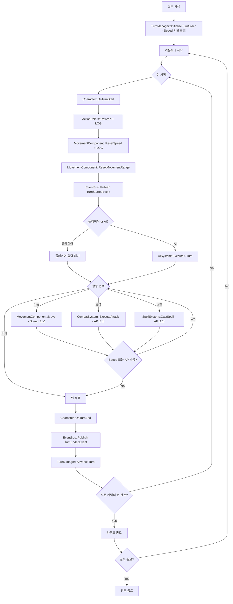

```mermaid
graph TD
    A[전투 시작] --> B[TurnManager::InitializeTurnOrder - Speed 기반 정렬]
    B --> C[라운드 1 시작]
    C --> D{턴 시작}

    D --> E[Character::OnTurnStart]
    E --> E1[ActionPoints::Refresh + LOG]
    E1 --> E2[MovementComponent::ResetSpeed + LOG]
    E2 --> E3[MovementComponent::ResetMovementRange]
    E3 --> F[EventBus::Publish TurnStartedEvent]

    F --> G{플레이어 or AI?}
    G -->|플레이어| H[플레이어 입력 대기]
    G -->|AI| I[AISystem::ExecuteAITurn]

    H --> J{행동 선택}
    I --> J

    J -->|이동| K[MovementComponent::Move - Speed 소모]
    J -->|공격| L[CombatSystem::ExecuteAttack - AP 소모]
    J -->|스펠| M[SpellSystem::CastSpell - AP 소모]
    J -->|대기| N[턴 종료]

    K --> O{Speed 또는 AP 남음?}
    L --> O
    M --> O

    O -->|Yes| J
    O -->|No| N

    N --> P[Character::OnTurnEnd]
    P --> Q[EventBus::Publish TurnEndedEvent]
    Q --> R[TurnManager::AdvanceTurn]

    R --> S{모든 캐릭터 턴 완료?}
    S -->|No| D
    S -->|Yes| T[라운드 종료]

    T --> U{전투 종료?}
    U -->|No| C
    U -->|Yes| V[전투 종료]
```