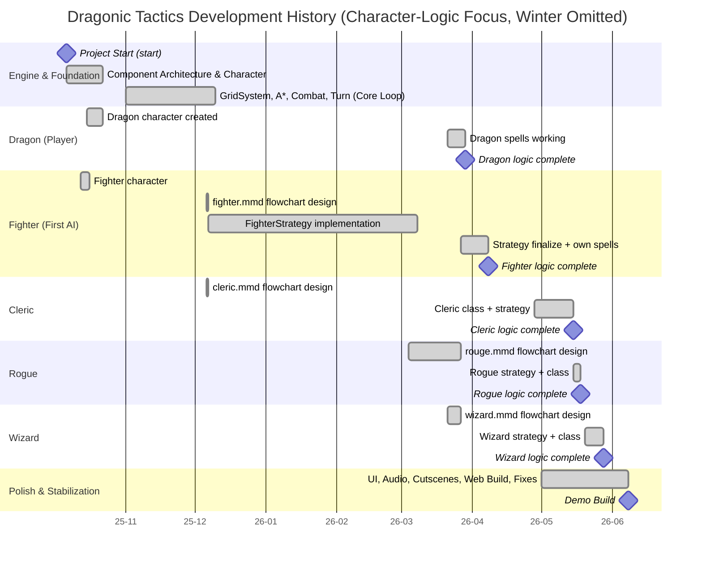

# Dragonic Tactics — Development History Gantt (Character-Logic Focus)

> From the project's first creation (2025-10-06) through each character's logic completion (Dragon, Fighter, Cleric, Rogue, Wizard).
> Dates are from the git commit history. **The winter lull (January–February) is omitted.** (A 2026-01-02 directory restructure made some files' git "first-added" date later than reality, so a commit-message-based semantic timeline is used.)

---

## 1. Mermaid Gantt (for rendering)

> Paste into GitHub / Notion / VS Code (Mermaid extension) / [mermaid.live](https://mermaid.live) to render as graphics.



---

## 2. ASCII Timeline (winter omitted, renders anywhere)

### 2-1. Character Logic Milestone Grid

```
Legend: [C] Character Created   [D] Flowchart Designed (.mmd)   [L] Logic Complete

Character / Logic Milestone                  | 2025          | 2026
                                             | Oct  Nov  Dec | Mar  Apr  May  Jun
--------------------------------------------------------------------------------
[C] Dragon created (player)                  |  *            |
[C] Fighter created (first AI)               |  *            |
[D] Fighter flowchart + first AI strategy    |        *      |
[D] Cleric flowchart                         |        *      |
[L] Dragon spells working                    |               |  *
[D] Rogue flowchart                          |               |  *
[D] Wizard flowchart                         |               |  *
[L] Fighter strategy + spells complete       |               |      *
[L] Cleric class + strategy complete         |               |           *
[L] Rogue strategy + class complete          |               |           *
[L] Wizard strategy + class complete         |               |           *
--------------------------------------------------------------------------------
(Winter lull, Jan-Feb, omitted - no Jan/Feb columns)
```

### 2-2. System Milestone Grid

```
Legend: [F] Feature Added   [M] Major Milestone   [D] Demo Complete

Activity / Milestone                         | 2025          | 2026
                                             | Oct  Nov  Dec | Mar  Apr  May  Jun
--------------------------------------------------------------------------------
[F] Project Start (Custom Engine)            |  *            |
[F] First Character (Fighter) & Spells       |  *            |
[F] CombatSystem (Dice-based)                |  *            |
[M] A* Path, SpellSystem & TurnManager       |        *      |
[F] AI Flowcharts & Turn Hooks               |        *      |
[M] All Character Strategies Implemented     |               |  *
[F] Spells, Status Effects & Audio           |               |  *
[F] Cleric Class Added                       |               |      *
[M] Unified Coordinates (Click Bug Fix)      |               |           *
[F] Rogue Class Added                        |               |           *
[F] Crash Dump System & GameOver             |               |           *
[F] Cutscenes Added                          |               |           *
[F] Wizard Class Added                       |               |           *
[M] Web Build Repaired (Win/Web Sync)        |               |           *
[M] All AI Characters Developed              |               |           *
[D] Demo Build Complete                      |               |               *
--------------------------------------------------------------------------------
(Winter lull, Jan-Feb, omitted - no Jan/Feb columns)
```

### 2-3. Progress Bar View (winter omitted - Jan/Feb skipped)

```
Progress Bar View:
2025-10 [====================>                                                             ]
2025-11 [========================>                                                         ]
2025-12 [===========================>                                                      ]
2026-03 [=====================================================>                            ]
2026-04 [=========================================================>                        ]
2026-05 [=========================================================================>        ]
2026-06 [============================================================================>     ]
```

---

## 3. Per-Character Logic Completion Summary

| Character | Type | Created | Flowchart (design) | Logic implemented / complete | Key files |
|---|---|---|---|---|---|
| **Dragon** | Player | 2025-10-15 | (N/A - player input) | Spells working **2026-03-29** | `Objects/Dragon`, PlayerInputHandler |
| **Fighter** | AI (1st) | 2025-10-12 | `fighter.mmd` 2025-12-06 | Strategy 2025-12-07 to 03-08, spells **2026-04-08** | `AI/FighterStrategy` |
| **Cleric** | AI (2nd) | 2026-04-28 | `cleric.mmd` 2025-12-06 / 2026-03-09 | Class + strategy **2026-05-15** (refined 04-29) | `AI/ClericStrategy`, `Objects/Cleric` |
| **Rogue** | AI (3rd) | 2026-05-18 | `rouge.mmd` 2026-03-04 | Strategy + class **2026-05-18** | `AI/RogueStrategy`, `Objects/Rogue` |
| **Wizard** | AI (4th) | 2026-05-28 | `wizard.mmd` 2026-03-21 | Strategy + class **2026-05-28** | `AI/WizardStrategy`, `Objects/Wizard` |

**Observations**
- All four AI classes followed the same pattern: **draw the flowchart (.mmd) first, then implement the strategy code** (design-first).
- Fighter was designed and implemented first (late 2025); after the winter lull, the 2026-03-08 "all strategies implemented" commit consolidated the strategy framework for every character at once.
- Cleric -> Rogue -> Wizard were added quickly in April-May 2026 using a **repeatable checklist** (the gap between each character addition shrank).
- Dragon is the player, not an AI, so its logic-completion criterion is input handling + spells (working 2026-03-29) rather than a "strategy".

---

*CodePistols - Dragonic Tactics - development history from the git commit log (character-logic focus, winter omitted)*
