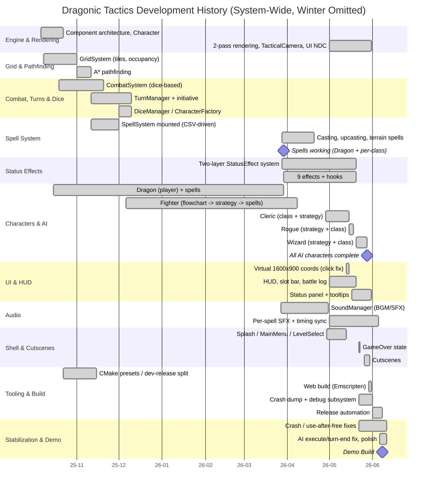

# Dragonic Tactics — Development History (System-Wide)

> The full story of the project from its first commit (2025-10-06) to the present, told in text and a Gantt chart. This document sweeps every system (engine, grid, combat, spells, status effects, characters/AI, UI, audio, shell, tooling, stabilization). Characters are included but are not the sole focus. Dates come from the git commit history. **The winter lull (January–February 2026) is omitted** — almost no work happened then, so it is skipped from the timeline.

---

## Part 1 — Narrative

### Phase 1 — Foundation (October 2025)
Development began on 2025-10-06 with a deliberate choice: build a D&D-style turn-based tactical RPG on a **custom C++20 OpenGL engine** rather than a commercial one. The first weeks went to structure, not gameplay. The team stood up the **component-based architecture** (the dual GameState/GameObject component model), the **Character** hierarchy, the grid coordinate types (`GridPosition`, `GameTypes`), and the **GridSystem**. The first entities appeared quickly — `Fighter` (2025-10-12), `Dragon` (2025-10-15) — and `CombatSystem` followed (2025-10-19). The defining decision of this phase was **data-driven design**: characters, maps, spells, and status effects would be loaded from JSON/CSV rather than hard-coded.

### Phase 2 — Core Loop (November–December 2025)
The systems that make it a game came online. On 2025-11-11, **A\* pathfinding** was completed, the **SpellSystem** was mounted into the engine, and the **TurnManager** joined, giving dice-based combat a proper turn order with D&D-style initiative. December stabilized the **CharacterFactory**, wired the `OnTurnStart`/`OnTurnEnd` hooks, and began the team's signature workflow: **designing AI as Mermaid flowcharts before writing code** (`fighter.mmd`, `cleric.mmd`). `FighterStrategy` received its first decision logic on 2025-12-07. By the break, a playable turn-based loop existed.

*(Winter lull, January–February 2026, omitted.)*

### Phase 3 — Systems Expansion (March 2026)
Work resumed and the data-driven investment paid off. On 2026-03-08 the strategy framework for every character was consolidated ("all strategies implemented"), and the fourth AI design (`wizard.mmd`) landed on 2026-03-21. **SoundManager** arrived on 2026-03-27. Across 2026-03-28/29 the **SpellSystem** and the **two-layer StatusEffect system** were completed, and spell consumption, the Dragon's spells, status effects, and **audio** all became functional.

### Phase 4 — Content & AI (April–May 2026)
The roster filled out using a **repeatable per-character checklist**, so each addition cost less than the last. Fighter-specific spells landed on 2026-04-08, the **Cleric** class and strategy on 2026-04-28 (refined 04-29), the **Rogue** on 2026-05-18, and the **Wizard** on 2026-05-28. By the end, four distinct AI classes (Fighter, Cleric, Rogue, Wizard) plus the player-controlled Dragon were in play, each with its own behavior tree and spell kit.

### Phase 5 — UI, Audio & Polish (May 2026)
The busiest stretch. The UI was overhauled onto a **shared virtual 1600×900 coordinate space** to fix resolution-dependent click bugs (2026-05-13), the status-effect UI and tooltips were built (2026-05-17), and the shell layer matured: **GameOver state plus an automatic crash-dump system** (2026-05-22) and **cutscenes** (2026-05-26). The **Emscripten web build was repaired** to keep Windows and Web in sync (2026-05-31). Audio integration deepened with per-character and per-spell SFX and timing synchronization.

### Phase 6 — Stabilization & Demo (June 2026 — present)
The final stretch focused on polish and stability: win/lose BGM (2026-06-05), a global F2 **screenshot** feature (2026-06-06), and the **demo build** (2026-06-08). The most recent stabilization round (2026-06-11) fixed AI execution/turn-ending edge cases (a non-executing decision now ends the turn instead of freezing), removed a redundant stealth notice, and corrected a status-effect hook so debuffs like Fear apply consistently. A separate `demo` branch unlocks all levels in release builds for demonstrations, and a `web-release` build has been produced.

### Summary
Early investment in **architecture and data-driven content** turned the later content (20+ spells, nine status effects, four AI classes) into cheap, repeatable additions. **Observability tooling** (crash dumps, a debug console, web-build gating) made the final crunch survivable. The largest weakness was continuity — the winter lull cost momentum — but the delivered scope closely matches the committed scope: a focused, polished, single-genre game that runs on both Windows and the Web.

---

## Part 2 — Mermaid Gantt (system-wide)

> Paste into GitHub / Notion / VS Code (Mermaid extension) / [mermaid.live](https://mermaid.live) to render.



---

## Part 3 — ASCII Timeline & Milestones (winter omitted)

```
System / Milestone                       | 2025          | 2026
                                         | Oct  Nov  Dec | Mar  Apr  May  Jun
----------------------------------------------------------------------------
Engine & Component Architecture          |  *            |
GridSystem                               |  *            |
A* Pathfinding                           |       *       |
CombatSystem (dice)                      |  *            |
SpellSystem mounted                      |       *       |
TurnManager + Initiative                 |       *       |
CharacterFactory / Turn hooks            |        *      |
AI Flowcharts + FighterStrategy          |        *      |
All Character Strategies Implemented     |               |  *
SpellSystem + StatusEffect complete      |               |  *
SoundManager + Audio working             |               |  *
Dragon spells working                    |               |  *
Fighter spells complete                  |               |  *
Cleric class + strategy                  |               |      *
Virtual 1600x900 UI (click fix)          |               |           *
Status-effect UI + tooltips              |               |           *
Rogue class + strategy                   |               |           *
GameOver + Crash Dump system             |               |           *
Cutscenes                                |               |           *
Wizard class + strategy                  |               |           *
Web Build repaired (Win/Web sync)        |               |           *
Win/Lose BGM, Screenshot (F2)            |               |               *
AI execute/turn-end fix, stabilization   |               |               *
Demo Build                               |               |               *
----------------------------------------------------------------------------
(Winter lull, Jan-Feb 2026, omitted - no Jan/Feb columns)
```

### Key milestones

| Date | Milestone |
|---|---|
| 2025-10-06 | Project start (custom C++ OpenGL engine) |
| 2025-10-12 / 10-15 | First characters: Fighter, Dragon |
| 2025-10-19 | CombatSystem (dice-based) |
| 2025-11-11 | A* complete + SpellSystem mounted + TurnManager (core loop) |
| 2025-12-07 | AI flowcharts + FighterStrategy |
| 2026-03-08 | All character strategies implemented |
| 2026-03-29 | SpellSystem + StatusEffect + audio + Dragon spells working |
| 2026-04-08 | Fighter spells complete |
| 2026-04-28 | Cleric added |
| 2026-05-13 | Unified virtual 1600x900 coordinates (click-bug fix) |
| 2026-05-18 | Rogue added |
| 2026-05-22 | GameOver + crash-dump system |
| 2026-05-28 | Wizard added — all AI characters complete |
| 2026-05-31 | Web build repaired (Windows/Web in sync) |
| 2026-06-08 | Demo build |
| 2026-06-11 | Latest stabilization round (AI execute/turn-end fix, etc.) |

---

*CodePistols — Dragonic Tactics — system-wide development history from the git commit log (winter omitted).*
